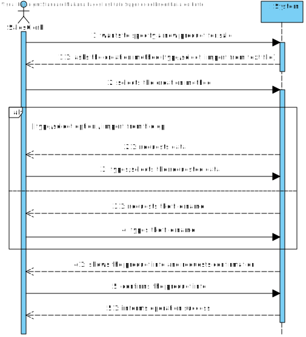
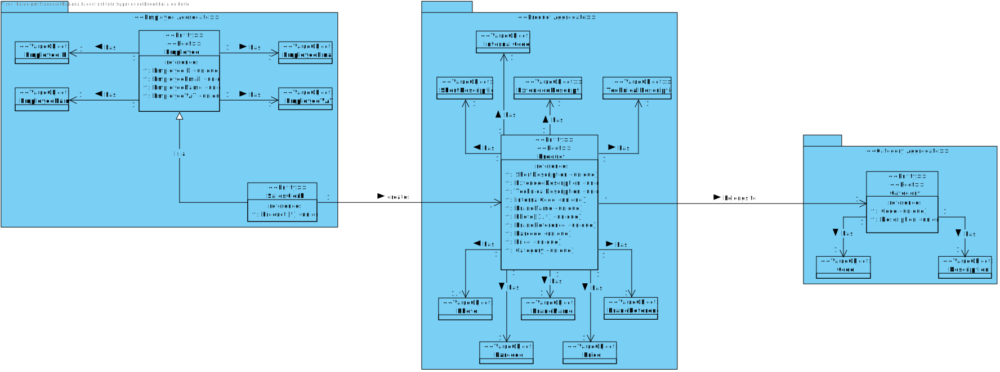
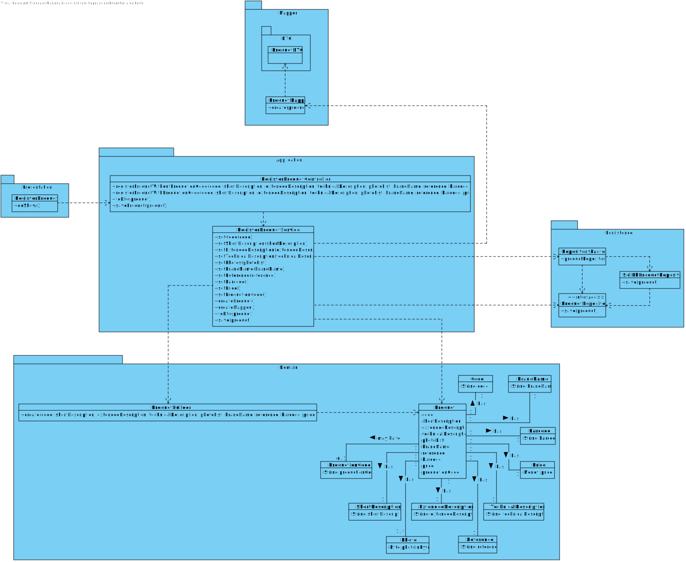

# US 1001 - Specify a new product for sale

## 1. Requirements Engineering

## 1.1. User Story Description

As a Sales Clerk, I want to specify a new product for sale.

* Specify a new product. A product specification comprehends multiple attributes (cf. section 2.1).
  * a. A product might be manually created by a salesclerk by typing (or selecting) all the mandatory data required to be order by a customer.
  * b. Alternatively, products might be imported from a text file generated by an external system. Multiple text file formats need to be supported (e.g.: CSV, XML).
  * c. Imported products might have some missing information (e.g.: its warehouse location), which can be further added by the salesclerk.

## 1.3. System Sequence Diagram (SSD)

## 2. OO Analysis

### Relevant Domain Model Excerpt

## 3. Design - User Story Realization

### 3.1. Sequence Diagram (SD)

### 3.2. Class Diagram (CD)

## 4. Tests

## 5. Construction (Implementation)

## 6. Observations