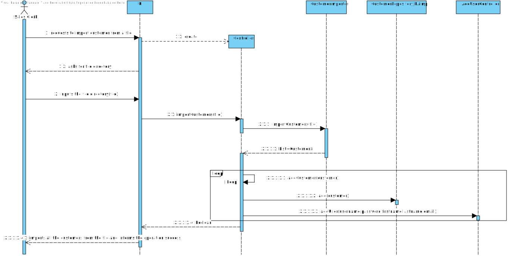

# US 1004
=======================================

# 1. Requisitos

**Demo:** As Sales Clerk, I want to create a new products order on behalf of a given customer.

As in any traditional products order management system, there is a minimum core information
regarding customers and the products catalog that is required to the system work properly. Thus, it is
important that SPOMS provides the users with the ability of either (i) to create and manage
products/customers information directly and (ii) to import such information from external systems in
use in the organization where the system is being deployed.

Moreover, customers should be able to easily convert their shopping cart content into a new products
order (or simply order).

**A products order** has an automatically set numeric identifier and the datetime it has been registered
in the system. It mandatorily refers to a single customer and records the typed/selected billing and
delivering address, the ordered products and its quantities and unitary prices as well as the order total
amount (before and after taxes). In this respect, it is worth highlighting that products information
(e.g.: prices but sometimes also descriptions) change over time.

# 2. Análise

##Domain Model

##Create a New Product Order on Behalf of a Given model.Customer

By a clerk on behalf of a given customer. In this case, the system might request the clerk
additional information regarding the source order information was provided (e.g.: phone,
email, other).

##Regarding the Order

* Has an automatically set numeric identifier and the datetime it has been registered
in the system. 
* It mandatorily refers to a single customer and records the typed/selected billing and
delivering address, the ordered products and its quantities and unitary prices as well as the order total
amount (before and after taxes). 
* In this respect, it is worth highlighting that products information
(e.g.: prices but sometimes also descriptions) change over time.

# 3. Design

*Nesta secção a equipa deve descrever o design adotado para satisfazer a funcionalidade. Entre outros, a equipa deve apresentar diagrama(s) de realização da funcionalidade, diagrama(s) de classes, identificação de padrões aplicados e quais foram os principais testes especificados para validar a funcionalidade.*

*Para além das secções sugeridas, podem ser incluídas outras.*

## 3.1. Realização da Funcionalidade

###Class Diagram

###Sequence Diagram

## 3.3. Padrões Aplicados

## 3.4. Testes
*Nesta secção deve sistematizar como os testes foram concebidos para permitir uma correta aferição da satisfação dos requisitos.*

**Teste 1:** Verificar que não é possível criar uma instância da classe Exemplo com valores nulos.

	@Test(expected = IllegalArgumentException.class)
		public void ensureNullIsNotAllowed() {
		Exemplo instance = new Exemplo(null, null);
	}

# 4. Implementação

*Nesta secção a equipa deve providenciar, se necessário, algumas evidências de que a implementação está em conformidade com o design efetuado. Para além disso, deve mencionar/descrever a existência de outros ficheiros (e.g. de configuração) relevantes e destacar commits relevantes;*

*Recomenda-se que organize este conteúdo por subsecções.*

# 5. Integração/Demonstração

*Nesta secção a equipa deve descrever os esforços realizados no sentido de integrar a funcionalidade desenvolvida com as restantes funcionalidades do sistema.*

# 6. Observações

*Nesta secção sugere-se que a equipa apresente uma perspetiva critica sobre o trabalho desenvolvido apontando, por exemplo, outras alternativas e ou trabalhos futuros relacionados.*

