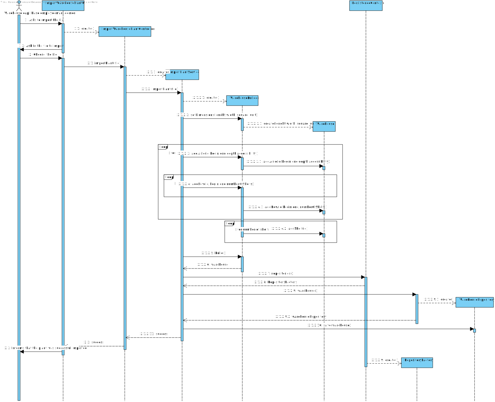

US 2001
=======================================

# 1. Requisitos

## **Demo:**

As Warehouse Employee, I want to set up the warehouse plant by uploading a JSON file.
 
 

### **AC:**

* 1: a pre-defined JSON file can be automatically upload (e.g. at application start-up) to get a default warehouse plant
  and avoiding the employee to execute this action.

### **Respostas no Forum:**

- Regarding the warehouse management, for the prototype we must consider a single one whose plant information is
  uploaded by a JSON file
- Each warehouse has its own plant and, therefore, plants might vary from one warehouse to another.

# 2. Análise

From the customer's answers and from the requirements document itself, we can conclude that if there is no plant in the
system the plant must be imported. If there is no JSON file to import the plant, the system should display an error
message. (TODO):Comfirmar)

In addition to importing the plant at the start of the application, the system should allow the user to choose the JSON
file to import the plant.

According to the customer's specifications, the "Aisles" dimensions are represented by 3 "dimensions": "Begin", "End"
and "Depth", in addition, it also has an attribute that represents the side accessible by the AGV.
The "Rows" are represented by two dimensions: "Begin" and "End".

The dimensions described above are used to represent in the plant matrix, as described in point 5.2 (page 15,16,17) of
the requirements document.

## Domain Model

## Load JSON file on start-up

When starting the application, the system should load and verify that a Warehouse plant exists in the database. Case
Otherwise, you must load the JSON file and save the plant in the database. (AC 1)

## Warehouse Employee upload a JSON file to import a plant

When Warehouse Employee imports the plant, the sequence of events is simple: The file is imported and the plant is
created and a success/failure message is displayed.

# 3. Design

## 3.1. Realização da Funcionalidade

### 3.1.1. Warehouse Employee faz o upload do ficheiro JSON para importar a planta.

We are using an layer structure desgn.:

- Domain Layer:
    - Warehouse
- Application Layer:
    - ImportWarehousePlantController
    - ImportPlantService
- Builder Layer:
    - WarehouseBuilder
- Repository Layer:
    - WarehouseRepository

### 3.1.2. No Start-up do Sistema

Design-wise, importing the plant on start-up is verry similar to the previous one. The only difference is that instead
of a UI on the start-up, the system must be able to import the plant from a JSON file if it is not already in the
repository.

## 3.3. Padrões Aplicados

- We used the builder pattern to create the Warehouse because it is an object that is created pass by pass. While
  reading the JSON file, the object is being created and once it's finished reading it is in a correct state and can be
  build.
- We used an application service to read the information from the JSON fine and save the Warehouse in the repository.

## 3.4. Testes

*Nesta secção deve sistematizar como os testes foram concebidos para permitir uma correta aferição da satisfação dos
requisitos.*

**Teste 1:** Verificar que não é possível criar uma instância da classe Warehouse com valores nulos.

	@Test(expected = IllegalArgumentException.class)
		public void ensureNullIsNotAllowed() {
		Wa instance = new Exemplo(null, null);
	}

# 4. Implementação

*Nesta secção a equipa deve providenciar, se necessário, algumas evidências de que a implementação está em conformidade
com o design efetuado. Para além disso, deve mencionar/descrever a existência de outros ficheiros (e.g. de configuração)
relevantes e destacar commits relevantes;*

*Recomenda-se que organize este conteúdo por subsecções.*

# 5. Integração/Demonstração

*Nesta secção a equipa deve descrever os esforços realizados no sentido de integrar a funcionalidade desenvolvida com as
restantes funcionalidades do sistema.*

# 6. Observações

*Nesta secção sugere-se que a equipa apresente uma perspetiva critica sobre o trabalho desenvolvido apontando, por
exemplo, outras alternativas e ou trabalhos futuros relacionados.*

