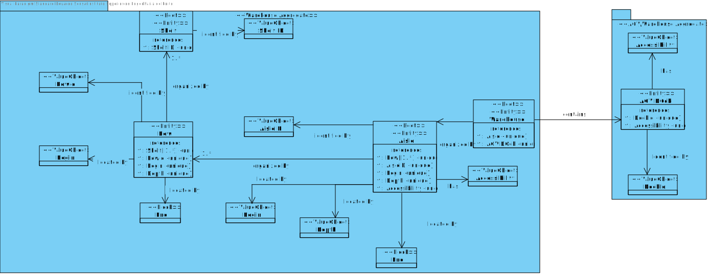

US 2001
=======================================

# 1. Requisitos

### **Demo:**

As Warehouse Employee, I want to set up the warehouse plant by uploading a JSON file.
 
 

### **AC:**

- a pre-defined JSON file can be automatically upload (e.g. at application start-up) to get a default warehouse plant
  and avoiding the employee to execute this action.

### **Respostas no Forum:**

- Regarding the warehouse management, for the prototype we must consider a single one whose plant information is
  uploaded by a JSON file
- Each warehouse has its own plant and, therefore, plants might vary from one warehouse to another.

# 2. Análise

Das respostas do cliente e do proprio documento de requisitos, podemos concluir que não existindo no sistema uma planta
deverá ser importada a planta.
Não existindo um ficheiro JSON para importar a planta, o sistema deverá apresentar uma mensagem de erro. (TODO:
Confirmar com o cliente)

Para além de importar a planta no início da aplicação, o sistema deverá permitir ao utilizador escolher o ficheiro JSON
para importar a planta.

Pelas especificações do cliente, as dimensoes dos "Aisles" são representadas por 3 "dimensões": "Begin", "End" e "Depth"
, para alem disso, tambem tem um atributo que reprensenta o lado acessivel pelo AGV.
As "Rows" são representadas por duas dimensões: "Begin" e "End".

As dimensões descritas acima são usadas para representar na matriz de planta, como é descrito no ponto 5.2 (pag. 15, 16,17) do documento de requisitos.

## Domain Model

## Load JSON file on start-up

## Warehouse Employee upload a JSON file to import a plant

# 3. Design

*Nesta secção a equipa deve descrever o design adotado para satisfazer a funcionalidade. Entre outros, a equipa deve
apresentar diagrama(s) de realização da funcionalidade, diagrama(s) de classes, identificação de padrões aplicados e
quais foram os principais testes especificados para validar a funcionalidade.*

*Para além das secções sugeridas, podem ser incluídas outras.*

## 3.1. Realização da Funcionalidade

### Class Diagram

### Sequence Diagram

## 3.3. Padrões Aplicados

## 3.4. Testes

*Nesta secção deve sistematizar como os testes foram concebidos para permitir uma correta aferição da satisfação dos
requisitos.*

**Teste 1:** Verificar que não é possível criar uma instância da classe Exemplo com valores nulos.

	@Test(expected = IllegalArgumentException.class)
		public void ensureNullIsNotAllowed() {
		Exemplo instance = new Exemplo(null, null);
	}

# 4. Implementação

*Nesta secção a equipa deve providenciar, se necessário, algumas evidências de que a implementação está em conformidade
com o design efetuado. Para além disso, deve mencionar/descrever a existência de outros ficheiros (e.g. de configuração)
relevantes e destacar commits relevantes;*

*Recomenda-se que organize este conteúdo por subsecções.*

# 5. Integração/Demonstração

*Nesta secção a equipa deve descrever os esforços realizados no sentido de integrar a funcionalidade desenvolvida com as
restantes funcionalidades do sistema.*

# 6. Observações

*Nesta secção sugere-se que a equipa apresente uma perspetiva critica sobre o trabalho desenvolvido apontando, por
exemplo, outras alternativas e ou trabalhos futuros relacionados.*

