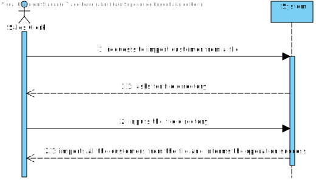
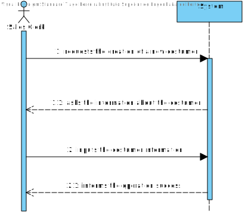
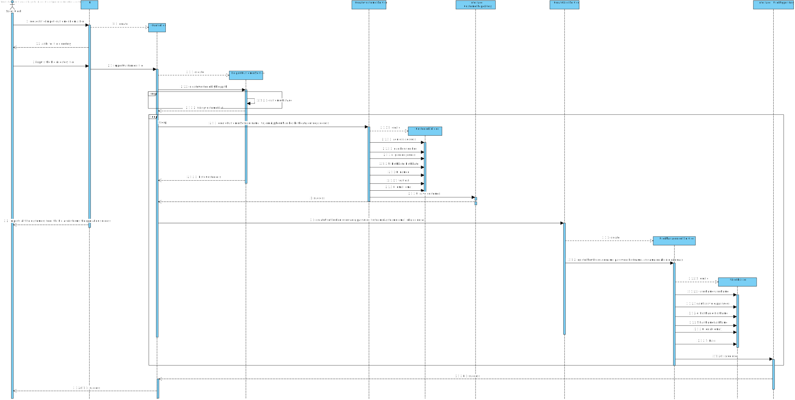

# US 1003
=======================================

# 1. Requisitos

**User Story:** As Sales Clerk, I want to register a new customer.

* There are three direct ways to create a new customer:
  * The customer accesses the application (without being authenticated) and proceeds to
    his/herself registration. The customer account needs to be further activated, otherwise
    the customer cannot access the system.
  * The registration is manually performed by a clerk. No account activation is required
  * Alternatively, customers info might be imported from a text file generated by an external
    system. Multiple text file formats need to be supported (e.g.: CSV, XML).

# 2. Análise

##Text File Generation

  * Multiple text file formats needs to be supported (eg.: CSV,XML)
  * Sales Clerk is responsible for importing the clients.
  * The System must notice the rows who don't follow the format, if  that happens, it must inform the user and skip to the next row.
  * The program should notify the customer that his account was created and send the password. 
  * The program should also send ,to the customer, a link able to change the customer password. 

##Sales Clerk Manually Creation

  * The registration is manually performed by a clerk. 
  * If the Sales Clerk wrongly inputs the customer information, the system must ask to input that same information again.
  * No account activation is required.
  * The program should notify the customer that his account was created and send the password.
  * The program should also send ,to the customer, a link able to change the customer password.

##Domain Model

##Regarding the Customer

* **Customer Responsability** : responsible to keep his/her own personal information updated, to create orders and
  follow their status and answer a survey questionnaire when requested and at his/her willing. 
* The minimum required information is its name, a valid Value-Added Tax (VAT) identifier, an email address, and a phone number.

* Optionally, customers might state their birthdate and gender and have/manage several billing and delivering postal addresses.

* The delivering postal  addresses should be kept updated  by customer during the ordering process, namely while they are concluding a new
  clientOrder.
* Every customer also has a unique identifier that is automatically generated by the system at
   the customer registration time.
* Customers and other kind of users frequently access the system to browse and search for products

# 3. Design

*Nesta secção a equipa deve descrever o design adotado para satisfazer a funcionalidade. Entre outros, a equipa deve apresentar diagrama(s) de realização da funcionalidade, diagrama(s) de classes, identificação de padrões aplicados e quais foram os principais testes especificados para validar a funcionalidade.*

*Para além das secções sugeridas, podem ser incluídas outras.*

## 3.1. Realização da Funcionalidade

###Sales Clerk Manual Customer Creation

###Sales Clerk Import Customer File

## 3.2. Diagrama de Classes

###Sales Clerk Manual Customer Creation

###Sales Clerk Import Customer File 

## 3.3. Padrões Aplicados

###Sales Clerk Manual Customer Creation 
* For this project we will maintain the UI-Controller interaction, the UI will interact with the
user, requesting information about the object eapli.base.customermanagement.domain.Customer which will then be sent to the Controller.
* The Controller will generate the eapli.base.customermanagement.domain.Customer object.
* The CustomerRepositoryJPAImp class will be responsible to add the object into the database.

## 3.4. Testes
*Nesta secção deve sistematizar como os testes foram concebidos para permitir uma correta aferição da satisfação dos requisitos.*

**Teste 1:** Verificar que não é possível criar uma instância da classe Exemplo com valores nulos.

	@Test(expected = IllegalArgumentException.class)
		public void ensureNullIsNotAllowed() {
		Exemplo instance = new Exemplo(null, null);
	}

# 4. Implementação

*Nesta secção a equipa deve providenciar, se necessário, algumas evidências de que a implementação está em conformidade com o design efetuado. Para além disso, deve mencionar/descrever a existência de outros ficheiros (e.g. de configuração) relevantes e destacar commits relevantes;*

*Recomenda-se que organize este conteúdo por subsecções.*

# 5. Integração/Demonstração

*Nesta secção a equipa deve descrever os esforços realizados no sentido de integrar a funcionalidade desenvolvida com as restantes funcionalidades do sistema.*

# 6. Observações

*Nesta secção sugere-se que a equipa apresente uma perspetiva critica sobre o trabalho desenvolvido apontando, por exemplo, outras alternativas e ou trabalhos futuros relacionados.*

