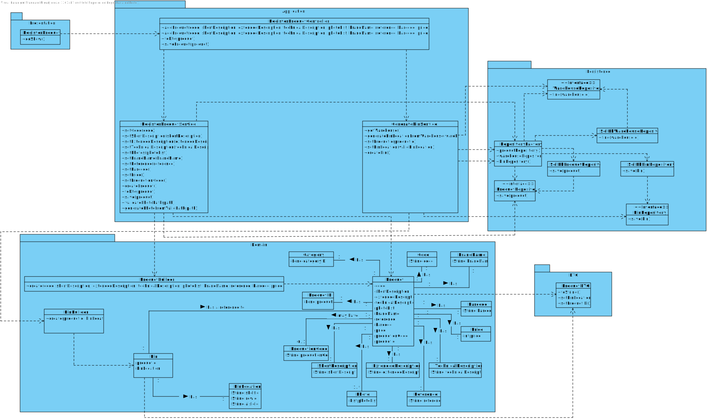

# US1001
=======================================

# 1. Requisitos

As a Sales Clerk, I want to specify a new product for sale.

* Specify a new product. A product specification comprehends multiple attributes (cf. section 2.1).
  * a. A product might be manually created by a salesclerk by typing (or selecting) all the mandatory data required to be clientOrder by a customer.
  * b. Alternatively, products might be imported from a text file generated by an external system. Multiple text file formats need to be supported (e.g.: CSV, XML).
  * c. Imported products might have some missing information (e.g.: its warehouse location), which can be further added by the salesclerk.

# 2. Análise

## 2.1. System Sequence Diagram (SSD)

## 2.2. Domain Model Excerpt (DM)

# 3. Design

## 3.1. Sequence Diagram (SD)

## 3.2. Class Diagram (CD)

## 3.3. Padrões Aplicados

*Nesta secção deve apresentar e explicar quais e como foram os padrões de design aplicados e as melhores práticas.*

## 3.4. Testes

# 4. Implementação

*Nesta secção a equipa deve providenciar, se necessário, algumas evidências de que a implementação está em conformidade com o design efetuado. Para além disso, deve mencionar/descrever a existência de outros ficheiros (e.g. de configuração) relevantes e destacar commits relevantes;*

*Recomenda-se que organize este conteúdo por subsecções.*

# 5. Integração/Demonstração

*Nesta secção a equipa deve descrever os esforços realizados no sentido de integrar a funcionalidade desenvolvida com as restantes funcionalidades do sistema.*

# 6. Observações

*Nesta secção sugere-se que a equipa apresente uma perspetiva critica sobre o trabalho desenvolvido apontando, por exemplo, outras alternativas e ou trabalhos futuros relacionados.*
