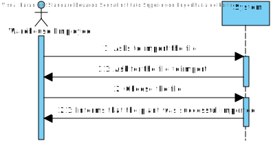

US 2001
=======================================

# 1. Requisitos

## **Demo:**

As Warehouse Employee, I want to set up the warehouse plant by uploading a JSON file.
<br>
<br>

### **AC:**

* 1: a pre-defined JSON file can be automatically upload (e.g. at application start-up) to get a default warehouse plant
  and avoiding the employee to execute this action.

### **Respostas no Forum:**

- Regarding the warehouse management, for the prototype we must consider a single one whose plant information is
  uploaded by a JSON file
- Each warehouse has its own plant and, therefore, plants might vary from one warehouse to another.
- US 2001 is just to set up the warehouse plant by uploading a file. As so, it is not necessary to graphically display
  the warehouse plant. Moreover, notice that a warehouse plant will be displayed in the scope of US 2005 (web dashboard,
  in sprint C).

# 2. Análise

From the customer's answers and from the requirements document itself, we can conclude that if there is no plant in the
system the plant must be imported. If there is no file to import the plant, the system should display an error message.

In addition to importing the plant at the start of the application, the system should allow the user to choose the JSON
file to import the plant.

According to the customer's specifications, the "Aisles" dimensions are represented by 3 "dimensions": "Begin", "End"
and "Depth", in addition, it also has an attribute that represents the side accessible by the AGV.
The "Rows" are represented by two dimensions: "Begin" and "End".

The dimensions described above are used to represent in the plant matrix, as described in point 5.2 (page 15,16,17) of
the requirements document.

## Domain Model

We are working within only one aggregate, the warehouse. The AGV dock is an entity that is shared by the wareouse
aggregate and the AGV aggregate, so we represent it outside the warehouse aggregate.


## Load JSON file on start-up

When starting the application, the system should load and verify that a Warehouse plant exists in the database. Case
Otherwise, you must load the JSON file and save the plant in the database. (AC 1)

## Warehouse Employee upload a JSON file to import a plant



When the Employee imports the plant, the sequence of events is simple: The file is imported and the plant is
created and a success/failure message is displayed.

# 3. Design

## 3.1. Realização da Funcionalidade

### 3.1.1. Warehouse Employee faz o upload do ficheiro JSON para importar a planta.

We are using a layer structure design.:

- Domain Layer:
    - Warehouse
- Application Layer:
    - ImportWarehousePlantController
    - ImportPlantService
- Builder Layer:
    - WarehouseBuilder
- Repository Layer:
    - WarehouseRepository


#### How is the Service created?


### 3.1.2. No Start-up do Sistema

Design-wise, importing the plant on start-up is very similar to the previous one. The only difference is that instead
of a UI on the start-up, the system must be able to import the plant from a JSON file if it is not already in the
repository.

## 3.3. Padrões Aplicados

- We used the builder pattern to create the Warehouse because it is an object that is created pass by pass. While
  reading the JSON file, the object is being created and once it's finished reading it is in a correct state and can be
  build.
- We used an application service to read the information from the file and save the Warehouse in the repository. In
  order to be able to be able to dinamically support different file formats, we used the parterns Factory to create
  different services.

## 3.4. Testes

**It is crutial to test the builder class since it is the "core" of this use case.**


**Teste 1:** Create an valid Warehouse

```
void simpleWarehouseTest() {
        WarehouseBuilder warehouseBuilder = new WarehouseBuilder()
          .withLength(20)
          .withWidth(30)
          .withSquare(1)
          .withUnit("m")
          .addAgvDock(String.valueOf(1), new Location(5, 4), new Location(5, 5), new Location(6, 6), Accessibility.LENGHT_PLUS)
          .addAgvDock(String.valueOf(2), new Location(10, 4), new Location(10, 5), new Location(10, 6), Accessibility.WIDTH_MINUS)
          .addAisle(1, new Location(0, 1), new Location(0, 6), new Location(3, 3), Accessibility.LENGHT_PLUS)
          .addAisle(2, new Location(10, 15), new Location(10, 20), new Location(15, 15), Accessibility.WIDTH_MINUS)
          .addRow(1, 1, new Location(0, 1), new Location(0, 2), 5)
          .addRow(1, 2, new Location(0, 2), new Location(0, 3), 10)
          .addRow(2, 1, new Location(10, 15), new Location(10, 16), 5)
          .withName("A Simple Warehouse");

        Warehouse warehouse = warehouseBuilder.build();
        assertNotNull(warehouse);
        //aisles
        assertEquals(2, warehouse.aisles().size());
    }
```

**Teste 2:** Try to create an invalid Warehouse, try to associate a row with an aisle that doesn't exist

```
@Test
void tryToAddRowsToAislesThatDontExist() {
WarehouseBuilder warehouseBuilder = new WarehouseBuilder()
.addAgvDock(String.valueOf(1), new Location(5, 4), new Location(5, 5), new Location(6, 6), Accessibility.LENGHT_PLUS)
.addAgvDock(String.valueOf(2), new Location(10, 4), new Location(10, 5), new Location(10, 6), Accessibility.WIDTH_MINUS)
.addAisle(1, new Location(0, 1), new Location(0, 6), new Location(3, 3), Accessibility.LENGHT_PLUS)
.addAisle(2, new Location(10, 15), new Location(10, 20), new Location(15, 15), Accessibility.WIDTH_MINUS)
.addRow(1, 1, new Location(0, 1), new Location(0, 2), 5)
.addRow(1, 2, new Location(0, 2), new Location(0, 3), 10)
.addRow(2, 1, new Location(10, 15), new Location(10, 16), 5)
.withName("No Rows :(");


        Location l1 = new Location(20, 20);
        Location l2 = new Location(20, 21);

        Exception e = Assertions.assertThrows(IllegalArgumentException.class, () -> warehouseBuilder.addRow(3, 2, l1, l2, 10));
        assertEquals("Aisle with id 3 does not exist", e.getMessage());
    }
```

# 4. Implementação

Since one of the requirements was to be able to read the information from a file on the start of the application, we
opted for keeping the path to the file in the application properties. This way, we can change the path to the file. We
use the class ApplicationSettings to read the path from the properties file.

# 5. Integração/Demonstração

It was added a new UI to the application, also we added a new menu deddicated for the warehouse management. For now, the
only has the option to import a warehouse plant, but it will be extended in the future.

When creating a new product, it is necessary to add his location in the warehouse. To do this, it will be necessary to
devleop a new functionality that will choose one of the available locations for the product. This functionality will be
implemented in the scope of US1001.

When configuring an AGV, it is necessary to add the location of the dock. So, here we have a point of connection
between the two parts of the application.
