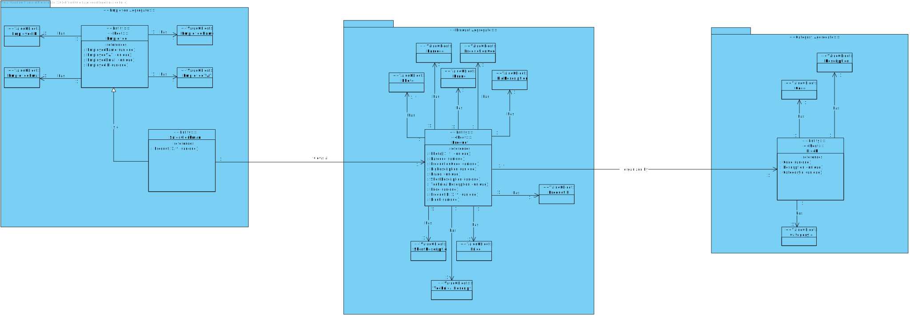
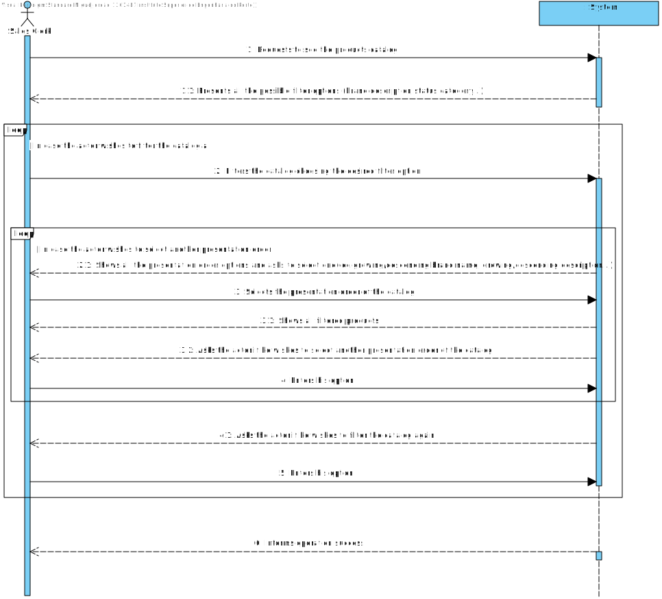
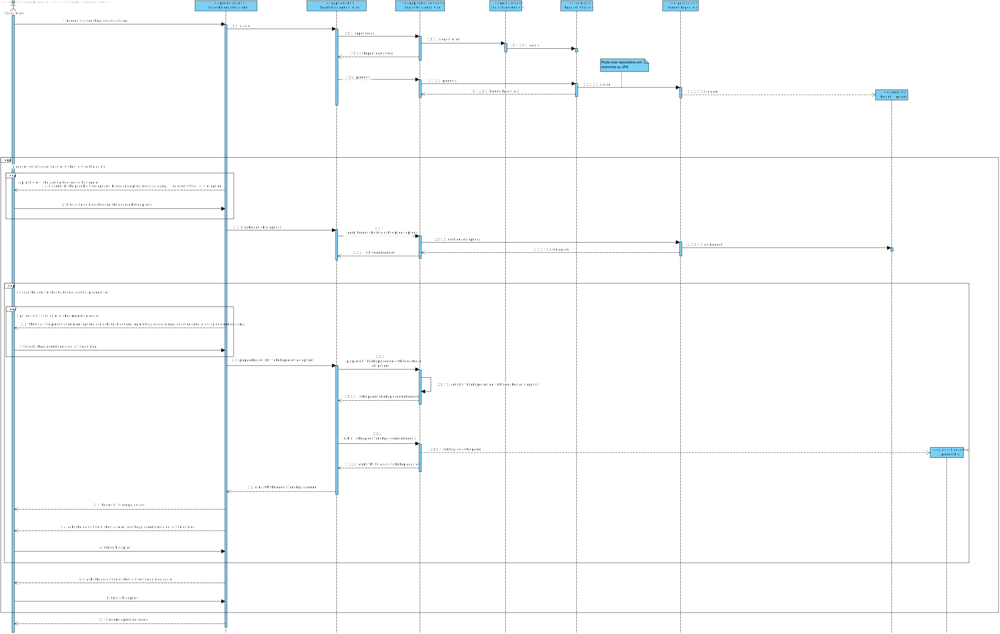

US1002
=======================================

# 1. Requisitos

As Sales Clerk, I want to view/search the products catalog.

* Browse and search the products catalog. With the purpose of ordering and/or as a mean to complete other functionality, several users need to browse and search the products catalog.
  
  + **a.** It must support filtering and sorting operations by one or more product attributes (e.g.:category, brand, description, status).
  + **b.** The filtered products catalog should be exported to a CSV file.
  + **c.** Add any listed product to the (customer) shopping cart.

 

**Demo**

- Demo 1.1 In this specific sprint, we will only focus in the option **a.** as stated previously.

  + In order to make this demo happen, we first have to analyze what is demanded in this Use Case scenario and what the client has said in the forum.
  + We are going to make a feature in our program that is going to list all available products with or without a filter and then show it to the User.
  + This filter option may be optional and is going to focus mainly in "category", "brand", "description", as stated by the client.  

# 2. Análise

## Brief approach

Before making any rash decisions, we must see the whole scenario, since the moment that the feature starts until its end. From the client answers it's possible to deduce that:
 * In the beginning, the system is going to present to the actor the option to filter, or not, the products list. The actor can enter multiple filter options, but cannot repeat filter options (e.g.: if he enters the brand filter option he cannot choose again the same option).

 

 * Afterwards, when the actor doesn't want to enter more options, the system is going to ask the actor if he wishes to order the product list by some specific order.

  

 * In the end, the system is going to show the product list with, or without, a specific order.

**Note : This is all information that the client provided in the forum.**

 

In order to represent this way of thinking better, we decided to create some artifacts in order to "illustrate" the Use Case itself.

## DM (Domain Model)

The first artifact done was the Domain Model, an abstract illustration of the business concept of this Use Case.

The same artifact applies the DDD pattern in order to illustrate the business concept. Shows all domain concepts relevant to this Use Case, making a clear representation of all business concepts.

## SSD (System Sequence Diagram)

The second artifact done in this section, analysis, was the System Sequence Diagram, where it clearly specifies the interaction between the System and the Actor, in this case, the Sales Clerk.

As we can see in the diagram, the exact interaction between the actor and the system is illustrated. We can choose multiple filter options and then choose a listing order.

##Conclusion

After this analysis, now we have all the information gather to start the design part, the design artifacts.

# 3. Design

###Brief approach

 Now we can start the "implementation", in other words, the design of the system itself, where we "draw" our ideias and make a "sketch" of the same. 

### SD (Sequence Diagram)

 The first diagram created in this section was the Sequence Diagram, where we illustrate how the system operates in this Use Case. 

 
 In order to analyze this diagram better, I would recommend the reader to open the file and see step by step how the system operates, that is exactly the same as stated previously in the analysis.
Now we know how the system will operate, step by step, and we can add additional artifacts to illustrate the system working. 

## 3.1. Realização da Funcionalidade

We are using a layer structure design.:
- Domain Layer:
    - Product
- Application Layer:
    - SearchCatalogController
    - SearchCatalogService
- Repository Layer:
    - ProductRepository

## 3.2. Diagrama de Classes

This artifact, as stated previously, it's complementary to the design part, only serves to make it richer.

## 3.3. Padrões Aplicados

* GRASI (Information Expert, Creator, Controller, Low Coupling (evaluative), High Coesion(evaluative), Polymorphism, Pure Fabrication, Indirection, Protected Variations);
* Tell, don't ask;
* Single Responsibility Principle;
* Interface Segregation Principle;
* Intention Revealing Interfaces;
* DDD (Persistence Ignorance, Entity, Value Object, Domain Service, Aggregate, Domain Event, Observer, Events)
* Repositories pattern;
* Services pattern;  
* Dependency Inversion Principle.

This are the mainly patterns applied while developing the artifacts and a valid approach to the Use Case itself.

## 3.4. Testes

Since this Use Case only relies on domain concepts already implemented by other user stories, the only tests possible are the "SmokeTests", that test the functional part of the use case itself.

**Teste 1:** Smoke test to show the catalog without options.

	@Test(expected = IllegalArgumentException.class)
		public void ensureNullIsNotAllowed() {
		Exemplo instance = new Exemplo(null, null);
	}

**Teste 2:** Smoke test to show the catalog with options.

    @Test

**Teste 3:** Smoke test to show the catalog without options, and a representation order.

    @Test

**Teste 4:** Smoke test to show the catalog with options, and a representation order.

    @Test

# 4. Implementação

Since the requirements of this Use Case was able to see all products with filters, or without, and represent them with a order, or not, we opted to make a service to filter the product list and sort it (considering the options introduced by the Actor), this way we can abstract the Controller, Application Layer, from the Repository Layer, applying this way the best as we can the Grap Pattern.

# 5. Integração/Demonstração

It was added a new UI to the application, also we added a new menu dedicated for the catalog management. For now, the
only has the option is to see the product catalog, but it will be extended in the future.

 

When the system must list all products, it is necessary to list them using implementation made in US1001 and US1005. To do this, it will be necessary to
develop a new functionality, a service, that will filter/sort the product list.

# 6. Observações

I think our interpretation of the Use case was the best as possible, since we treated all possible input making it impossible to have "incorrect data" (all data must be according to the patterns specified by the client), and the way we show the result list is in a great quality, since we use the DTO pattern and instead of sending the domain concept object to the UI we send a DTO of the same, only having the necessary information to the actor.