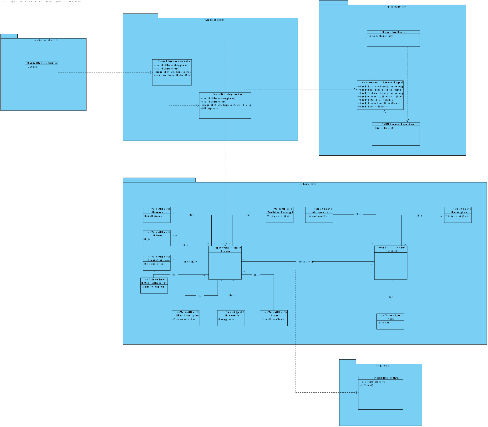

US1002
=======================================

# 1. Requirements

As Sales Clerk, I want to view/search the products catalog.

* Browse and search the products catalog. With the purpose of ordering and/or as a mean to complete other functionality, several users need to browse and search the products catalog.
  
  + **a.** It must support filtering and sorting operations by one or more product attributes (e.g.: category, brand, description, status).
  + **b.** The filtered products catalog should be exported to a CSV file.
  + **c.** Add any listed product to the (customer) shopping cart.

 

**Demo**

- Demo 1.1: In this sprint, we will only focus in the first Use Case (**a.**).

  + In order to make this demo happen, we first have to analyze what is demanded in this Use Case scenario and what the client has said in the forum.
  + We are going to make a feature in our program that is going to list all the available products with or without a filter and then show it to the User.
  + This filter option may be optional and is going to focus mainly in "category", "brand", "description", as stated by the client.  

# 2. Analysis

## Brief approach

Before making any rash decisions, we must see the whole scenario since the moment that the feature starts until its end. From the client answers, it is possible to deduce that:
 * In the beginning, the system is going to present to the actor the option to filter (or not) the products list. The actor can enter multiple filter options, but cannot repeat filter options (e.g.: if he enters the brand filter option he cannot choose it again).

 * Afterwards, when the actor doesn't want to enter more options, the system is going to ask the actor if he wishes to order the product list by some specific order.

 * In the end, the system is going to show the product list with (or without) the order specified.
 
**Note: This is all information that the client provided in the forum.**

 

In order to better represent this way of thinking, we decided to create some artifacts to "illustrate" the Use Case itself.

## DM (Domain Model)

The first artifact done was the Domain Model, an abstract illustration of the business concept of this Use Case.

This artifact applies the DDD pattern in order to illustrate the business concept. It shows all domain concepts relevant to this Use Case, making a clear representation of all business concepts.

## SSD (System Sequence Diagram)

The second artifact done in this section was the System Sequence Diagram, where it clearly specifies the interaction between the System and the Actor, which is, in this case, the Sales Clerk.

As we can see in the diagram, the exact interaction between the actor and the system is illustrated. We can choose multiple filter options and then choose a listing order.

## Conclusion

After this analysis, we have gathered all the information to start the design part, the design artifacts.

# 3. Design

## Brief approach

Now we can start the "implementation" or, in other words, the design of the system itself, where we "draw" our ideas and make a "sketch" of the same.

## SD (Sequence Diagram)

The first diagram created in this section was the Sequence Diagram, where we illustrate how the system operates in this Use Case.

In order to better analyze this diagram, I would recommend the reader to open the file and see step by step how the system operates, that is exactly the same as stated previously in the analysis.

Now we know how the system will operate, step by step, and we can add additional artifacts to illustrate the system working.

## 3.1. Functionality Realization

We are using a layer structure design:
- Domain Layer:
    - Product
- Application Layer:
    - SearchCatalogController
    - SearchCatalogService
- Repository Layer:
    - ProductRepository

## 3.2. CD (Class Diagram)

This artifact, as stated previously, it's complementary to the design part, only serves to make it more complete.

## 3.3. Applied Patterns

* GRASI (Information Expert, Creator, Controller, Low Coupling (evaluative), High Cohesion (evaluative), Polymorphism, Pure Fabrication, Indirection, Protected Variations);
  + Information Expert - The service, since has a direct connection with the repositories, in this case, knows all domain concepts from this specific Use Case;
  + Creator, the UI creates the controller, and the controller creates all needed services;
  + Low Coupling and High Cohesion, since we are using a lot of structured layers, all with a specific meaning, we are applying this pattern aswell;
  + Polymorphism, since a domain concept object may have multiple different values;
  + Pure Fabrication, since there is only 1 of each type of class created, meaning, in case of the controller and the UI they are only created one time;
  + The other patterns already were explained by previous points;
* Tell, don't ask;
  + Basic pattern, has a similar function as "Keep it simple", since both patterns apply simple interaction between actor - UI and UI - controller;
* Single Responsibility Principle;
* Interface Segregation Principle;
* Intention Revealing Interfaces;
* DDD (Persistence Ignorance, Entity, Value Object, Domain Service, Aggregate, Domain Event, Observer, Events);
  + This pattern was introduced in EAPLI, where we started working with this pattern. It is very important to fully understand this pattern, since it makes an implementation of a domain business concept way easier (and makes it easier to understand to outside people), Entities, value objects, services... All are well explained in the Geral Domain model and the glossary, so I think there is no need to explain this here;
* Repositories pattern;
  + This pattern applies a persistance context using repositories to have an easier communication between the run time system, and a remote database, where it makes the operation between the same atomic and simple transactions;
* Services pattern;
  + This pattern applies both to the domain and the application layer, in this specific Use Case it wasn't used services in the domain layer only in the Application layer, as stated previously to make an easier interaction between CONTROLLER - SERVICE - REPOSITORY;
* Dependency Inversion Principle.

These are the mainly patterns applied while developing the artifacts and a valid approach to the Use Case itself.

## 3.4. Tests

Since this Use Case only relies on domain concepts already implemented by other user stories, the only tests possible are the "SmokeTests", which test the functional part of the use case itself.

**Teste 1:** Smoke test to show mock the catalog feature.

	private void checkASimpleCatalog() {
        RegisterProductController controller = new RegisterProductController();

        //create 2 simple products
        Code CODE1 = Code.valueOf("P0001");
        Description SHORT_DESCRIPTION1 = Description.valueOf("Test short description");
        Description EXTENDED_DESCRIPTION1 = Description.valueOf("Test extended description");
        Description TECHNICAL_DESCRIPTION1 = Description.valueOf("Test technical description");
        BrandName BRAND_NAME1 = BrandName.valueOf("Test brand name");
        Reference REFERENCE1 = Reference.valueOf("Teste reference");
        Barcode BARCODE1 = Barcode.valueOf(1L);
        Money PRICE1 = Money.valueOf("10 EUR");
        List<String> PHOTO_LIST1 = new ArrayList<>();
        PHOTO_LIST1.add("Docs/Extra/Photos/livro.jpg");
        final ProductionCode PRODUCTION_CODE1 = ProductionCode.valueOf("PC1");

        try {
            controller.registerProductWithProductionCode(2, CODE1, SHORT_DESCRIPTION1, EXTENDED_DESCRIPTION1, TECHNICAL_DESCRIPTION1, BRAND_NAME1, REFERENCE1, BARCODE1, PRICE1, PHOTO_LIST1, PRODUCTION_CODE1);
        } catch (IOException e) {
            throw new RuntimeException(e);
        }

        //product 2
        Code CODE2 = Code.valueOf("P0002");
        Description SHORT_DESCRIPTION2 = Description.valueOf("Test short description");
        Description EXTENDED_DESCRIPTION2 = Description.valueOf("Test extended description");
        Description TECHNICAL_DESCRIPTION2 = Description.valueOf("Test technical description");
        BrandName BRAND_NAME2 = BrandName.valueOf("Test brand name");
        Reference REFERENCE2 = Reference.valueOf("Teste reference");
        Barcode BARCODE2 = Barcode.valueOf(2L);
        Money PRICE2 = Money.valueOf("10 EUR");
        List<String> PHOTO_LIST2 = new ArrayList<>();
        PHOTO_LIST2.add("Docs/Extra/Photos/livro.jpg");
        final ProductionCode PRODUCTION_CODE2 = ProductionCode.valueOf("PC2");

        try {
            controller.registerProductWithProductionCode(2, CODE2, SHORT_DESCRIPTION2, EXTENDED_DESCRIPTION2, TECHNICAL_DESCRIPTION2, BRAND_NAME2, REFERENCE2, BARCODE2, PRICE2, PHOTO_LIST2, PRODUCTION_CODE2);
        } catch (IOException e) {
            throw new RuntimeException(e);
        }

        //get catalog
        SearchCatalogController searchCatalogController = new SearchCatalogController();
        Iterable<ProductDTO> p = searchCatalogController.searchAllProducts();
        // check if there is 2 products with this short description
        List<ProductDTO> products = new ArrayList<>();
        p.forEach(products::add);
        if (products.stream().filter(product -> product.getShortDescription().equals(SHORT_DESCRIPTION1.toString())).count() < 2) {
            throw new IllegalStateException("There is not 2 products with this short description");
        }
        logger.info(("»»» Product Catalog"));

    }

# 4. Implementation

Since the requirements of this Use Case were to be able to see all products with or without filters and represent them with an order (or not), we opted to make a service to filter the product list and sort it (considering the options introduced by the Actor). This way we can abstract the Controller, Application Layer, from the Repository Layer, thus applying the Grap Pattern the best as we can.

# 5. Integration/Demonstration

It was added a new UI to the application and a new menu dedicated for the catalog management.
For now, the only option it has is to see the product catalog, but it will be extended in the future.

 

When the system must list all products, it is necessary to list them using implementation made in US1001 and US1005. To do this, it will be necessary to
develop a new functionality, a service, that will filter/sort the product list.

# 6. Observations

I think our interpretation of the Use Case was the best as possible, since we treated all possible input making it impossible to have "incorrect data" (all data must be according to the patterns specified by the client), and the way we show the result list is in a great quality, since we use the DTO pattern and instead of sending the domain concept object to the UI we send a DTO of the same, only having the necessary information to the actor.