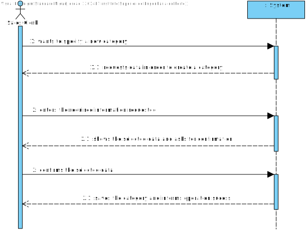

US1005
=======================================

# 1. Requirements

As Warehouse Employee, I want to configure the AGVs available on the warehouse.

* Create a new product category. A category is characterized by an alphanumeric code, a description, and, optionally, a reference to its super-category.
  
  
**Note:** According to some client answers that exist in the forum, the category doesn't need to have a reference to a super category! So we are going to procced in this Use Case with that in mind.

 

**Demo**

- Demo 1.1: - Create a new product category

    + In order to make this demo happen, we first have to analyze what is demanded in this Use Case scenario and what the client has said in the forum.
    
    + We are going to make a feature in our program that is going to create a new product category with specific information introduced by the Actor, which is, in this case, the Sales Clerk.
    
    + This information must obey some specific rules/patterns, such as: the code is a not empty alphanumeric code with at 10 chars maximum and the description can't be empty and must have a minimum of 20 chars and 50 chars maximum;
    
    + The same information cannot be empty and must carry a meaning in the business concept, so we must be careful when it is introduced in the system.

# 2. Analysis

## Brief approach

Before making any rash decisions, we must see the whole scenario, since the moment that the feature starts until its end. From the client answers, it is possible to deduce that:

* In the beginning, the system is going to ask the actor the necessary information, which is all mandatory, in order to create a category. The actor must obey the rules specified by the client when introducing this information.

* Afterwards, the system is going to create the category with the information entered by the Actor.

* In the end, the system is going to show the created category to the Actor and ask its confirmation in order to save it (persist it).

**Note: This is all information that the client provided in the forum.**

 

In order to better represent this way of thinking, we decided to create some artifacts to "illustrate" the Use Case itself.

## DM (Domain Model)

The first artifact done was the Domain Model, an abstract illustration of the business concept of this Use Case.

The same artifact applies the DDD pattern in order to illustrate the business concept. Shows all domain concepts relevant to this Use Case, making a clear representation of all business concepts that are used in this Use Case scenario.

## SSD (System Sequence Diagram)

The second artifact done in this section was the System Sequence Diagram, where it clearly specifies the interaction between the System and the Actor, which is, in this case, the Sales Clerk.

As we can see in the diagram, the exact interaction between the actor and the system is illustrated. The system is going to ask the Actor the mentioned information and then confirm if the actor wishes to save the category that was created.

## Conclusion

After this analysis, we have gathered all the information to start the design part, the design artifacts.

# 3. Design

## Brief approach

Now we can start the "implementation" or, in other words, the design of the system itself, where we "draw" our ideias and make a "sketch" of the same.

## SD (Sequence Diagram)

The first diagram created in this section was the Sequence Diagram, where we illustrate how the system operates in this Use Case.

In order to better analyze this diagram, I would recommend the reader to open the file and see step by step how the system operates, that is exactly the same as stated previously in the analysis.
Now we know how the system will operate, step by step, and we can add additional artifacts to illustrate the system working.

As we can see here, after the confirmation from the Actor, the category is persisted in order to be used by other Actors in other Use Cases, such as, for example, when creating a product.

## 3.1. Functionality Realization

We are using a layer structure design:
- Domain Layer:
    - Category
- Application Layer:
    - RegisterCategoryController
    - RegisterCategoryController
- Builder Layer:
    - CategoryBuilder
- Repository Layer:
    - CategoryRepository

## 3.2. CD (Class Diagram)

This artifact, as stated previously, it's complementary to the design part, only serves to make it more complete.

## 3.3. Applied Patterns

* GRASI (Information Expert, Creator, Controller, Low Coupling (evaluative), High Cohesion (evaluative), Polymorphism, Pure Fabrication, Indirection, Protected Variations);
  + Information Expert - The service, since has a direct connection with the repositories, in this case, knows all domain concepts from this specific Use Case;
  + Creator, the UI creates the controller, and the controller creates all needed services;
  + Low Coupling and High Cohesion, since we are using a lot of structured layers, all with a specific meaning, we are applying this pattern aswell;
  + Polymorphism, since a domain concept object may have multiple different values;
  + Pure Fabrication, since there is only 1 of each type of class created, meaning, in case of the controller and the UI they are only created one time;
  + The other patterns already were explained by previous points;
* Tell, don't ask;
  + Basic pattern, has a similar function as "Keep it simple", since both patterns apply simple interaction between actor - UI and UI - controller;
* Single Responsibility Principle;
* Interface Segregation Principle;
* Intention Revealing Interfaces;
* DDD (Persistence Ignorance, Entity, Value Object, Domain Service, Aggregate, Domain Event, Observer, Events);
  + This pattern was introduced in EAPLI, where we started working with this pattern. It is very important to fully understand this pattern, since it makes an implementation of a domain business concept way easier (and makes it easier to understand to outside people), Entities, value objects, services... All are well explained in the Geral Domain model and the glossary, so I think there is no need to explain this here;
* Repositories pattern;
  + This pattern applies a persistence context using repositories to have an easier communication between the run time system, and a remote database, where it makes the operation between the same atomic and simple transactions;
* Services pattern;
  + This pattern applies both to the domain, and the application layer, in this specific Use Case it wasn't used services in the domain layer only in the Application layer, as stated previously to make an easier interaction between CONTROLLER - SERVICE - REPOSITORY;
* Builder pattern;
  + This pattern is very important in this Use Case since it's the main "producer" of all categories in this Use Case. Is this pattern that has the responsibility to create, step by step, all categories available in the running time system and persisted in the database! So we decided to user a builder since it's simpler than a factory, and in this context, does a perfect job; 
* Dependency Inversion Principle.

* Dependency Inversion Principle.

These are the mainly patterns applied while developing the artifacts and a valid approach to the Use Case itself.

## 3.4. Tests

**Teste 1:** Ensure a Category can be created with valid information.

    @Test
    public void ensureCategoryWithDescriptionAndCode() {

        private static final Description DESCRIPTION_NAME = Description.valueOf("A valid description for tests!");
        private static final AlphaNumericCode ALPHA_NUMERIC_CODE = AlphaNumericCode.valueOf("C0001");

        new Category(DESCRIPTION_NAME, ALPHA_NUMERIC_CODE);
        assertTrue(true);
    }

**Teste 2:** Verify if an exception is raised when the description is null.

        @org.junit.Test(expected = IllegalArgumentException.class)
         public void ensureMustHaveDescription() {
         new Category(null, ALPHA_NUMERIC_CODE);
        }

**Teste 3:** Verify if an exception is raised when the alphanumeric code is null.

         @org.junit.Test(expected = IllegalArgumentException.class)
          public void ensureMustHaveCode() {
          new Category(DESCRIPTION_NAME, null);
         }

**Teste 4:** Ensure can not change the alphanumeric code to a null value.

        @org.junit.Test(expected = IllegalArgumentException.class)
            public void ensureCannotChangeCodeToNull() {
            final Category subject = buildCategory();

            final AlphaNumericCode newInfo = null;

             subject.update(newInfo, DESCRIPTION_NAME);
         }

**Teste 5:** Ensure can not change the description value.

         @org.junit.Test(expected = IllegalArgumentException.class)
            public void ensureCannotChangeDescriptionToNull() {
            final Category subject = buildCategory();

            final Description newInfo = null;

            subject.update(ALPHA_NUMERIC_CODE, newInfo);
         }

**Teste 6:** Ensure can change the alphanumeric code value.

            @Test
            public void ensureCanChangeCode() {
                final Category subject = buildCategory();

                final AlphaNumericCode newInfo = AlphaNumericCode.valueOf("C0003");

                subject.update(newInfo, DESCRIPTION_NAME);
             }

**Teste 7:** Ensure the category builder can build a category with a valid description, and a valid alphanumeric code.

        @Test
         public void ensureCanBuildCategoryWithDescriptionAndCode(){
           final Category subject = new CategoryBuilder().withADescription(DESCRIPTION).coded(ALPHA_NUMERIC_CODE).build();

            assertNotNull(subject);
        }

**Teste 8:** Ensure the category builder can not build a category with a invalid description, and a valid alpha code.

        @Test
        public void ensureCannotBuildCategoryWithDescriptionNull() {
            Exception e = Assertions.assertThrows(IllegalArgumentException.class, () -> new CategoryBuilder().withADescription(Description.valueOf("")).coded(ALPHA_NUMERIC_CODE).build());
            assertEquals("Description should neither be null nor empty",e.getMessage());

        }

**Teste 9:** Ensure the category builder can not build a category with valid description, and an invalid alphanumeric code.

        @Test
         public void ensureCannotBuildCategoryWithCodeNull() {
          Exception e = Assertions.assertThrows(IllegalArgumentException.class, () -> new CategoryBuilder().withADescription(DESCRIPTION).coded(AlphaNumericCode.valueOf("")).build());
          assertEquals("AlphaNumeric code should neither be null nor empty",e.getMessage());
        }

# 4. Implementation

Since the requirements of this Use Case were to be able to register a new category, we opted to make a service to register the category. This way we can abstract the Controller, Application Layer, from the Repository Layer, thus applying the Grap Pattern the best as we can.

# 5. Integration/Demonstration

It was added a new UI to the application, and a new menu dedicated for the category management.
For now, the only option it has is to register a new category, but it will be extended in the future.

 

This is an important Use Case, since a lot more Use Cases depend on this one, like the Use Case where a product will be registered, for example. If there weren't categories in the system, it wouldn't be possible to register new products, which would affect the Use Case where an order must be registered by a Sales Clerk, the same actor as this Use Case.

# 6. Observation

I think our interpretation of the Use Case was the best as possible, since we treated all possible input making it impossible to have "incorrect data" (all data must be according to the patterns specified by the client), and the way we show the category created is in a great quality, since we use the DTO pattern and instead of sending the domain concept object to the UI we send a DTO of the same, only having the necessary information to the actor.