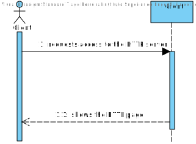
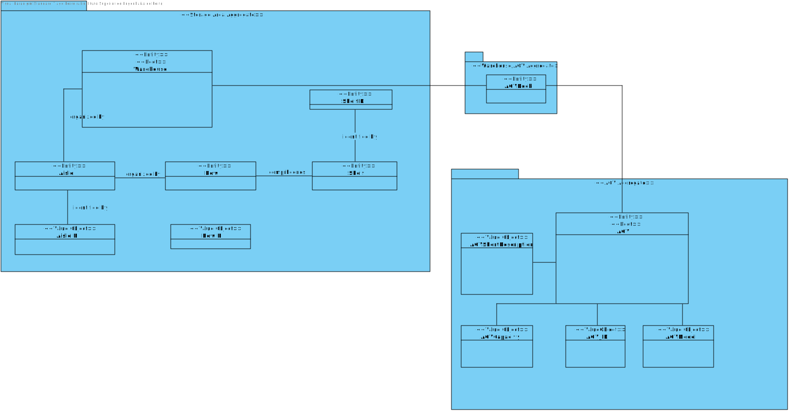
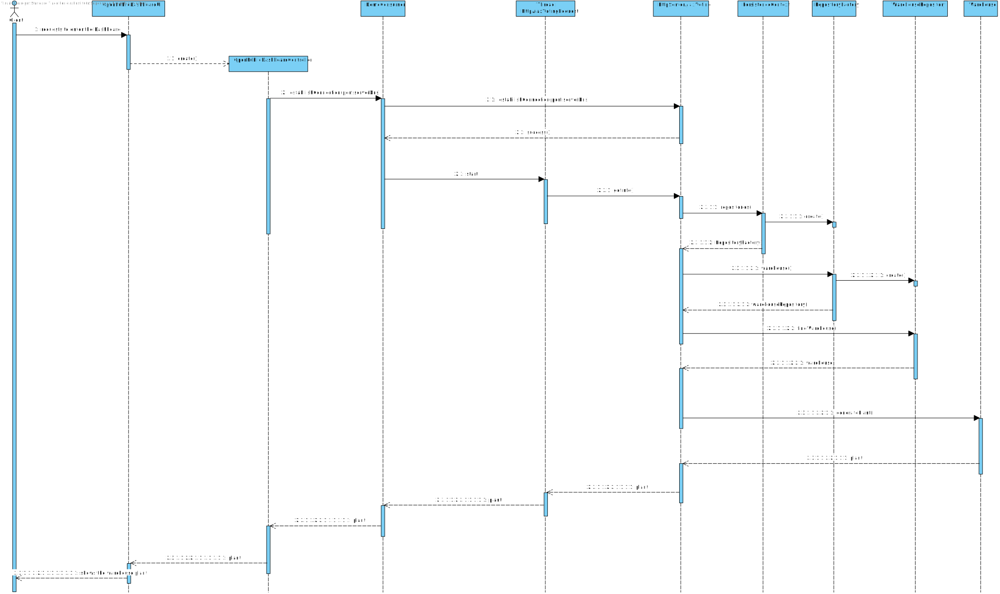
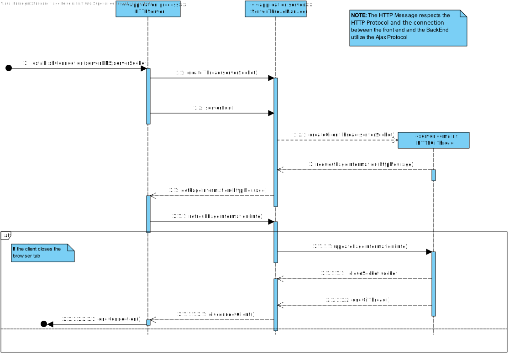
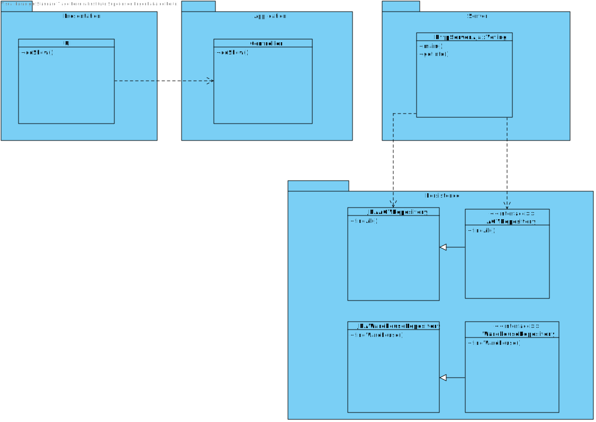

US 2005
=======================================

# 1. Requisitos

As Warehouse Employee, I want to open a web dashboard presenting the current status of the AGVs as well as their position in the warehouse layout and keeps updated

## 1.1 Acceptance Criteria:

* It must be used the provided application protocol (SPOMS2022).
* The dashboard is intended to be displayed on a web page provided by an existing HTTP server in the "BackOfficeApp" application and only available to localhost.
* The dashboard web page is kept updated without reloading.

**Demo**

- Demo 1.1: In this User story, we will only focus in the whole use case:

    + In order to make this demo happen, we first have to analyze what is demanded in this Use Case scenario and what the client has said in the forum;
    + We are going to make a feature that will open, locally, a page in our predefined browser which will show the status of the warehouse right now (the warehouse plant and the AGV status overall)
    + This dashboard will have a frontEnd part and a backEnd part, which is going to use HTTP Protocol (to send the messages between the client and the server) to create the HTTP Server
    + This communication will also use XTMLRequests, using the Ajax protocol (for that we must have a java script file to update the information in the page)
    + It is necessary to update this page in x minutes, so, for such, we must have the HTTPS Server running and updating, without the client reloading the page, the information in the page.

##1.2 Client Answers:

**Q1:** Regarding this US it is said that "It must be used the provided application protocol (SPOMS2022). The dashboard is intended to be displayed on a web page provided by an existing HTTP server in the ""BackOfficeApp"" application (...)".

Our question is, between what applications should the SPOMS protocol be implemented? Should the HTTP server be part of the "BackOfficeApp" and communicate with the AGV Manager using the REQUESTS_API? Or should the HTTP server be its own application and communicate only with the "BackOfficeApp", which on the other hand communicates directly with the database?

**A1:** As it is being said the "HTTP Server" is part of the "Backoffice Application" in order to provide a local web page only. As so, the "HTTP Server" is a component of the "Backoffice Application".

However, a question stands out: where the data to be presented by the "HTTP server" comes from?

The "backoffice Application" (or one of its components) must, somehow, get the data from the "AGV Manager" (and/or the system database).

In addition, you should notice that the SPOMS2002 protocol relies on the TCP and not on HTTP.

# 2. Análise

## 2.1. Brief approach

Before making any rash decisions, we must see the whole scenario since the moment that the feature starts until its end. From the client answers, it is possible to deduce that:

* The **Dashboard** must be connected to the **HTTP** server, which will always
provide updates to it, when there is changes to the **AGVs** at the **Warehouse**.

* The **HTTP** server is part of the **Backoffice Application**. This server, will be
responsible to access the **Database** to be able to access the **Warehouse** plant
and whenever there is updates on the **AGVs**. The server is responsible to check
if there were any changes to the **Warehouse** plant.

* The user will directly access the **HTTP** web page, with the **Warehouse** plant,
the program will provide a link to it, which will automatically open in the **User**
computer.

**Note: This is all information that the client provided in the forum.**

 

In order to better represent this way of thinking, we decided to create some artifacts to "illustrate" the Use Case itself.

## 2.2. System Sequence Diagram (SSD)

The first artifact is divided in two since this US uses the same logic as a previous US (the catalog one) ,which specifies that this section was the System Sequence Diagram, where it clearly specifies the interaction between the System and the Actor, which is, in this case, the customer itself.

As we can see in the diagram, the exact interaction between the actor and the system is illustrated. We must enter all information demanded by the system (some are not mandatory).

## 2.3. Domain Model Excerpt (DM)

The second artifact applies the DDD pattern in order to illustrate the business concept. It shows all domain concepts relevant to this Use Case, making a clear representation of all business concepts.

##  2.4. Conclusion

After this analysis, we have gathered all the information to start the design part, the design artifacts.

# 3. Design

## 3.1. Brief approach

Now we can start the "implementation" or, in other words, the design of the system itself, where we "draw" our ideas and make a "sketch" of the same.

## 3.2. Sequence Diagram (SD)

The first diagram created in this section was the Sequence Diagram, where we illustrate how the system operates in this Use Case.

In order to better analyze this diagram, I would recommend the reader to open the file and see step by step how the system operates, that is exactly the same as stated previously in the analysis.

As we can see on this **SD**, the only thing that the **UI** and the **Controller** wil provide to
the user is a link to the **HTTP** page, which will take the user directly to the web page,

The interaction between the client and the **HTTPS server** is illustrated in another SD

Now we know how the system will operate, step by step, and we can add additional artifacts to illustrate the system working.
As we mention before, this feature will be constantly communicating with the **HTTP server** to retrieve all the needed information since the **BackOfficeApplication** shouldn't communicate with the database directly.

To formart the **HTTP server** webpage, we used **HTTP CSS Style** and **JavaScript** to create the **DashBoard** requested by the client.

## 3.3. Class Diagram (CD)

The **UI** and the **Controller** will never directly interact with the server. 

## 3.4. Functionality Realization

We are using a layer structure design:

- Application Layer:
    - OpenDashBoardUI
    - OpenDashBoardController
- Server Application layer:
    - HTTPServer
    - ServerThreadManager
- Server Domain Layer:
    - HTTPCliThread
    
## 3.5. Padrões Aplicados

* GRASI (Information Expert, Creator, Controller, Low Coupling (evaluative), High Cohesion (evaluative), Polymorphism, Pure Fabrication, Indirection, Protected Variations);
    + Information Expert - The service, since has a direct connection with the repositories, in this case, knows all domain concepts from this specific Use Case;
    + Creator, the UI creates the controller, and the controller creates all needed services;
    + Low Coupling and High Cohesion, since we are using a lot of structured layers, all with a specific meaning, we are applying this pattern aswell;
    + Pure Fabrication, since there is only 1 of each type of class created, meaning, in case of the controller and the UI they are only created one time;
    + The other patterns already were explained by previous points;
* Tell, don't ask;
    + Basic pattern, has a similar function as "Keep it simple", since both patterns apply simple interaction between actor - UI and UI - controller;
* Single Responsibility Principle;
* Interface Segregation Principle;
* DDD (Persistence Ignorance, Entity, Value Object, Domain Service, Aggregate, Domain Event, Observer, Events);
    + This pattern was introduced in EAPLI, where we started working with this pattern. It is very important to fully understand this pattern, since it makes an implementation of a domain business concept way easier (and makes it easier to understand to outside people), Entities, value objects, services... All are well explained in the Geral Domain model and the glossary, so I think there is no need to explain this here;
* Services pattern;
    + This pattern applies both to the domain and the application layer, in this specific Use Case it wasn't used services in the domain layer only in the Application layer, as stated previously to make an easier interaction between CONTROLLER - SERVICE - REPOSITORY;
* Client - Server pattern;
    + The name of this interaction doesn't have properly this name, but, since we didn't found any specific pattern that would describe what we utilized here, we decided to have this name to illustrate the fact that we utilize servers to communicate with the client/backOffice applications and the servers (using the SPOMS protocol)
    
## Tests

###Test 1: Testing the HTTP connection

    package eapli.base.infrastructure.smoketests;
    import eapli.base.httpsServer.domain.HTTPmessage;
    import eapli.framework.actions.Action;
    import org.slf4j.LoggerFactory;
    import org.slf4j.Logger;
    import java.io.DataInputStream;
    import java.io.DataOutputStream;
    import java.io.IOException;
    import java.net.*;

    public class AccessDashBoardSmokTest implements Action {
    private static Socket sock;
    private static InetAddress serverIP;
    private static int serverPort;
    private static DataOutputStream sOut;
    private static DataInputStream sIn;

    private final static String PORT = "30639";
    private final static String DNS = "vs-gate.dei.isep.ipp.pt";

    private static final Logger LOGGER = LoggerFactory.getLogger(AccessDashBoardSmokTest.class);

    @Override
    public boolean execute() {

        try {
            serverIP = InetAddress.getByName(DNS);
        } catch (UnknownHostException ex) {
            LOGGER.error("Invalid SERVER-ADDRESS." + DNS);
            return false;
        }

        try {
            serverPort = Integer.parseInt(PORT);
        } catch (NumberFormatException ex) {
            LOGGER.error("Invalid SERVER-PORT." + PORT);
            return false;
        }

        HTTPmessage request = new HTTPmessage();
        request.setRequestMethod("GET");
        request.setURI("/info");

        try {
            sock = new Socket(serverIP, serverPort);
        } catch (IOException ex) {
            LOGGER.error("Failed to connect to provided SERVER-ADDRESS and SERVER-PORT.");
            LOGGER.error("Application aborted.");
            return false;
        }

        try {
            sOut = new DataOutputStream(sock.getOutputStream());
            sIn = new DataInputStream(sock.getInputStream());
        } catch (IOException ex) {
            LOGGER.error("Error accessing socket's streams. Aborted.");
            try {
                sock.close();
            } catch (IOException ex2) {
                LOGGER.error("Error closing socket.");
                return false;
            }
            LOGGER.warn("Application aborted.");
            return false;
        }

        try {
            request.send(sOut);                // send HTTP request

            HTTPmessage response = new HTTPmessage(sIn);    // receive HTTP response
            LOGGER.info("HTTP server response status: " + response.getStatus());
        } catch (IOException e) {
            return false;
        }

        try {
            sock.close();
        } catch (IOException ex2) {
            LOGGER.error("Error closing socket.");
            return false;
        }

        return true;
    }
    }

# 4. Implementation

Since the requirements of this Use Case was to be able to open the Dashboard which contains the information of the current status of the warehouse (the plant) and the current status of all AGVs, and be refreshed minute by minute, we implemented patterns which allowed us to make this feature way simpler and completed. This way we can abstract the Controller, Application Layer, from the Repository Layer, thus applying the Grap Pattern the best as we can (Since the only module that is going to use the database API is the application servers module).

# 5. Integration/Demonstration

It was added a new UI to the application and a new menu dedicated for this specific feature, inside the dashboard management.
This feature can be executed inside the warehouse employee, or understand how the feature will role by seeing the smoke test developed.

 

# 6. Observations

I think our interpretation of the Use Case was the best as possible, since we added the option to run this HTTP server in the cloud, which was extra.
