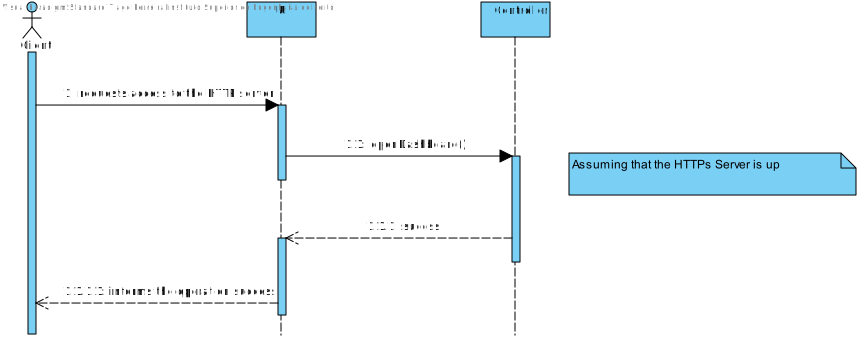

US 2005
=======================================

## **Demo:**

As Warehouse Employee, I want to open a web dashboard presenting the current status of the AGVs as well as their position in the warehouse layout and keeps updated

## Acceptance Criteria:

* It must be used the provided application protocol (SPOMS2022).
* The dashboard is intended to be displayed on a web page provided by an existing HTTP server in the "BackOfficeApp" application and only available to localhost.
* The dashboard web page is kept updated without reloading.
##Client Answers:

**Q1:** Regarding this US it is said that "It must be used the provided application protocol (SPOMS2022). The dashboard is intended to be displayed on a web page provided by an existing HTTP server in the ""BackOfficeApp"" application (...)".

Our question is, between what applications should the SPOMS protocol be implemented? Should the HTTP server be part of the "BackOfficeApp" and communicate with the AGV Manager using the REQUESTS_API? Or should the HTTP server be its own application and communicate only with the "BackOfficeApp", which on the other hand communicates directly with the database?

**A1:** As it is being said the "HTTP Server" is part of the "Backoffice Application" in order to provide a local web page only. As so, the "HTTP Server" is a component of the "Backoffice Application".

However, a question stands out: where the data to be presented by the "HTTP server" comes from?

The "backoffice Application" (or one of its components) must, somehow, get the data from the "AGV Manager" (and/or the system database).

In addition, you should notice that the SPOMS2002 protocol relies on the TCP and not on HTTP.
#Analysis

The **Dashboard** must be connected to the **HTTP** server, which will always
provide updates to it, when there is changes to the **AGVs** at the **Warehouse**.

The **HTTP** server is part of the **Backoffic Application**. This server, will be
responsible to access the **Database** to be able to access the **Warehouse** plant
and whenever there is updates on the **AGVs**. The server is responsible to check
if there were any changes to the **Warehouse** plant.

The user will directly access the **HTTP** web page, with the **Warehouse** plant,
the program will provide a link to it, which will automatically open in the **User**
computer.

## Domain Model

## SSD

##Design

###Sequence Diagram

###Class Diagram

###Functionality Realization

## Applied Techniques

## Tests

###Test 1: Smoke Test, Testing the HTTP connection

    package eapli.base.infrastructure.smoketests;
    import eapli.base.httpsServer.domain.HTTPmessage;
    import eapli.framework.actions.Action;
    import org.slf4j.LoggerFactory;
    import org.slf4j.Logger;
    import java.io.DataInputStream;
    import java.io.DataOutputStream;
    import java.io.IOException;
    import java.net.*;

    public class AccessDashBoardSmokTest implements Action {
    private static Socket sock;
    private static InetAddress serverIP;
    private static int serverPort;
    private static DataOutputStream sOut;
    private static DataInputStream sIn;

    private final static String PORT = "30639";
    private final static String DNS = "vs-gate.dei.isep.ipp.pt";

    private static final Logger LOGGER = LoggerFactory.getLogger(AccessDashBoardSmokTest.class);

    @Override
    public boolean execute() {

        try {
            serverIP = InetAddress.getByName(DNS);
        } catch (UnknownHostException ex) {
            LOGGER.error("Invalid SERVER-ADDRESS." + DNS);
            return false;
        }

        try {
            serverPort = Integer.parseInt(PORT);
        } catch (NumberFormatException ex) {
            LOGGER.error("Invalid SERVER-PORT." + PORT);
            return false;
        }

        HTTPmessage request = new HTTPmessage();
        request.setRequestMethod("GET");
        request.setURI("/info");

        try {
            sock = new Socket(serverIP, serverPort);
        } catch (IOException ex) {
            LOGGER.error("Failed to connect to provided SERVER-ADDRESS and SERVER-PORT.");
            LOGGER.error("Application aborted.");
            return false;
        }

        try {
            sOut = new DataOutputStream(sock.getOutputStream());
            sIn = new DataInputStream(sock.getInputStream());
        } catch (IOException ex) {
            LOGGER.error("Error accessing socket's streams. Aborted.");
            try {
                sock.close();
            } catch (IOException ex2) {
                LOGGER.error("Error closing socket.");
                return false;
            }
            LOGGER.warn("Application aborted.");
            return false;
        }

        try {
            request.send(sOut);                // send HTTP request

            HTTPmessage response = new HTTPmessage(sIn);    // receive HTTP response
            LOGGER.info("HTTP server response status: " + response.getStatus());
        } catch (IOException e) {
            return false;
        }

        try {
            sock.close();
        } catch (IOException ex2) {
            LOGGER.error("Error closing socket.");
            return false;
        }

        return true;
    }
    }
