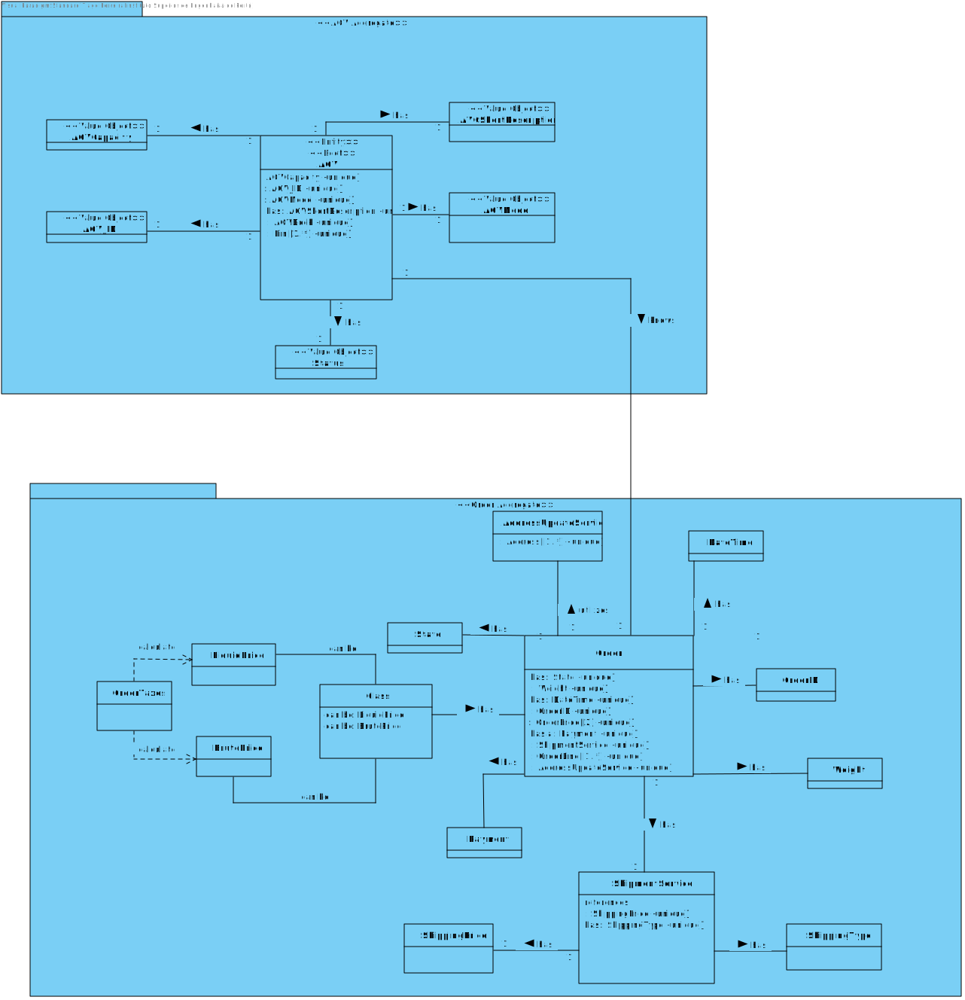
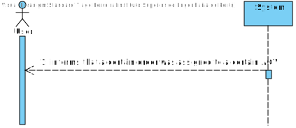
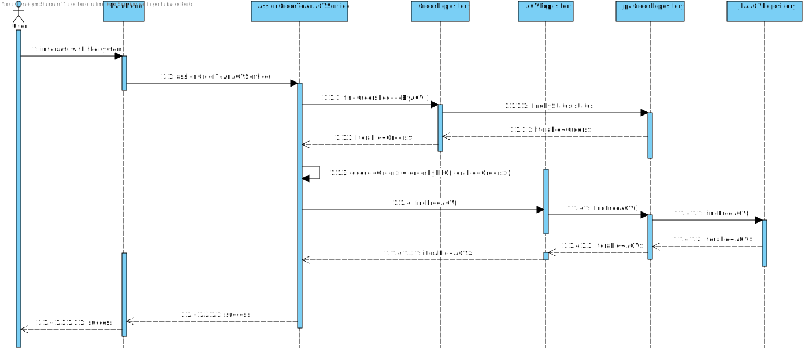
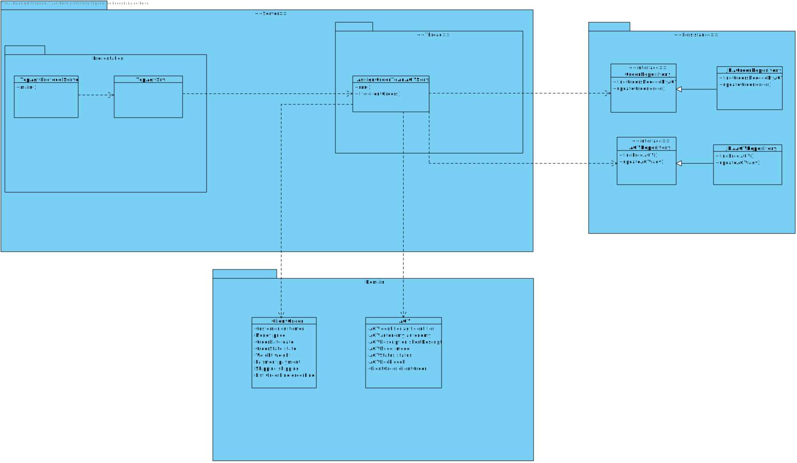

US 4002
=======================================

## **Demo:**

As Project Manager, I want that the "AGVManager" component is enhanced with a basic FIFO algorithm to automatically assign tasks to AGVs.

## Acceptance Criteria:

* The general idea is that product orders reaching a certain state whose meaning is of "need to be prepared by an AGV" are added to a queue. Then, following the FIFO algorithm orders are removed from the queue and assigned to available AGVs capable of performing the task that such order implies.
* Teams are free to propose a solution for that problem/issue. Notice that all team decisions must be well supported in light of business need and technical constraints.

#Analysis

The program should automatically associate **Orders** that are ready to be processed by **AGV**
and search for a free **AGV** by prioritizing the **FIFO** algorithm.

Each **Order** can only be associated with only one **AGV**, after an **AGV** is assigned
to an **Order** it can no longer process any other **Order** until it has completed processing
its current **Order**.

## Domain Model

## SSD

##Design

###General and Best Scenarion
Each time a **User** is in its **Menu**, the program will update the **AGV-Order** relation by
calling a service named **AssignOrderToAnAGVService**, this service will search all the **Orders**
that need to be processed by an **AGV**, and then it will search all available **AGVs**.

After this search, the program will organize the **Orders** by a queue which will use the
**FIFO algorithm** and then the **Orders** will be associated by the available **AGVs**.

###Worst Scenario

If there are **Orders** that need to be processed by **AGVs** but all of them are occupied,
the program will inform the **User** that there is no **AGV** availabe to process an **Order**.

We think that only the **Warehouse Managers** should be the only ones who get this information, since
they're in charge of the **Warehouse** and the **AGV** management.

###Sequence Diagram

###Class Diagram

