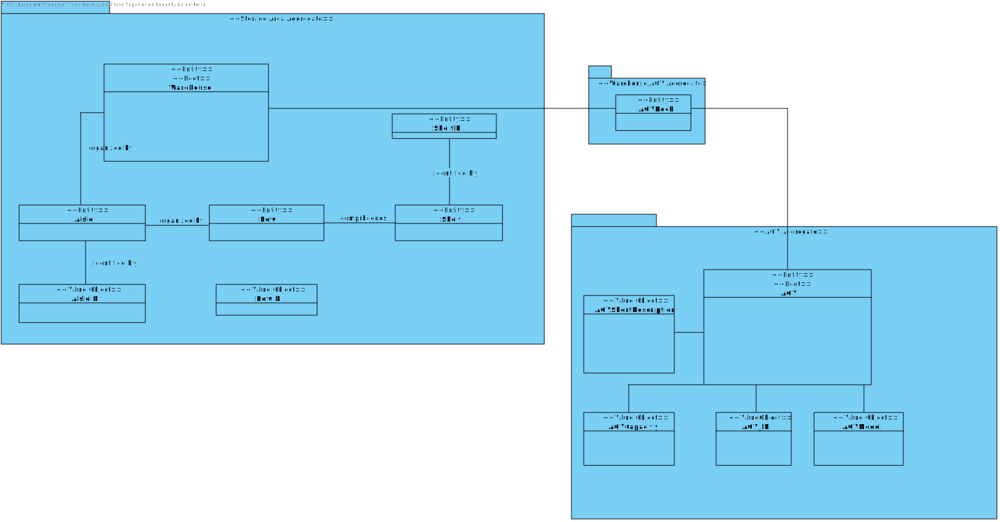

US 5002
=======================================

## **Demo:**

As Project Manager, I want that the team start developing the output communication module of the AGV digital twin to update its status on the "AGVManager".

## Acceptance Criteria:

* First, at an initial phase, it is only necessary to address the interactions regarding tasks acceptance
  and its completion by mocking somehow the process of picking up products and moving through
  the warehouse
* It must be used the provided application protocol (SPOMS2022).
* AGVManager Server is responsible for the **AGV DIgital Twin** management.

#Analysis

This user story must already have the SPOMS2022 implemmented. **AGV Twin** works when 
the **AGV Manager** server is on. 

The **AGV Twin** is a **Thread** associated with the **AGV ID**  whenever
is free to be assigned with a new task, its status will be updated to **Available**.
Whenever the **AGV Management** server assigns a new task to the **AGV Twin**, the **AGV**
status will be updated to **Occupied**.

## Domain Model

##Design

The **AGV Manager** server has the following classes: **REQUEST_OCCUPIED_AGV**
and **REQUEST_FREE_AGV**, which are responsible to update the **AGV Twin** status.

The **REQUESTS_API_RequestFactory** is responsible to build all the requests implemmented in the server.

## Applied Techniques

* GRASI (Information Expert, Creator, Controller, Low Coupling (evaluative), High Cohesion (evaluative), Polymorphism, Pure Fabrication, Indirection, Protected Variations);
    + Information Expert - The service, since has a direct connection with the repositories, in this case, knows all domain concepts from this specific Use Case;
    + Creator, the UI creates the controller, and the controller creates all needed services;
    + Low Coupling and High Cohesion, since we are using a lot of structured layers, all with a specific meaning, we are applying this pattern aswell;
    + Polymorphism, since a domain concept object may have multiple different values;
    + Pure Fabrication, since there is only 1 of each type of class created, meaning, in case of the controller and the UI they are only created one time;
    + The other patterns already were explained by previous points;
* Tell, don't ask;
    + Basic pattern, has a similar function as "Keep it simple", since both patterns apply simple interaction between actor - UI and UI - controller;
* Single Responsibility Principle;
* Interface Segregation Principle;
* Intention Revealing Interfaces;
* DDD (Persistence Ignorance, Entity, Value Object, Domain Service, Aggregate, Domain Event, Observer, Events);
    + This pattern was introduced in EAPLI, where we started working with this pattern. It is very important to fully understand this pattern, since it makes an implementation of a domain business concept way easier (and makes it easier to understand to outside people), Entities, value objects, services... All are well explained in the Geral Domain model and the glossary, so I think there is no need to explain this here;
* Repositories pattern;
    + This pattern applies a persistance context using repositories to have an easier communication between the run time system, and a remote database, where it makes the operation between the same atomic and simple transactions;
* Services pattern;
    + This pattern applies both to the domain and the application layer, in this specific Use Case it wasn't used services in the domain layer only in the Application layer, as stated previously to make an easier interaction between CONTROLLER - SERVICE - REPOSITORY;

## Tests

###Test 1: Smoke Test, testing the AGV Manager Connection.

    private static final Logger LOGGER = LogManager.getLogger(TwinClient.class);

    public static void tcpEstablishTeste() {
        AGVRepository agvRepository = PersistenceContext.repositories().agvRepository();

        String dns = Application.settings().getTcpAgvManagerServerDns()
        int sock = Integer.parseInt(Application.settings().getTcpAgvManagerClientSocketPort());

        Iterable<AGV> agvList = agvRepository.findAll();
        int serverPort = Integer.parseInt(Application.settings().getTcpTwinServerSocketPort());

        for (AGV agv : agvList) {
            Thread t = new AGVTwinThread(agv, sockNum, dns, serverPort);
            t.start();
            serverPort--;
        }

    }
    }

# 5. Integration/Demonstration

We implemmented a EstablishConnection class on the AGVTwin module, each time we connect
to the server, it will automatically assing Order to the Available AGVs.

# 6. Observations

I think our interpretation of the Use Case was the best as possible, since we added the option to run this TCP Server in the cloud, which was extra.

