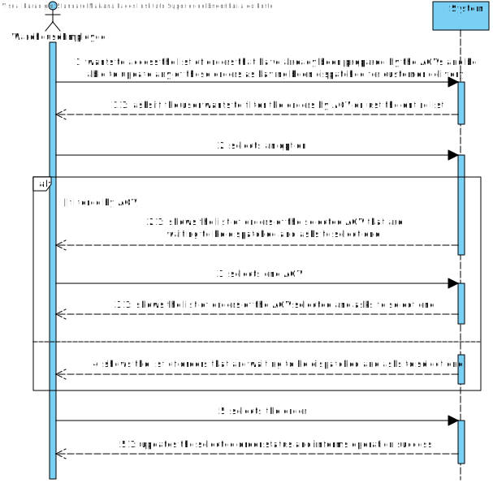
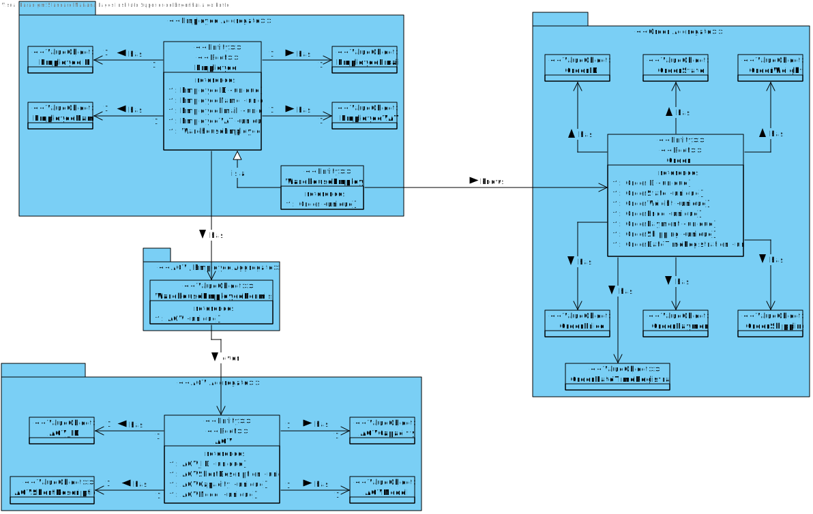

US2004
=======================================

# 1. Requisitos

As Warehouse Employee, I want to access the list of orders that have already been prepared by the AGVs and be able to update any of those orders as having been dispatched for customer delivery.

Mark orders as dispatched for customer delivery. All orders whose products have already been
picked up by an AGV are (manually) inspected by a warehouse employee, which after that is
responsible for packaging and dispatching those products for customer delivery. At the end, (s)he
must inform the system that such work has been done. For that, the system should provide the
employee a list of orders on such condition. The ability to filter those order by the AGV that have
collected those products is request.

 

**Demo**

- Demo 1.1: In this User story, we will only focus in the whole use case:

    + In order to make this demo happen, we first have to analyze what is demanded in this Use Case scenario and what the client has said in the forum;
    + We are going to make a feature in our program that is going to dispatch an order if there is any order awaiting to be dispatched;
    + As stated previously, first there must be an order in the system that has the state "waiting_to_be_dispatched", only then is possible to run successfully this feature;
    + We must, also, give the option to filter by AGV, meaning, the actor can choose one order in the correct state from a specific AGV;
    
# 2. Análise

## 2.1. Brief approach

Before making any rash decisions, we must see the whole scenario since the moment that the feature starts until its end. From the client answers, it is possible to deduce that:

 

* In the beginning, the system will show to the actor all the orders that are waiting to be dispatched;
  + The actor can choose to filter which order he will see, meaning, we must implement a feature that filters the order list that was prepared by a certain AGV;

* Afterwards, the actor selects his desired order (with our without the filter), the system will validate the given request;

* In the end, after the system validate the request, it changes the state of the order to "dispatched_to_client";

**Note: This is all information that the client provided in the forum.**

 

In order to better represent this way of thinking, we decided to create some artifacts to "illustrate" the Use Case itself.

## 2.2. System Sequence Diagram (SSD)

The first artifact done in this section was the System Sequence Diagram, where it clearly specifies the interaction between the System and the Actor, which is, in this case, the Sales Clerk.

As we can see in the diagram, the exact interaction between the actor and the system is illustrated. We must enter all information demanded by the system (some are not mandatory).

## 2.3. Domain Model Excerpt (DM)

The second artifact applies the DDD pattern in order to illustrate the business concept. It shows all domain concepts relevant to this Use Case, making a clear representation of all business concepts.

##  2.4. Conclusion

After this analysis, we have gathered all the information to start the design part, the design artifacts.

# 3. Design

## 3.1. Brief approach

Now we can start the "implementation" or, in other words, the design of the system itself, where we "draw" our ideas and make a "sketch" of the same.

## 3.2. Sequence Diagram (SD)

The first diagram created in this section was the Sequence Diagram, where we illustrate how the system operates in this Use Case.

In order to better analyze this diagram, I would recommend the reader to open the file and see step by step how the system operates, that is exactly the same as stated previously in the analysis.

Now we know how the system will operate, step by step, and we can add additional artifacts to illustrate the system working.
As we mention before, this feature will be constantly communicating with the server to retrieve all the needed information since the backOfficeApplication shouldn't communicate with the database directly.

## 3.3. Functionality Realization

We are using a layer structure design:
- Domain Layer:
    - Order
    - AGV
    - AGVDto
    - OrderDto
- Application Layer:
    - UpdateOrderController
    - ViewAllOrdersService
- Repository Layer:
    - OrderRepository
    - AGVRepository

## 3.5. Padrões Aplicados

* GRASI (Information Expert, Creator, Controller, Low Coupling (evaluative), High Cohesion (evaluative), Polymorphism, Pure Fabrication, Indirection, Protected Variations);
    + Information Expert - The service, since has a direct connection with the repositories, in this case, knows all domain concepts from this specific Use Case;
    + Creator, the UI creates the controller, and the controller creates all needed services;
    + Low Coupling and High Cohesion, since we are using a lot of structured layers, all with a specific meaning, we are applying this pattern aswell;
    + Polymorphism, since a domain concept object may have multiple different values;
    + Pure Fabrication, since there is only 1 of each type of class created, meaning, in case of the controller and the UI they are only created one time;
    + The other patterns already were explained by previous points;
* Tell, don't ask;
    + Basic pattern, has a similar function as "Keep it simple", since both patterns apply simple interaction between actor - UI and UI - controller;
* Single Responsibility Principle;
* Intention Revealing Interfaces;
* DDD (Persistence Ignorance, Entity, Value Object, Domain Service, Aggregate, Domain Event, Observer, Events);
    + This pattern was introduced in EAPLI, where we started working with this pattern. It is very important to fully understand this pattern, since it makes an implementation of a domain business concept way easier (and makes it easier to understand to outside people), Entities, value objects, services... All are well explained in the Geral Domain model and the glossary, so I think there is no need to explain this here;
* Repositories pattern;
    + This pattern applies a persistance context using repositories to have an easier communication between the run time system, and a remote database, where it makes the operation between the same atomic and simple transactions;
* Services pattern;
    + This pattern applies both to the domain and the application layer, in this specific Use Case it wasn't used services in the domain layer only in the Application layer, as stated previously to make an easier interaction between CONTROLLER - SERVICE - REPOSITORY;
* Client - Server pattern;
    + The name of this interaction doesn't have properly this name, but, since we didn't found any specific pattern that would describe what we utilized here, we decided to have this name to illustrate the fact that we utilize servers to communicate with the client/backOffice applications and the servers (using the SPOMS protocol)
* Data Transfer Object (DTO) pattern;
    + In order to abstract the entities and value objects from the domain layer or business layer we implement DTOs to abstract the UI Layer from the Domain Layer;

## 3.6. Testes

**Teste 1:** MOCK TEST : Dispatch an existing valid order (in the state of awating_to_be_dispatched)

       @Override
        public boolean execute() {
        runSmokeTestDispatchOrderWithoutFilter();

        if (runSmokeTestDispatchOrderWithoutFilter() && runSmokeTestDispatchOrderWithFilter()) {
            LOGGER.info("»»» Order status update SUCCESS!");
            return true;
        }

        LOGGER.info("»»» Order status update ERROR!");
        return false;
    }

    private boolean runSmokeTestDispatchOrderWithoutFilter() {
        Date date = new Date("13/01/2020");
        Calendar calendar = Calendar.getInstance();
        calendar.setTime(date);

        final Customer customer = new CustomerBuilder().brithDate(new BirthDate(new Date("12/12/2002"))).vat(new VAT(12)).number(new PhoneNumber(123, 123456789)).named(new Name("customer1 customer")).gender(new Gender("Male")).email(new Email("email@email.com")).address(new Address("Billing Address", 11, "postal code", "city", "country")).build();

        ClientOrder clientOrder = new OrderBuilder()
                .addDate(new OrderDate())
                .addDate(calendar)
                .addWeight(12)
                .addPrice(new Money(12, Currency.getInstance("EUR")))
                .addCustomer(customer)
                .addOrderLine(null)
                .addState(OrderState.READY_FOR_CARRIER_DISPATCHING)
                .addPayment(new Payment(PaymentMethod.PAYPAL))
                .addShipping(new Shipping())
                .build();

        try {
            controller.updateOrderStatus(clientOrder.toDTO());

            return true;

        } catch (Exception e) {
            return false;
        }
    }

    private boolean runSmokeTestDispatchOrderWithFilter() {
        Date date = new Date("13/01/2021");
        Calendar calendar = Calendar.getInstance();
        calendar.setTime(date);

        final Customer customer = new CustomerBuilder().brithDate(new BirthDate(new Date("12/12/2002"))).vat(new VAT(12)).number(new PhoneNumber(123, 123456789)).named(new Name("customer1 customer")).gender(new Gender("Male")).email(new Email("email@email.com")).address(new Address("Billing Address", 11, "postal code", "city", "country")).build();

        ClientOrder clientOrder = new OrderBuilder()
                .addDate(new OrderDate())
                .addDate(calendar)
                .addWeight(12)
                .addPrice(new Money(12, Currency.getInstance("EUR")))
                .addCustomer(customer)
                .addOrderLine(null)
                .addState(OrderState.READY_FOR_CARRIER_DISPATCHING)
                .addPayment(new Payment(PaymentMethod.PAYPAL))
                .addShipping(new Shipping())
                .build();

        final String agvIdentifier = "BX001202";
        final int agvAutonomy = 34;
        final String agvDescription = "DescriptionABV1";
        final String agvModel = "ModelZZ";
        final AGVStatus agvStatus = AGVStatus.AVAILABLE;

        AGV agv = new AGVBuilder()
                .autonomy(agvAutonomy)
                .capacity(20)
                .description(agvDescription)
                .model(agvModel)
                .dock(null)
                .identifier(agvIdentifier)
                .status(agvStatus)
                .build();

        try {
            agv.addOrderToAGV(clientOrder);
            List<OrderDto> orderList = controller.getOrdersToBeDispatchedFromAGV(agv.toDTO());
            controller.updateOrderStatus(orderList.get(0));

            return true;

        } catch (Exception e) {
            return false;
        }
    }

# 4. Implementation

Since the requirements of this Use Case was to be able to assign an order in the state awating_to_be_dispatched. This way we can abstract the Controller, Application Layer, from the Repository Layer, thus applying the Grap Pattern the best as we can (Since the only module that is going to use the database API is the application servers module).

# 5. Integration/Demonstration

It was added a new UI to the application and a new menu dedicated for this specific feature, inside the order management.
This feature can be executed inside the warehouse employee or by the smoke test it self.

 

# 6. Observations

I think our interpretation of the Use Case was the best as possible, since we treated all possible input making it impossible to have "incorrect data" (all data must be according to the patterns specified by the client), and the way we show the result list is in a great quality, since we use the DTO pattern and instead of sending the domain concept object to the UI we send a DTO of the same, only having the necessary information to the actor.