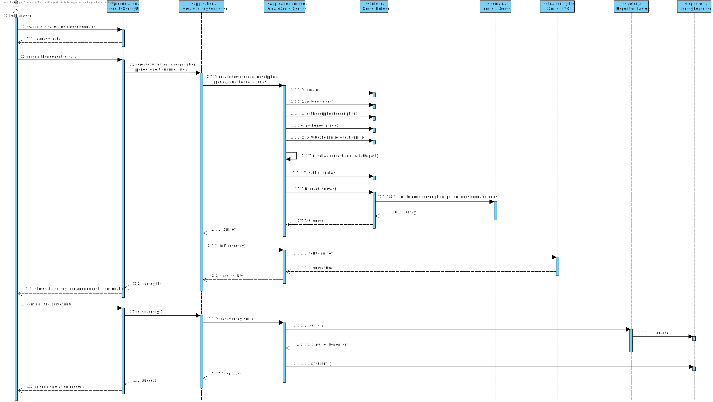

US3001
=======================================

# 1. Requisitos

As Sales Manager, I want to create a new questionnaire to be further answered by customers meeting the specified criteria (e.g.: have ordered a given product; belong to a given age group).

Create a new survey. A survey is characterized by an alphanumeric code, a description, the period
(in days) it will be performed, the intended questionnaire and a set of rules that allows the system
to determine the survey target audience.

Some examples of those rules are:
  * customers that have ordered a given product during a given period;
  * customers that have ordered any product of a given brand or category during a given period;
  * customers of a given gender;
  * customers that fit on a given age group (e.g.: 20-29).

**Demo**

- Demo 1.1: In this User story, we will focus in the whole use case:

  + In order to make this demo happen, we first have to analyze what is demanded in this Use Case scenario and what the client has said in the forum;
  + We are going to make a feature in our program that is going to read VALID questionnaires already existing in the system or inputted by an actor when running this same feature;
  + In order to make this possible, we must create a grammar in ANTLR4 that can read all types of VALID QUESTIONNAIRES. If an invalid questionnaire is introduced by the actor, the system must alert the same and specify the error found;
  + Also, we must verify the file that is introduced in the system, if it exists and has a valid extension (txt), and, in the end of this feature, we must persist the content of the survey in our database running in the cloud.

## 1.1 Relevant Client Answers

  * "Each survey has one questionnaire that can be answered by multiple users."

  * "It is also clear that the survey is, first, created then distributed for customers to answer it, answers are further collected and, finally, some statistics will be computed.
    Regarding "... store the file loaded", I recommend you to read previous posts about this topic.
    There is no need to upload file. However, if a file is upload then you should notice that what is really important is not the file but its content."

  * "First of all, and to be clear, notice that creating a survey has two distinct set of data:
    * alphanumeric code, a description, the period (in days) it will be performed and a set of rules that allows the system to determine the survey target audience; and
    * the intended questionnaire, i.e. the title, the welcome message, sections and questions."
  
  * "Moreover, notice that no matter what option you take, at the end, all the input information must be validated, which includes parsing the data regarding the "intended questionnaire"."

# 2. Análise

## 2.1. Brief approach

Before making any rash decisions, we must see the whole scenario since the moment that the feature starts until its end. From the client answers, it is possible to deduce that:

* In the beginning, the system will ask certain information to the actor so the survey can be correctly built. Which are rules (can be multiple and can be alphanumeric), survey code (that must be an alphanumeric number), survey description, the survey period of time (which must be a valid number - above 0) and the questionnaire path, which later on, the system will verify the integrity of the file;

* Afterwards, when the actor inputs all requested data, as mentioned before, the system will first validate the path introduced by the actor, if is valid it will start parsing the content using our grammar developed in US3000, if not, an alert error will pop in the UI alerting the actor that the introduced file is not valid!

* In the end, if the content of the file can pass the grammar, the survey will finally be created and persisted in the database.

**Note: This is all information that the client provided in the forum.**

In order to better represent this way of thinking, we decided to create some artifacts to "illustrate" the Use Case itself.

## 2.2. System Sequence Diagram (SSD)

The first artifact done in this section was the System Sequence Diagram, where it clearly specifies the interaction between the System and the Actor, which is, in this case, the Sales Clerk.

As we can see in the diagram, the exact interaction between the actor and the system is illustrated. We must enter all information demanded by the system (some are not mandatory).

## 2.3. Domain Model Excerpt (DM)

The second artifact applies the DDD pattern in order to illustrate the business concept. It shows all domain concepts relevant to this Use Case, making a clear representation of all business concepts.

##  2.4. Conclusion

After this analysis, we have gathered all the information to start the design part, the design artifacts.

# 3. Design

## 3.1. Brief approach

Now we can start the "implementation" or, in other words, the design of the system itself, where we "draw" our ideas and make a "sketch" of the same.

## 3.2. Sequence Diagram (SD)

The first diagram created in this section was the Sequence Diagram, where we illustrate how the system operates in this Use Case.

In order to better analyze this diagram, I would recommend the reader to open the file and see step by step how the system operates, that is exactly the same as stated previously in the analysis.

Now we know how the system will operate, step by step, and we can add additional artifacts to illustrate the system working.
As we mention before, this feature will be constantly communicating with the server to retrieve all the needed information since the backOfficeApplication shouldn't communicate with the database directly.

## 3.3. Functionality Realization

We are using the following layer structure design:

- Domain Layer:
  - Survey
  - SurveyBuilder
  - SurveyDTO

- Application Layer:
  - CreateSurveyController
  - CreateSurveyService

- Repository Layer:
  - SurveyRepository

## 3.5. Padrões Aplicados

* GRASI (Information Expert, Creator, Controller, Low Coupling (evaluative), High Cohesion (evaluative), Polymorphism, Pure Fabrication, Indirection, Protected Variations);
  + Information Expert - The service, since has a direct connection with the repositories, in this case, knows all domain concepts from this specific Use Case;
  + Creator, the UI creates the controller, and the controller creates all needed services;
  + Low Coupling and High Cohesion, since we are using a lot of structured layers, all with a specific meaning, we are applying this pattern aswell;
  + Polymorphism, since a domain concept object may have multiple different values;
  + Pure Fabrication, since there is only 1 of each type of class created, meaning, in case of the controller and the UI they are only created one time;
  + The other patterns already were explained by previous points;
* Tell, don't ask;
  + Basic pattern, has a similar function as "Keep it simple", since both patterns apply simple interaction between actor - UI and UI - controller;
* Single Responsibility Principle;
* Intention Revealing Interfaces;
* DDD (Persistence Ignorance, Entity, Value Object, Domain Service, Aggregate, Domain Event, Observer, Events);
  + This pattern was introduced in EAPLI, where we started working with this pattern. It is very important to fully understand this pattern, since it makes an implementation of a domain business concept way easier (and makes it easier to understand to outside people), Entities, value objects, services... All are well explained in the Geral Domain model and the glossary, so I think there is no need to explain this here;
* Repositories pattern;
  + This pattern applies a persistance context using repositories to have an easier communication between the run time system, and a remote database, where it makes the operation between the same atomic and simple transactions;
* Services pattern;
  + This pattern applies both to the domain and the application layer, in this specific Use Case it wasn't used services in the domain layer only in the Application layer, as stated previously to make an easier interaction between CONTROLLER - SERVICE - REPOSITORY;
* Data Transfer Object (DTO) pattern;
  + In order to abstract the entities and value objects from the domain layer or business layer we implement DTOs to abstract the UI Layer from the Domain Layer;

## 3.6. Testes

**Geral information for tests** 

    private static final SurveyCode SURVEY_CODE = SurveyCode.valueOf("S01");
    private static final Description DESCRIPTION = Description.valueOf("Survey description");
    private static final Period PERIOD = Period.valueOf(7);

    private static final byte[] bytes = new byte[0];
    private static final Questionnaire QUESTIONNAIRE = Questionnaire.valueOf(bytes);

    private static final List<Rule> RULE_LIST = new ArrayList<>();

    private Survey buildSurvey() {
        return new SurveyBuilder().withASurveyCode(SURVEY_CODE).withADescription(DESCRIPTION).withAPeriod(PERIOD).withAQuestionnaire(QUESTIONNAIRE).withASetOfRules(RULE_LIST).build();
    }

**Test 1:** Ensure it is possible to create a survey.

         @Test
         void ensureCanCreateSurvey() {
             new Survey(SURVEY_CODE, DESCRIPTION, PERIOD, QUESTIONNAIRE, RULE_LIST);

            assertTrue(true);
         }

**Test 2:** Ensure that the survey must have a (valid) code.

        @Test
         void ensureMustHaveSurveyCode() {
             assertThrows(IllegalArgumentException.class, () -> new Survey(null, DESCRIPTION, PERIOD, QUESTIONNAIRE, RULE_LIST));
         }

**Test 3:** Ensure that the survey must have a (valid) description.

          @Test
          void ensureMustHaveDescription() {
            assertThrows(IllegalArgumentException.class, () -> new Survey(SURVEY_CODE, null, PERIOD, QUESTIONNAIRE, RULE_LIST));
          }

**Test 4:** Ensure that the survey must have a (valid) period.

         @Test
         void ensureMustHavePeriod() {
             assertThrows(IllegalArgumentException.class, () -> new Survey(SURVEY_CODE, DESCRIPTION, null, QUESTIONNAIRE, RULE_LIST));
        }

**Test 5:** Ensure that the survey must have a (valid) questionnaire.

        @Test
        void ensureMustHaveQuestionnaire() {
             assertThrows(IllegalArgumentException.class, () -> new Survey(SURVEY_CODE, DESCRIPTION, PERIOD, null, RULE_LIST));
        }

**Test 6:** Ensure that the survey must have (valid) rule(s).

        @Test
        void ensureMustHaveRule() {
            assertThrows(IllegalArgumentException.class, () -> new Survey(SURVEY_CODE, DESCRIPTION, PERIOD, QUESTIONNAIRE, null));
        }

**Test 7:** Ensure that it is not possible to create a survey with a **null code**.

        @Test
        void ensureCannotChangeSurveyCodeToNull() {
             final Survey subject = buildSurvey();

            assertThrows(IllegalArgumentException.class, () -> subject.update(null, DESCRIPTION, PERIOD, QUESTIONNAIRE, RULE_LIST));
        }

**Test 8:** Ensure that it is not possible to create a survey with a **null description**.

        @Test
         void ensureCannotChangeDescriptionToNull() {
        final Survey subject = buildSurvey();

        assertThrows(IllegalArgumentException.class, () -> subject.update(SURVEY_CODE, null, PERIOD, QUESTIONNAIRE, RULE_LIST));
    }

**Test 9:** Ensure that it is not possible to create a survey with a **null period of time**.

        @Test
         void ensureCannotChangePeriodToNull() {
            final Survey subject = buildSurvey();

            assertThrows(IllegalArgumentException.class, () -> subject.update(SURVEY_CODE, DESCRIPTION, null, QUESTIONNAIRE, RULE_LIST));
        }

**Test 10:** Ensure that it is not possible to create a survey with a **null questionnaire**.

         @Test
         void ensureCannotChangeQuestionnaireToNull() {
            final Survey subject = buildSurvey();

            assertThrows(IllegalArgumentException.class, () -> subject.update(SURVEY_CODE, DESCRIPTION, PERIOD, null, RULE_LIST));
        }

**Test 11:** Ensure that it is not possible to create a survey with **null rule(s)**.

        @Test
        void ensureCannotChangeRuleToNull() {
            final Survey subject = buildSurvey();

            assertThrows(IllegalArgumentException.class, () -> subject.update(SURVEY_CODE, DESCRIPTION, PERIOD, QUESTIONNAIRE, null));
        }

**Test 12:** Ensure that it is possible to create a survey with **another valid description**.

        @Test
        void ensureCanChangeDescription() {
            final Survey subject = buildSurvey();
    
            final Description newInfo = Description.valueOf("Another description");

             subject.update(SURVEY_CODE, newInfo, PERIOD, QUESTIONNAIRE, RULE_LIST);
        }

**Test 13:** Ensure that it is possible to create a survey with **another valid period of time**.

        @Test
        void ensureCanChangePeriod() {
         final Survey subject = buildSurvey();

            final Period newInfo = Period.valueOf(30);

            subject.update(SURVEY_CODE, DESCRIPTION, newInfo, QUESTIONNAIRE, RULE_LIST);
        }

# 4. Implementation

Since the requirements of this Use Case was to be able to validate a questionnaire and create a survey based on it (the questionnaire will be validated by the parser of our grammar), we implemented patterns which allowed us to make this feature way simpler and completed. This way we can abstract the Controller, Application Layer, from the Repository Layer, thus applying the Grasp Pattern the best as we can (Since the only module that is going to use the database API is the application servers module).

# 5. Integration/Demonstration

It was added a new UI to the application and a new menu dedicated for this specific feature, inside the order management.
This feature can be executed inside the sales manager menu.

 

# 6. Observations

I think our interpretation of the Use Case was the best as possible, since we treated all possible input making it impossible to have "incorrect data" (all data must be according to the patterns specified by the client), and the way we show the result list is in a great quality, since we use the DTO pattern and instead of sending the domain concept object to the UI we send a DTO of the same, only having the necessary information to the actor.