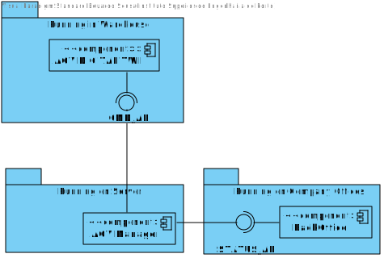
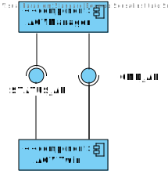

US 4001
=======================================

# 1. Requisitos

## **Demo:**

As Project Manager, I want that the "AGVManager" component supports properly, at request, the needs of the "
BackOfficeApp" application as well as the needs the AGV digital twin.
<br>
<br>

### **AC:**

* 1: It must be used the provided application protocol (SPOMS2022).
* 2: It is suggested the adoptiong of concurrent mechanisms (e.g. threads) and state sharing between these mechanisms.

### **Respostas no Forum:**

*Ainda nenhuma resposta*

# 2. Análise

* In this US the AGVManager acts as the server and the BackOfficeApp acts as client
* BackOfficeApp should comunicate with AVGManager with REQUESTS_API
* AGV digital twin should comunicate with AVGManager with STATUS_API



In this diagram we can see how the stated components should talk to each other, in special how should the client
components send requsts to the server component.

It is worty to notice that the comunication with the Digital Twin works in the two ways:



## Required needs

Right now the backoffice component can request the following functionalities to the AGVManager:

* Access the list of orders that need to be prepared by an AGV and be able to ask/force any of those orders to be
  immediately prepared by an AGV available.
  <br>
  <br>

Right now the AGVTwin component can request the following functionalities to the AGVManager:

* Request a task to be done by the AGV

Right now the AGVManager component can request the following functionalities to the AGVTwin:

* Request the status of an AGV
* Assign an task to an AGV

## The Server

| Server DNS                | Server Port |
|---------------------------|-------------|
| vsgate-s2.dei.isep.ipp.pt | 2225        |

# 3. Design

## Protocol

### Requests

| Functionality                                      | Message code to the server |
|----------------------------------------------------|----------------------------|
| Obtain the position of the agv's                   | 0x05                       |
| Change the position of an bin                      | 0x06                       |
| Assign an order to an AGV                          | 0x07                       |
| Request all the free AGV                           | 0x08                       |
| Request orders to be prepared                      | 0x09                       |
| AGV requests an order                              | 0x0A                       |
| Warn ther server about an new order to be prepared | 0x0B                       |
| Request the occupied AGV                           | 0x0C                       |
| Request all the free AGV                           | 0x0D                       |

## Sequence of events


# Testes

In order to ensure the correct communication between the components, it is necessary to test the Message parser.

````java
class TcpProtocolParserTest {

  @Test
  void testParseMessage() {
    byte[] protocolMessage = new byte[15];

    protocolMessage[0] = 0;
    protocolMessage[1] = 0;
    protocolMessage[2] = 0;
    protocolMessage[3] = 79;
    protocolMessage[4] = 76;
    protocolMessage[5] = 65;
    protocolMessage[6] = 0;
    protocolMessage[7] = 0;
    protocolMessage[8] = 0;
    protocolMessage[9] = 0;
    protocolMessage[10] = 0;
    protocolMessage[11] = 0;
    protocolMessage[12] = 0;
    protocolMessage[13] = 0;
    protocolMessage[14] = 0;

    String expected = "OLA";
    String actual = TcpProtocolParser.readProtocolMessageIntoString(protocolMessage, 6);
    assertEquals(expected, actual);

  }


  @Test
  void testWriteMessage() {
    String protocolString = "OLA";

    byte[] protocolMessage = TcpProtocolParser.createProtocolMessageWithAString(protocolString, 0);

    assertEquals(protocolString, TcpProtocolParser.readProtocolMessageIntoString(protocolMessage, 7).substring(1, 4));
  }

  @Test
  void testLeght() {
    String protocolString = "OLA";

    byte[] protocolMessage = TcpProtocolParser.createProtocolMessageWithAString(protocolString, 0);

    assertEquals(protocolString.length(), TcpProtocolParser.readProtocolMessageIntoString(protocolMessage, 7).length() - 1);
  }
}

````

It is important to test the correct criation of each request

````java
class REQUESTS_API_RequestFactoryTest {

    @Test
    void testBuild() {
        REQUESTS_API_RequestFactory factory = new REQUESTS_API_RequestFactory();
        //Get the agv position
        byte[] request = new byte[]{0x00, 0x05};
        factory.setRequestType(request);
        Assertions.assertEquals(REQUEST_AGV_POSITION_Request.class, factory.build().getClass());
        //Not a valid request
        request = new byte[]{0x00, 0x06};
        factory.setRequestType(request);
        Assertions.assertNull(factory.build());
        //Assign order
        request = new byte[]{0x00, 0x07};
        factory.setRequestType(request);
        Assertions.assertEquals(REQUEST_ASSIGN_ORDER_Request.class, factory.build().getClass());
        //Request free agv
        request = new byte[]{0x00, 0x08};
        factory.setRequestType(request);
        Assertions.assertEquals(REQUEST_FREE_AGV_Request.class, factory.build().getClass());
        //Request orders
        request = new byte[]{0x00, 0x09};
        factory.setRequestType(request);
        Assertions.assertEquals(REQUEST_ORDERS_Request.class, factory.build().getClass());
        //AGV request order
        request = new byte[]{0x00, 0x0A};
        factory.setRequestType(request);
        Assertions.assertEquals(AGV_Request_ORDER.class, factory.build().getClass());
        //Warning server that there is a new order
        request = new byte[]{0x00, 0x0B};
        factory.setRequestType(request);
        Assertions.assertEquals(WARN_SERVER_NEW_ORDER.class, factory.build().getClass());
        //Request occupied agv
        request = new byte[]{0x00, 0x0C};
        factory.setRequestType(request);
        Assertions.assertEquals(REQUEST_OCCUPIED_AGV.class, factory.build().getClass());
        //Request free agv
        request = new byte[]{0x00, 0x0D};
        factory.setRequestType(request);
        Assertions.assertEquals(REQUEST_FREE_AGV_Request.class, factory.build().getClass());
    }
}
````
