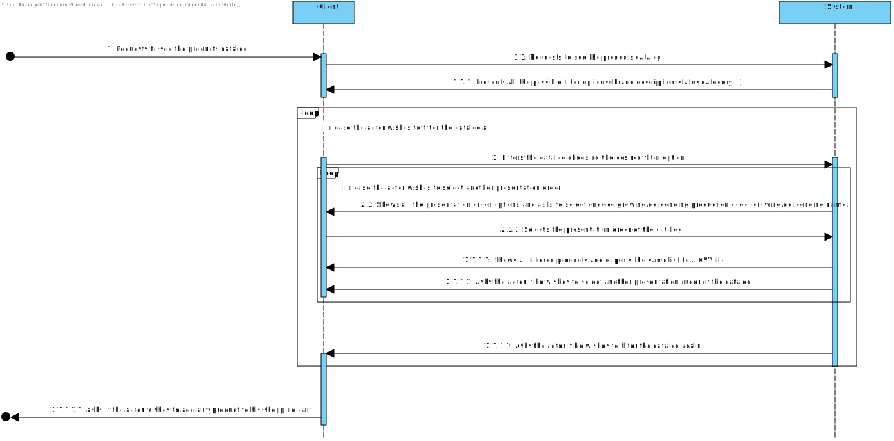
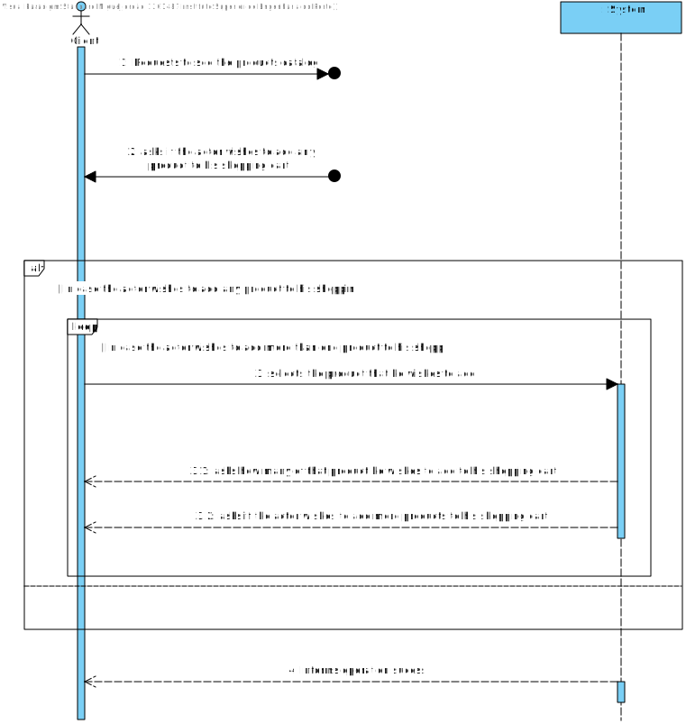
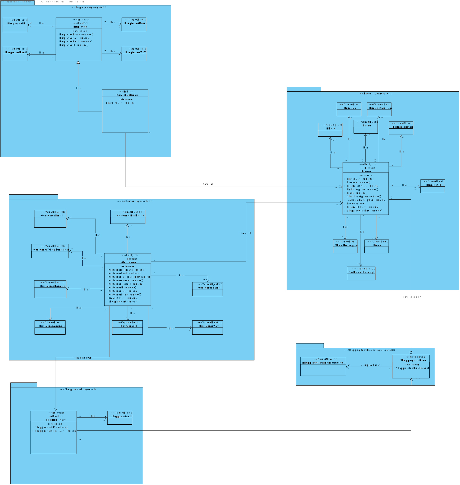
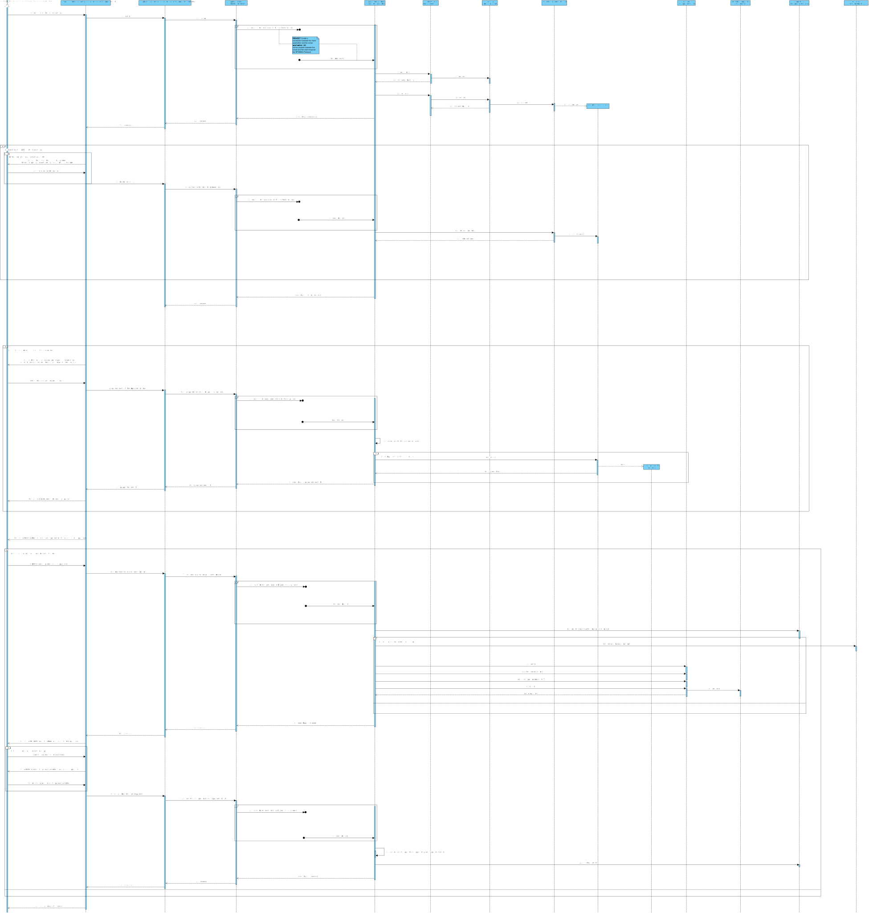

US1501
=======================================

# 1. Requisitos

As Customer, I want to view/search the product catalog and be able to add a product to the shopping cart.

Browse and search the products catalog. With the purpose of ordering and/or as a mean to complete other functionality, several users need to browse and search the products catalog.
   * a. It must support filtering and sorting operations by one or more product attributes (e.g.:category, brand, description, status).
   * b. The filtered products catalog should be exported to a CSV file.
   * c. Add any listed product to the (customer) shopping cart.
 

**Demo**

- Demo 1.2: In this User story, we will focus both in the third Use Case (**c.**), and the first Use Case (**a.**).

    + In order to make this demo happen, we first have to analyze what is demanded in this Use Case scenario and what the client has said in the forum;
    + We are going to make a feature in our program that will allow a customer (client) to browse the products catalog (developed in the last sprint) and allow the customer to add a specific product, that he sees in the catalog, in his shopping cart.
    + If the customer doesn't have a shopping cart, the system must be configured to create one for him
    + Also, the shopping cart must be persisted! The shopping cart shouldn't be reset whenever the customer leaves the application;
    + This feature will be constantly communicating with the Order server in order to update the customer shopping cart.

# 2. Análise

## 2.1. Brief approach

Before making any rash decisions, we must see the whole scenario since the moment that the feature starts until its end. From the client answers, it is possible to deduce that:

 

* In the beginning, the system will show the catalog feature developed in the previous sprint, but, this time, if a client wishes to add a specific product shown in the catalog he can add the same to his shopping cart.
  + **From the client answers,** ALL communication between the client application and the Order Server must respect the SPOMS2022 protocol, protocol that defines how the responses/requests will be sent/handled by the server/client;
  + All information shown in the catalog must be sent from the Order Server since the client application does not have communication with the Database API  
    
* Afterwards, when the feature is running, and the catalog is shown, the client can add his desired product and how many products he wishes to add to his/her shopping cart, and he/her can repeat this action N times as he/her wishes (Notice! This is not mandatory, the client can only see the catalog and not add anything to his/her shopping cart).

* In the end, the system will verify the integrity of the shopping cart and then add the desired product(s) to his/her shopping cart and persist it in the Database.
    + The shopping cart must be saved inside the thread, inside the Order Server, that is handling the request from the client. This thread will communicate with the Database using their API.

* All the information needed will be obtained from the OrderServer, by requests, since the client wishes that the client doesn't have access to the database.
* This server is implementing the TCP Protocol and the SPOMS2022 Protocol.

**Note: This is all information that the client provided in the forum.**

 

In order to better represent this way of thinking, we decided to create some artifacts to "illustrate" the Use Case itself.

## 2.2. System Sequence Diagram (SSD)

The first artifact is divided in two since this US uses the same logic as a previous US (the catalog one) ,which specifies that this section was the System Sequence Diagram, where it clearly specifies the interaction between the System and the Actor, which is, in this case, the customer itself.

The second part of the artifact has the "desired" interaction of this US between the client and the System

As we can see in the diagram, the exact interaction between the actor and the system is illustrated. We must enter all information demanded by the system (some are not mandatory).

## 2.3. Domain Model Excerpt (DM)

The second artifact applies the DDD pattern in order to illustrate the business concept. It shows all domain concepts relevant to this Use Case, making a clear representation of all business concepts.

##  2.4. Conclusion

After this analysis, we have gathered all the information to start the design part, the design artifacts.

# 3. Design

## 3.1. Brief approach

Now we can start the "implementation" or, in other words, the design of the system itself, where we "draw" our ideas and make a "sketch" of the same.

## 3.2. Sequence Diagram (SD)

The first diagram created in this section was the Sequence Diagram, where we illustrate how the system operates in this Use Case.

In order to better analyze this diagram, I would recommend the reader to open the file and see step by step how the system operates, that is exactly the same as stated previously in the analysis.
The ref box in the US1501_SD references to diagram above, which describes the interaction between the client application, and the order server

Now we know how the system will operate, step by step, and we can add additional artifacts to illustrate the system working.
As we mention before, this feature will be constantly communicating with the server to retrieve all the needed information since the backOfficeApplication shouldn't communicate with the database directly.

## 3.3. Functionality Realization

We are using a layer structure design:
- Domain Layer:
    - Customer
    - Product
    - ShoppingCart
    - ProductDTO
- Application Layer:
    - AssignOrderToAgvController
    - EstablishCommunicationService
- Server Application layer:
    - AssignOrderToAgvService
    - OrderProtocolServer
    - ServerThreadManager
    - ClientThread
- Repository Layer:
    - OrderRepository
    - AGVRepository
    - CustomerRepository

## 3.5. Padrões Aplicados

* GRASI (Information Expert, Creator, Controller, Low Coupling (evaluative), High Cohesion (evaluative), Polymorphism, Pure Fabrication, Indirection, Protected Variations);
    + Information Expert - The service, since has a direct connection with the repositories, in this case, knows all domain concepts from this specific Use Case;
    + Creator, the UI creates the controller, and the controller creates all needed services;
    + Low Coupling and High Cohesion, since we are using a lot of structured layers, all with a specific meaning, we are applying this pattern aswell;
    + Polymorphism, since a domain concept object may have multiple different values;
    + Pure Fabrication, since there is only 1 of each type of class created, meaning, in case of the controller and the UI they are only created one time;
    + The other patterns already were explained by previous points;
* Tell, don't ask;
    + Basic pattern, has a similar function as "Keep it simple", since both patterns apply simple interaction between actor - UI and UI - controller;
* Single Responsibility Principle;
* Interface Segregation Principle;
* Intention Revealing Interfaces;
* DDD (Persistence Ignorance, Entity, Value Object, Domain Service, Aggregate, Domain Event, Observer, Events);
    + This pattern was introduced in EAPLI, where we started working with this pattern. It is very important to fully understand this pattern, since it makes an implementation of a domain business concept way easier (and makes it easier to understand to outside people), Entities, value objects, services... All are well explained in the Geral Domain model and the glossary, so I think there is no need to explain this here;
* Repositories pattern;
    + This pattern applies a persistance context using repositories to have an easier communication between the run time system, and a remote database, where it makes the operation between the same atomic and simple transactions;
* Services pattern;
    + This pattern applies both to the domain and the application layer, in this specific Use Case it wasn't used services in the domain layer only in the Application layer, as stated previously to make an easier interaction between CONTROLLER - SERVICE - REPOSITORY;
* Client - Server pattern;
    + The name of this interaction doesn't have properly this name, but, since we didn't found any specific pattern that would describe what we utilized here, we decided to have this name to illustrate the fact that we utilize servers to communicate with the client/backOffice applications and the servers (using the SPOMS protocol)

## 3.6. Testes

**Test private methods:**

    private Email email1 = new Email("ola@gmail.com");
    private Gender gender1 = new Gender("Male");
    private BirthDate birthDate1 = new BirthDate(new Date("11/1/2001"));
    private Name name2 = new Name("Tiago Ferreira");
    private VAT VAT1 = new VAT(2);
    private PhoneNumber phoneNumber1 = new PhoneNumber(123, 123456789);
    private Address address1 = new Address("aa", 11, "aa", "aa", "aa");

    private static final Long CATEGORY_ID = 123456L;
    private static final Code CODE = Code.valueOf("P0001");
    private static final Description SHORT_DESCRIPTION = Description.valueOf("Test short description");
    private static final Description EXTENDED_DESCRIPTION = Description.valueOf("Test extended description");
    private static final Description TECHNICAL_DESCRIPTION = Description.valueOf("Test technical description");
    private static final BrandName BRAND_NAME = BrandName.valueOf("Test brand name");
    private static final Reference REFERENCE = Reference.valueOf("Teste reference");
    private static final Barcode BARCODE = Barcode.valueOf(1L);
    private static final Money PRICE = Money.valueOf("10 EUR");
    private static final List<Photo> PHOTO_LIST = new ArrayList<>();
    private static final ProductionCode PRODUCTION_CODE = ProductionCode.valueOf("PC1");

    private Product buildProductWithProductionCode() {
        return new ProductBuilder().withACategoryId(CATEGORY_ID).coded(CODE).withAShortDescription(SHORT_DESCRIPTION).withAnExtendedDescription(EXTENDED_DESCRIPTION).withATechnicalDescription(TECHNICAL_DESCRIPTION).withABrandName(BRAND_NAME).withAReference(REFERENCE).withABarcode(BARCODE).withAPrice(PRICE).withASetOfPhotos(PHOTO_LIST).withAProductionCode(PRODUCTION_CODE).build();
    }

    private Customer buildCustomer1() {
        return new Customer(phoneNumber1, birthDate1, name2, gender1, VAT1, email1, address1);
    }

    private List<ShoppingCartLine> buildShoppingCartList() {
        List<ShoppingCartLine> list = new ArrayList<>();
        list.add(new ShoppingCartLine(buildProductWithProductionCode(), new ShoppingCartLineProductQuantity(1)));
        return list;
    }

    private ShoppingCart buildShoppingCart() {
        return new ShoppingCart(buildCustomer1(), buildShoppingCartList());
    }

    private ShoppingCart buildShoppingCartWithoutProducts() {
        return new ShoppingCart(buildCustomer1(), new ArrayList<>());
    }

    private ShoppingCart buildInvalidShoppingCartWithoutCustomer() {
        return new ShoppingCart(null, buildShoppingCartList());
    }

    private ShoppingCart buildInvalidShoppingCartWithoutShoppingCartLine() {
        return new ShoppingCart(buildCustomer1(), null);
    }

    private ShoppingCartLine buildInvalidShoppingCartLineWithoutProduct() {
        return new ShoppingCartLine(null, new ShoppingCartLineProductQuantity(1));
    }

    private ShoppingCartLine buildInvalidShoppingCartLineWithoutQuantity() {
        return new ShoppingCartLine(buildProductWithProductionCode(), null);
    }

**Test 1:** Verify if it is possible to create a valid shopping cart

    @Test
    void ensureShoppingCartCanBeCorrectlyBuilt() {
        try {
            ShoppingCart sp = buildShoppingCart();
            assertNotNull(sp);
        } catch (Exception e) {
            fail();
        }
    }

**Test 2:** Ensure a shopping cart MUST have a customer assign to it

    @Test
    void ensureShoppingCartMustHaveCustomer() {
        assertThrows(IllegalArgumentException.class, () -> buildInvalidShoppingCartWithoutCustomer());
    }

**Test 3:** Ensure a shopping cart MUST have a valid list of shopping cart lines

    @Test
    public void ensureShoppingCartMustHaveShoppingCartLines() {
        assertThrows(IllegalArgumentException.class, () -> buildInvalidShoppingCartWithoutShoppingCartLine());
    }

**Test 4:** Ensure a shopping cart can add valid shopping cart lines and verify the lines integrity

    @Test
    public void ensureTheShoppingCartCanAddLines() {
        List<ShoppingCartLine> list = buildShoppingCartList();
        ShoppingCart shoppingCart = buildShoppingCartWithoutProducts();

        shoppingCart.updateShoppingCartLine(list.get(0));

        if (shoppingCart.verifyShoppingCartLines()) {
            assertNotNull(shoppingCart);
        } else {
            fail();
        }
    }

**Test 5:** Ensure a shopping cart line MUST have a product assign to it

    @Test
    public void ensureShoppingCartLineMustHaveACustomer() {
        assertThrows(IllegalArgumentException.class, () -> buildInvalidShoppingCartLineWithoutProduct());
    }

**Test 6:** Ensure a shopping cart line MUST have a valid quantity of products assign to it

    @Test
    public void ensureShoppingCartLineMustHaveAValidQuantity() {
        assertThrows(IllegalArgumentException.class, () -> buildInvalidShoppingCartLineWithoutQuantity());
    }

  

# 4. Implementation

Since the requirements of this Use Case was to be able to assign products from the catalog to the customer shopping cart, and this same feature should be implemented by having several modules communicating between each other,for that, we opted to make a service to establish the communication between the modules. This way we can abstract the Controller, Application Layer, from the Repository Layer, thus applying the Grap Pattern the best as we can, and the server - client pattern (Since the only module that is going to use the database API is the application servers module).

# 5. Integration/Demonstration

It was added a new UI to the application and a new menu dedicated for this specific feature, inside the client catalog management.

 
The catalog is now complete, since the client can now not only view the Catalog but can also add products to his shopping cart.

In order to show the shoppingCart, and see it changing, we developed a extra feature which allows the client to see his shopping cart.

 

When the Use Case controller requests all information, a new communication is establish between the Backoffice application and the Application servers.

# 6. Observations

I think our interpretation of the Use Case was the best as possible, since we treated all possible input making it impossible to have "incorrect data" (all data must be according to the patterns specified by the client), and the way we show the result list is in a great quality, since we use the DTO pattern and instead of sending the domain concept object to the UI we send a DTO of the same, only having the necessary information to the actor.