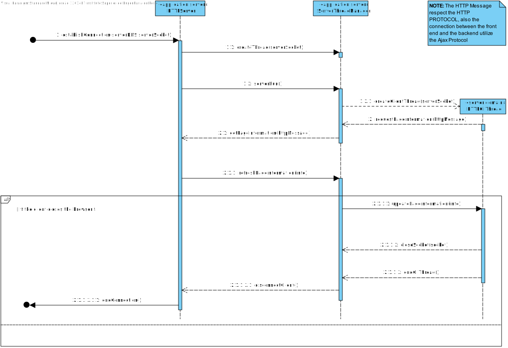

US1901
=======================================

# 1. Requisitos

As Project Manager, I want that the "OrdersServer" component supports properly, at request, the needs of the "CustomerApp" application.

Since this is a FUNCTIONAL USER STORY, there is no current demo.
 

###Acceptance Criteria:
It must be used the provided application protocol (SPOMS2022).

# 2. Análise

## 2.1. Brief approach

Before making any rash decisions, we must see the whole scenario since the moment that the feature starts until its end. From the client answers, it is possible to deduce that:

 

* This User story only validates the integrity of the ORDER SERVER it self, and its functionality.
* This server is implementing the TCP Protocol.

**Note: This is all information that the client provided in the forum.**

 

In order to better represent this way of thinking, we decided to create 3 SDs which illustrate all SERVERS, not only the ORDER SERVER

# 3. Design

## 3.2. Sequence Diagram (SD)

###Order Server

###AGV MANAGER SERVER

###HTTP SERVER (DASHBOARD)

