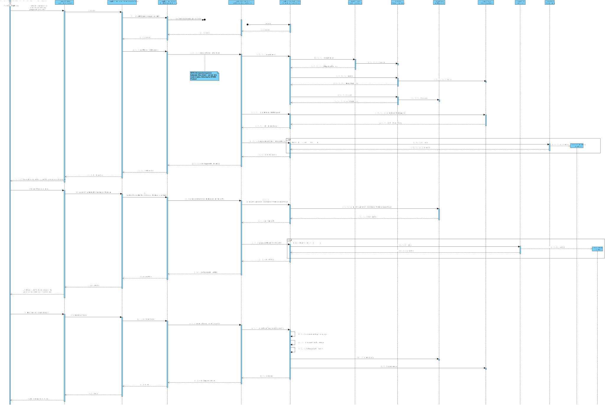

US2003
=======================================

# 1. Requisitos

As Warehouse Employee, I want to access the list of orders that need to be prepared by an AGV and be able to ask/force any of those orders to be immediately prepared by an AGV available.

Assign a task/order to an AGV. Any order that has been paid represents a task that can be assigned to an AGV. The task consists of picking up all the items of the respective order. The assignment of a task to an AGV can be done:
  * a. Automatically by the system. Currently, a basic FIFO (first in, first out) algorithm is foreseen as acceptable. However, latter on a more complex algorithm might be needed.
  * b. Manually by a warehouse employee. In this case, the employee identifies both the intended order, and the intended AGV.
  * c. Either done automatically or manually the AGV constraints regarding volume and weight must be verified

 

**Demo**

- Demo 1.1: In this User story, we will only focus in the second Use Case (**b.**).

  + In order to make this demo happen, we first have to analyze what is demanded in this Use Case scenario and what the client has said in the forum;
  + We are going to make a feature in our program that is going to assign an available order (in the status "waiting") to an available AGV either forcing or asking the same to prepare that specific order; 
  + Before we can assign an order to an AGV we must first see if there is any available AGV and then verify if there is any AGV that prepare that specific order (since the capacity between AGVs is different);
  + We must, also, verify the waiting orders list, if it is correct or not (an error might have occurred).

# 2. Análise

## 2.1. Brief approach

Before making any rash decisions, we must see the whole scenario since the moment that the feature starts until its end. From the client answers, it is possible to deduce that:

 

* In the beginning, the system will show to the actor all the orders that are waiting to be prepared by an AGV and also all available AGVs at the moment.
  If an AGV already has an ongoing task it cannot be canceled, the task must first end in order to this specific AGV be free again.
  Also, for an AGV to be ready his autonomy must be sufficient to carry the desired order.
  From the client answers, it is useful to show the order id, the order date, the customer id or name, and the order total. The Total weight and total volume might be also useful if (s)he knows the AGV' characteristics. However, it is up to the system ensure that the selected AGV is capable of fulfilling the task.

* Afterwards, the actor selects his desired order (inputting one of the valid options to identify an order), and the desired AGV (selecting one of the available AGV by inputting his id aswell);

* In the end, the system will verify if that specific request is possible and will inform the actor if the request was successfully or not. 

**Note: This is all information that the client provided in the forum.**

 

In order to better represent this way of thinking, we decided to create some artifacts to "illustrate" the Use Case itself.

## 2.2. System Sequence Diagram (SSD)

The first artifact done in this section was the System Sequence Diagram, where it clearly specifies the interaction between the System and the Actor, which is, in this case, the Sales Clerk.

As we can see in the diagram, the exact interaction between the actor and the system is illustrated. We must enter all information demanded by the system (some are not mandatory).

## 2.3. Domain Model Excerpt (DM)

The second artifact applies the DDD pattern in order to illustrate the business concept. It shows all domain concepts relevant to this Use Case, making a clear representation of all business concepts.

##  2.4. Conclusion

After this analysis, we have gathered all the information to start the design part, the design artifacts.

# 3. Design

## 3.1. Brief approach

Now we can start the "implementation" or, in other words, the design of the system itself, where we "draw" our ideas and make a "sketch" of the same.

## 3.2. Sequence Diagram (SD)

The first diagram created in this section was the Sequence Diagram, where we illustrate how the system operates in this Use Case.

In order to better analyze this diagram, I would recommend the reader to open the file and see step by step how the system operates, that is exactly the same as stated previously in the analysis.

Now we know how the system will operate, step by step, and we can add additional artifacts to illustrate the system working.

## 3.3. Functionality Realization

We are using a layer structure design:
- Domain Layer:
  - Order
  - Bin
  - AGV
  - AGVDto
  - OrderDto
- Application Layer:
  - AssignOrderToAnAGVtController
  - AssignOrderToAnAGVService
- Repository Layer:
  - OrderRepository
  - AGVRepository
  - BinRepository

## 3.4. Class Diagram (CD)

This artifact, as stated previously, it's complementary to the design part, only serves to make it more complete.

## 3.5. Padrões Aplicados

* GRASI (Information Expert, Creator, Controller, Low Coupling (evaluative), High Cohesion (evaluative), Polymorphism, Pure Fabrication, Indirection, Protected Variations);
  + Information Expert - The service, since has a direct connection with the repositories, in this case, knows all domain concepts from this specific Use Case;
  + Creator, the UI creates the controller, and the controller creates all needed services;
  + Low Coupling and High Cohesion, since we are using a lot of structured layers, all with a specific meaning, we are applying this pattern aswell;
  + Polymorphism, since a domain concept object may have multiple different values;
  + Pure Fabrication, since there is only 1 of each type of class created, meaning, in case of the controller and the UI they are only created one time;
  + The other patterns already were explained by previous points;
* Tell, don't ask;
  + Basic pattern, has a similar function as "Keep it simple", since both patterns apply simple interaction between actor - UI and UI - controller;
* Single Responsibility Principle;
* Interface Segregation Principle;
* Intention Revealing Interfaces;
* DDD (Persistence Ignorance, Entity, Value Object, Domain Service, Aggregate, Domain Event, Observer, Events);
  + This pattern was introduced in EAPLI, where we started working with this pattern. It is very important to fully understand this pattern, since it makes an implementation of a domain business concept way easier (and makes it easier to understand to outside people), Entities, value objects, services... All are well explained in the Geral Domain model and the glossary, so I think there is no need to explain this here;
* Repositories pattern;
  + This pattern applies a persistance context using repositories to have an easier communication between the run time system, and a remote database, where it makes the operation between the same atomic and simple transactions;
* Services pattern;
  + This pattern applies both to the domain and the application layer, in this specific Use Case it wasn't used services in the domain layer only in the Application layer, as stated previously to make an easier interaction between CONTROLLER - SERVICE - REPOSITORY;

## 3.6. Testes

**Teste 1:** Verificar que é possível criar uma instância da classe Product **sem** production code.
        
    @Test
    public void ensureCanBuildProductWithoutProductionCode() {
        final Product subject = new ProductBuilder().withACategoryId(CATEGORY).coded(CODE).withAShortDescription(SHORT_DESCRIPTION).withAnExtendedDescription(EXTENDED_DESCRIPTION).withATechnicalDescription(TECHNICAL_DESCRIPTION).withABrandName(BRAND_NAME).withAReference(REFERENCE).withABarcode(BARCODE).withAPrice(PRICE).withASetOfPhotos(PHOTO_LIST).build();

        assertNotNull(subject);
    }

**Teste 2:** Verificar que é possível criar uma instância da classe Product **com** production code.
    
    @Test
    public void ensureCanBuildProduct() {
        final Product subject = new ProductBuilder().withACategoryId(CATEGORY).coded(CODE).withAShortDescription(SHORT_DESCRIPTION).withAnExtendedDescription(EXTENDED_DESCRIPTION).withATechnicalDescription(TECHNICAL_DESCRIPTION).withABrandName(BRAND_NAME).withAReference(REFERENCE).withABarcode(BARCODE).withAPrice(PRICE).withASetOfPhotos(PHOTO_LIST).withAProductionCode(PRODUCTION_CODE).build();

        assertNotNull(subject);
    }

**Teste 3:** Verificar que não é possível criar uma instância da classe Product com um internal code nulo.

    @Test
    void ensureCannotBuildProductWithCodeNull() {
        Exception exception = Assertions.assertThrows(IllegalArgumentException.class, () -> new ProductBuilder().withACategoryId(CATEGORY).coded(Code.valueOf("")).withAShortDescription(SHORT_DESCRIPTION).withAnExtendedDescription(EXTENDED_DESCRIPTION).withATechnicalDescription(TECHNICAL_DESCRIPTION).withABrandName(BRAND_NAME).withAReference(REFERENCE).withABarcode(BARCODE).withAPrice(PRICE).withASetOfPhotos(PHOTO_LIST).build());
        assertEquals("Code should neither be null nor empty", exception.getMessage());
    }

**Teste 4:** Verificar que não é possível criar uma instância da classe Product sem estar associada a uma categoria.

    @Test
    void ensureMustHaveCategoryId() {
        assertThrows(IllegalArgumentException.class, () -> new Product(null, CODE, SHORT_DESCRIPTION, EXTENDED_DESCRIPTION, TECHNICAL_DESCRIPTION, BRAND_NAME, REFERENCE, BARCODE, PRICE, PHOTO_LIST));
    }

**Teste 5:** Verificar que é possível atualizar os valores de uma instância da classe Product com uma nova pequena descrição.

    @Test
    void ensureCanChangeShortDescription() {
        final Product subject = buildProductWithProductionCode();

        final Description newInfo = Description.valueOf("Another short description");

        subject.update(CATEGORY_ID, CODE, newInfo, EXTENDED_DESCRIPTION, TECHNICAL_DESCRIPTION, BRAND_NAME, REFERENCE, BARCODE, PRICE, PHOTO_LIST, PRODUCTION_CODE);
    }

**Teste 6:** Verificar que é possível criar uma instância da classe Bin.

    @Test
    public void ensureCanBuildBin() {
        final Bin subject = new BinBuilder().withABinLocation(BIN_LOCATION).withAProductId(PRODUCT_ID).build();
    }

**Teste 7:** Verificar que não é possível criar uma instância da classe Bin com um product ID nulo.

    @Test
    void ensureCannotBuildBinWithProductIdNull() {
        Exception exception = Assertions.assertThrows(IllegalArgumentException.class, () -> new BinBuilder().withABinLocation(BIN_LOCATION).withAProductId(Long.valueOf("")));
        assertEquals("For input string: \"\"", exception.getMessage());
    }

**Teste 8:** Verificar que não é possível criar uma instância da classe Bin com uma localização nula.

    @Test
    void ensureMustHaveLocation() {
        assertThrows(IllegalArgumentException.class, () -> new Bin(null, PRODUCT_ID));
    }

**Teste 9:** Verificar que é possível atualizar os valores de uma instância da classe Bin com uma nova localização.

    @Test
    void ensureCanChangeLocation() {
        final Bin subject = buildBin();

        final BinLocation newInfo = BinLocation.valueOf(2,2,2);

        subject.update(newInfo, PRODUCT_ID);
    }

# 4. Implementação

## RegisterProductController

    @UseCaseController
    public class RegisterProductController {
    
        private Product product;
        private final AuthorizationService authorizationService = AuthzRegistry.authorizationService();
        private final RegisterProductService registerProductService = new RegisterProductService();
        private final ViewAllCategoriesService viewAllCategoriesService = new ViewAllCategoriesService();
        private final GenerateBinService generateBinService = new GenerateBinService();
        private final SearchWarehouseService service = new SearchWarehouseService();
    
        public Product registerProductWithoutProductionCode(final int option, final Code code, final Description shortDescription, final Description extendedDescription, final Description technicalDescription, final BrandName brandName, final Reference reference, final Barcode barcode, final Money price, final List<String> photo) throws IOException {
            authorizationService.ensureAuthenticatedUserHasAnyOf(BaseRoles.SALES_CLERK, BaseRoles.POWER_USER);
    
            this.product = registerProductService.registerProductWithoutProductionCode(findCategoryId(option), code, shortDescription, extendedDescription, technicalDescription, brandName, reference, barcode, price, convertByteIntoPhoto(photo));
    
            return product;
        }
    
        public Product registerProductWithProductionCode(final int option, final Code code, final Description shortDescription, final Description extendedDescription, final Description technicalDescription, final BrandName brandName, final Reference reference, final Barcode barcode, final Money price, final List<String> photo, final ProductionCode productionCode) throws IOException {
            authorizationService.ensureAuthenticatedUserHasAnyOf(BaseRoles.SALES_CLERK, BaseRoles.POWER_USER);
    
            this.product = registerProductService.registerProductWithProductionCode(findCategoryId(option), code, shortDescription, extendedDescription, technicalDescription, brandName, reference, barcode, price, convertByteIntoPhoto(photo), productionCode);
    
            return product;
        }
    
        public ProductDTO getProductDTO() {
            return product.toDTO();
        }
    
        public List<CategoryDTO> getCategoryDTOList() {
            return viewAllCategoriesService.getAllCategories();
        }
    
        private Long findCategoryId(int option) {
            CategoryDTO categoryDTO = getCategoryDTOList().get(option - 1);
    
            return viewAllCategoriesService.getCategoryId(categoryDTO);
        }
    
        public boolean validateAndVerifyPath(String path) {
            String extension = FilenameUtils.getExtension(path);
    
            if (extension.equals("png") || extension.equals("jpg") || extension.equals("svg")) {
                File file = new File(path);
    
                if (file.exists() && !file.isDirectory()) {
                    return true;
    
                } else {
                    throw new IllegalStateException("Invalid path! The path introduced does not exist.");
                }
            } else {
                throw new IllegalStateException("Invalid file format! Please enter a .png, .jpg or .svg file.");
            }
        }
    
        private List<Photo> convertByteIntoPhoto(List<String> sList) throws IOException {
            List<Photo> photoList = new ArrayList<>();
    
            for (byte[] aByte : registerProductService.validatePhotoPath(sList)) {
                Photo p = Photo.valueOf(aByte);
                photoList.add(p);
            }
    
            return photoList;
        }
    
        public ShelfDTO getBinLocation() {
            return generateBinService.generateBin(product.identity());
        }
    
        public boolean verifyWarehouseImported() {
            if (service.getWarehouse() == null) return false;
            else return true;
        }
    }

## Product

    @Entity
    public class Product implements AggregateRoot<Long>, DTOable<ProductDTO>, Representationable {

        private static final long serialVersionUID = 210702L;

        @Id
        @GeneratedValue(strategy = GenerationType.AUTO)
        private Long productId;
    
        @Version
        private Long version;
    
        @JoinColumn(nullable = false, name = "category_id")
        private Long categoryId;
    
        @Column(unique = true, nullable = false)
        private Code code;
    
        @AttributeOverride(name = "value", column = @Column(name = "short_description"))
        @Column(nullable = false)
        private Description shortDescription;
    
        @AttributeOverride(name = "value", column = @Column(name = "extended_description"))
        @Column(nullable = false)
        private Description extendedDescription;
    
        @AttributeOverride(name = "value", column = @Column(name = "technical_description"))
        @Column(nullable = false)
        private Description technicalDescription;
    
        @Column(nullable = false)
        private BrandName brandName;
    
        @Column(nullable = false)
        private Reference reference;
    
        @Column(nullable = false)
        private Barcode barcode;
    
        @Column(nullable = false)
        private Money price;
    
        @OneToMany(cascade = CascadeType.ALL)
        private List<Photo> photoList;
    
        @Column
        private ProductionCode productionCode;
    
        protected Product() {
            // For ORM only
        }
    
        public Product(final Long categoryId, final Code code, final Description shortDescription, final Description extendedDescription, final Description technicalDescription, final BrandName brandName, final Reference reference, final Barcode barcode, final Money price, final List<Photo> photoList) {
            Preconditions.noneNull(categoryId, code, shortDescription, extendedDescription, technicalDescription, brandName, reference, barcode, price, photoList);
    
            this.categoryId = categoryId;
            this.code = code;
            this.shortDescription = shortDescription;
            this.extendedDescription = extendedDescription;
            this.technicalDescription = technicalDescription;
            this.brandName = brandName;
            this.reference = reference;
            this.barcode = barcode;
            this.price = price;
            this.photoList = photoList;
        }
    
        public Product(final Long categoryId, final Code code, final Description shortDescription, final Description extendedDescription, final Description technicalDescription, final BrandName brandName, final Reference reference, final Barcode barcode, final Money price, final List<Photo> photoList, final ProductionCode productionCode) {
            Preconditions.noneNull(categoryId, code, shortDescription, extendedDescription, technicalDescription, brandName, reference, barcode, price, photoList);
    
            this.categoryId = categoryId;
            this.code = code;
            this.shortDescription = shortDescription;
            this.extendedDescription = extendedDescription;
            this.technicalDescription = technicalDescription;
            this.brandName = brandName;
            this.reference = reference;
            this.barcode = barcode;
            this.price = price;
            this.photoList = photoList;
            this.productionCode = productionCode;
        }
    
        @Override
        public Long identity() {
            return this.productId;
        }
    
        @Override
        public boolean sameAs(final Object other) {
            if (!(other instanceof Product)) {
                return false;
            }
    
            final Product that = (Product) other;
            if (this == that) {
                return true;
            }
    
            return identity().equals(that.identity()) && categoryId.equals(that.categoryId)
                    && code.equals(that.code)
                    && shortDescription.equals(that.shortDescription)
                    && extendedDescription.equals(that.extendedDescription)
                    && technicalDescription.equals(that.technicalDescription)
                    && brandName.equals(that.brandName)
                    && reference.equals(that.reference)
                    && barcode.equals(that.barcode)
                    && price.equals(that.price)
                    && photoList.equals(that.photoList);
        }
    
        @Override
        public <R> R buildRepresentation(RepresentationBuilder<R> builder) {
            builder.startObject("Product").withProperty("category ID", String.valueOf(categoryId))
                    .withProperty("code", String.valueOf(code))
                    .withProperty("short description", shortDescription)
                    .withProperty("extended description", extendedDescription)
                    .withProperty("technical description", technicalDescription)
                    .withProperty("brand name", String.valueOf(brandName))
                    .withProperty("reference", String.valueOf(reference))
                    .withProperty("barcode", String.valueOf(barcode))
                    .withProperty("price", price)
                    .withProperty("photoList", String.valueOf(photoList))
                    .withProperty("production code", String.valueOf(productionCode));
    
            return builder.build();
        }

        @Override
        public boolean equals(Object o) {
            return DomainEntities.areEqual(this, o);
        }
    
        @Override
        public int hashCode() {
            return DomainEntities.hashCode(this);
        }
    
        @Override
        public ProductDTO toDTO() {
            return new ProductDTO(categoryId.toString(), code.toString(), shortDescription.toString(), extendedDescription.toString(), brandName.toString(), reference.toString(), price);
        }
    
        private void changeCategory(final Long categoryId) {
            if (categoryId == null) {
                throw new IllegalArgumentException();
            }
            this.categoryId = categoryId;
        }
    
        private void changeCode(final Code code) {
            if (code == null) {
                throw new IllegalArgumentException();
            }
            this.code = code;
        }

        private void changeShortDescription(final Description shortDescription) {
            if (shortDescription == null) {
                throw new IllegalArgumentException();
            }
            this.shortDescription = shortDescription;
        }

        private void changeExtendedDescription(final Description extendedDescription) {
            if (extendedDescription == null) {
                throw new IllegalArgumentException();
            }
            this.extendedDescription = extendedDescription;
        }

        private void changeTechnicalDescription(final Description technicalDescription) {
            if (technicalDescription == null) {
                throw new IllegalArgumentException();
            }
            this.technicalDescription = technicalDescription;
        }

        private void changeBrandName(final BrandName brandName) {
            if (brandName == null) {
                throw new IllegalArgumentException();
            }
            this.brandName = brandName;
        }

        private void changeReference(final Reference reference) {
            if (reference == null) {
                throw new IllegalArgumentException();
            }
            this.reference = reference;
        }

        private void changeBarcode(final Barcode barcode) {
            if (barcode == null) {
                throw new IllegalArgumentException();
            }
            this.barcode = barcode;
        }

        private void changePrice(final Money price) {
            if (price == null) {
                throw new IllegalArgumentException();
            }
            this.price = price;
        }

        private void changePhoto(final List<Photo> photo) {
            if (photo == null) {
                throw new IllegalArgumentException();
            }
            this.photoList = photo;
        }

        private void changeProductionCode(final ProductionCode productionCode) {
            if (productionCode == null) {
                throw new IllegalArgumentException();
            }
            this.productionCode = productionCode;
        }

        public void update(final Long categoryId, final Code code, final Description shortDescription, final Description extendedDescription, final Description technicalDescription, final BrandName brandName, final Reference reference, final Barcode barcode, final Money price, final List<Photo> photo, final ProductionCode productionCode) {
            Preconditions.noneNull(categoryId, code, shortDescription, extendedDescription, technicalDescription, brandName, reference, barcode, price, photo);

            changeCategory(categoryId);
            changeCode(code);
            changeShortDescription(shortDescription);
            changeExtendedDescription(extendedDescription);
            changeTechnicalDescription(technicalDescription);
            changeBrandName(brandName);
            changeReference(reference);
            changeBarcode(barcode);
            changePrice(price);
            changePhoto(photo);
            changeProductionCode(productionCode);
        }

        public Money price() {
            return this.price;
        }
    }

## ViewAllCategoriesService

    @ApplicationService
    public class ViewAllCategoriesService {

        private final CategoryRepository categoryRepository = PersistenceContext.repositories().categories();

        public List<CategoryDTO> getAllCategories() {
            List<Category> categoryList = categoryRepository.findAll();

            List<CategoryDTO> categoryDTOS = new ArrayList<>();

            for(Category category : categoryList) {
                categoryDTOS.add(category.toDTO());
            }

            return categoryDTOS;
        }

        public Long getCategoryId(CategoryDTO categoryDTO) {
            return categoryRepository.findByCodeAndReturnId(categoryDTO.getAlphaNumericCode());
        }
    }

## RegisterPhotoService

    @ApplicationService
    public class RegisterProductService {

        private final ProductRepository productRepository = PersistenceContext.repositories().products();
    
        public Product registerProductWithoutProductionCode(final Long categoryId, final Code code, final Description shortDescription, final Description extendedDescription, final Description technicalDescription, final BrandName brandName, final Reference reference, final Barcode barcode, final Money price, final List<Photo> photoList) throws IOException {
            return productRepository.save(new Product(categoryId, code, shortDescription, extendedDescription, technicalDescription, brandName, reference, barcode, price, photoList));
        }
    
        public Product registerProductWithProductionCode(final Long categoryId, final Code code, final Description shortDescription, final Description extendedDescription, final Description technicalDescription, final BrandName brandName, final Reference reference, final Barcode barcode, final Money price, final List<Photo> photoList, final ProductionCode productionCode) {
            return productRepository.save(new Product(categoryId, code, shortDescription, extendedDescription, technicalDescription, brandName, reference, barcode, price, photoList, productionCode));
        }
    
        public byte[][] validatePhotoPath(List<String> pathPhotoList) throws IOException {
    
            byte[][] byteMatrix = new byte[pathPhotoList.size()][];
            int index = 0;
    
            for (String s : pathPhotoList) {
                File file = new File(s);
                byte[] picInBytes = new byte[(int) file.length()];
                FileInputStream fileInputStream = new FileInputStream(file);
                fileInputStream.read(picInBytes);
                fileInputStream.close();
    
                byteMatrix[index] = picInBytes;
                index++;
            }
    
            return byteMatrix;
        }
    }

## Bin

    @Entity
    public class Bin implements AggregateRoot<Long>, DTOable<BinDTO>, Representationable {
    
        @Id
        @GeneratedValue(strategy = GenerationType.AUTO)
        private Long binId;
    
        @Column(nullable = false)
        private BinLocation binLocation;
    
        @JoinColumn(nullable = false, name = "product_id")
        private Long productId;
    
        protected Bin() {
            // For ORM only
        }
    
        public Bin(final BinLocation binLocation, final Long productId) {
            Preconditions.noneNull(binLocation, productId);
    
            this.binLocation = binLocation;
            this.productId = productId;
        }
    
        @Override
        public Long identity() {
            return this.binId;
        }
    
        @Override
        public boolean sameAs(Object other) {
            if (!(other instanceof Bin)) {
                return false;
            }
    
            final Bin that = (Bin) other;
            if (this == that) {
                return true;
            }
    
            return identity().equals(that.identity())
                    && binLocation.equals(that.binLocation)
                    && productId.equals(that.productId);
        }
    
        @Override
        public <R> R buildRepresentation(RepresentationBuilder<R> builder) {
            builder.startObject("Bin").withProperty("bin location", String.valueOf(binLocation))
                    .withProperty("product ID", String.valueOf(productId));
    
            return builder.build();
        }
    
        @Override
        public boolean equals(Object o) {
            return DomainEntities.areEqual(this, o);
        }
    
        @Override
        public int hashCode() {
            return DomainEntities.hashCode(this);
        }
    
        @Override
        public BinDTO toDTO() {
            return new BinDTO(binLocation.toString(), productId.toString());
        }
    
        private void changeBinLocation(final BinLocation binLocation) {
            if (binLocation == null) {
                throw new IllegalArgumentException();
            }
            this.binLocation = binLocation;
        }
    
        private void changeProduct(final Long productId) {
            if (productId == null) {
                throw new IllegalArgumentException();
            }
            this.productId = productId;
        }
    
        public void update(final BinLocation binLocation, final Long productId) {
            Preconditions.noneNull(binLocation, productId);
    
            changeBinLocation(binLocation);
            changeProduct(productId);
        }
    }

## BinLocation

    @Embeddable
    public class BinLocation implements ValueObject {
    
        private final int aisleIdentifier;
        private final int rowIdentifier;
        private final int shelfIdentifier;
    
        public BinLocation(int aisleIdentifier, int rowIdentifier, int shelfIdentifier) {
            Preconditions.nonNegative(aisleIdentifier);
            Preconditions.nonNegative(rowIdentifier);
            Preconditions.nonNegative(shelfIdentifier);
    
    
            this.aisleIdentifier = aisleIdentifier;
            this.rowIdentifier = rowIdentifier;
            this.shelfIdentifier = shelfIdentifier;
    
        }
    
        protected BinLocation() {
            //for ORM purposes only
            this.aisleIdentifier = 0;
            this.rowIdentifier = 0;
            this.shelfIdentifier = 0;
        }
    
        public static BinLocation valueOf(int shelfId, int rowId, int aisleId) {
            return new BinLocation(shelfId, rowId, aisleId);
        }
    
        @Override
        public boolean equals(Object o) {
            if (this == o) return true;
            if (o == null || getClass() != o.getClass()) return false;
            BinLocation that = (BinLocation) o;
            return this.aisleIdentifier == that.aisleIdentifier && this.rowIdentifier == that.rowIdentifier && this.shelfIdentifier == that.shelfIdentifier;
        }
    }

## GenerateBinService

    @ApplicationService
    public class GenerateBinService {
    private Bin bin;
    
        private final SearchWarehouseService service = new SearchWarehouseService();
        private final AssignShelfService assignShelfService = new AssignShelfService(service.getWarehouse());
        private final AuthorizationService authz = AuthzRegistry.authorizationService();
        private final BinRepository binRepository = PersistenceContext.repositories().bins();
    
        public ShelfDTO generateBin(final Long productId) {
            authz.ensureAuthenticatedUserHasAnyOf(BaseRoles.SALES_CLERK);
    
            ShelfDTO shelfDTO = assignShelfService.assignShelf();
            Bin bin = new Bin(BinLocation.valueOf(shelfDTO.shelf(), shelfDTO.row(), shelfDTO.aisle()), productId);
            binRepository.save(bin);
    
            return shelfDTO;
        }
    }

# 5. Integração/Demonstração

It was added a new UI to the application and a new menu dedicated for the product management.
For now, the only option it has is to see the product creation, but it will be extended in the future.

 

When the system creates products, it is necessary to assign  them positions in the warehouse. For that, we decided to create a binService, which generates bins that compreehends a product and has a unique location inside the warehouse.
This bin is going to be saved in the database so we can have the product location persisted aswell.

# 6. Observações

I think our interpretation of the Use Case was the best as possible, since we treated all possible input making it impossible to have "incorrect data" (all data must be according to the patterns specified by the client), and the way we show the product creation and his location in great quality, since we use the DTO pattern and instead of sending the domain concept object to the UI we send a DTO of the same, only having the necessary information to the actor.