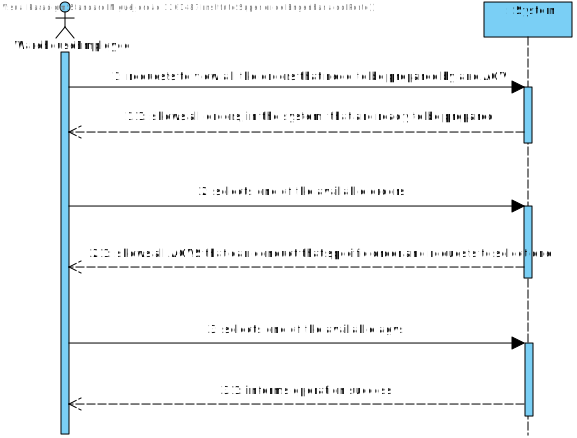

US2003
=======================================

# 1. Requisitos

As Warehouse Employee, I want to access the list of orders that need to be prepared by an AGV and be able to ask/force any of those orders to be immediately prepared by an AGV available.

Assign a task/order to an AGV. Any order that has been paid represents a task that can be assigned to an AGV. The task consists of picking up all the items of the respective order. The assignment of a task to an AGV can be done:
  * a. Automatically by the system. Currently, a basic FIFO (first in, first out) algorithm is foreseen as acceptable. However, latter on a more complex algorithm might be needed.
  * b. Manually by a warehouse employee. In this case, the employee identifies both the intended order, and the intended AGV.
  * c. Either done automatically or manually the AGV constraints regarding volume and weight must be verified

 

**Demo**

- Demo 1.1: In this User story, we will only focus in the second Use Case (**b.**).

  + In order to make this demo happen, we first have to analyze what is demanded in this Use Case scenario and what the client has said in the forum;
  + We are going to make a feature in our program that is going to assign an available order (in the status "waiting") to an available AGV either forcing or asking the same to prepare that specific order; 
  + Before we can assign an order to an AGV we must first see if there is any available AGV and then verify if there is any AGV that prepare that specific order (since the capacity between AGVs is different);
  + We must, also, verify the waiting orders list, if it is correct or not (an error might have occurred);
  + This feature will be constantly communicating with the AGVManager server in order to update the status of an AGV, and the status of an order (both selected by the actor).

# 2. Análise

## 2.1. Brief approach

Before making any rash decisions, we must see the whole scenario since the moment that the feature starts until its end. From the client answers, it is possible to deduce that:

 

* In the beginning, the system will show to the actor all the orders that are waiting to be prepared by an AGV and also all available AGVs at the moment.
  If an AGV already has an ongoing task it cannot be canceled, the task must first end in order to this specific AGV be free again.
  Also, for an AGV to be ready his autonomy must be sufficient to carry the desired order.
  From the client answers, it is useful to show the order id, the order date, the customer id or name, and the order total. The Total weight and total volume might be also useful if (s)he knows the AGV' characteristics. However, it is up to the system ensure that the selected AGV is capable of fulfilling the task.

* Afterwards, the actor selects his desired order (inputting one of the valid options to identify an order), and the desired AGV (selecting one of the available AGV by inputting his id aswell);

* In the end, the system will verify if that specific request is possible and will inform the actor if the request was successfully or not.

* All the information needed will be obtained from the AGVManagerServer, by requests.
* This server is implementing the TCP Protocol.

**Note: This is all information that the client provided in the forum.**

 

In order to better represent this way of thinking, we decided to create some artifacts to "illustrate" the Use Case itself.

## 2.2. System Sequence Diagram (SSD)

The first artifact done in this section was the System Sequence Diagram, where it clearly specifies the interaction between the System and the Actor, which is, in this case, the Sales Clerk.

As we can see in the diagram, the exact interaction between the actor and the system is illustrated. We must enter all information demanded by the system (some are not mandatory).

## 2.3. Domain Model Excerpt (DM)

The second artifact applies the DDD pattern in order to illustrate the business concept. It shows all domain concepts relevant to this Use Case, making a clear representation of all business concepts.

##  2.4. Conclusion

After this analysis, we have gathered all the information to start the design part, the design artifacts.

# 3. Design

## 3.1. Brief approach

Now we can start the "implementation" or, in other words, the design of the system itself, where we "draw" our ideas and make a "sketch" of the same.

## 3.2. Sequence Diagram (SD)

The first diagram created in this section was the Sequence Diagram, where we illustrate how the system operates in this Use Case.

In order to better analyze this diagram, I would recommend the reader to open the file and see step by step how the system operates, that is exactly the same as stated previously in the analysis.

Now we know how the system will operate, step by step, and we can add additional artifacts to illustrate the system working.
As we mention before, this feature will be constantly communicating with the server to retrieve all the needed information since the backOfficeApplication shouldn't communicate with the database directly.

## 3.3. Functionality Realization

We are using a layer structure design:
- Domain Layer:
  - Order
  - AGV
  - AGVDto
  - OrderDto
- Application Layer:
  - AssignOrderToAgvController
  - EstablishCommunicationService
- Server Application layer:
  - AssignOrderToAgvService
  - AGVManagerServer
- Repository Layer:
  - OrderRepository
  - AGVRepository
  
## 3.5. Padrões Aplicados

* GRASI (Information Expert, Creator, Controller, Low Coupling (evaluative), High Cohesion (evaluative), Polymorphism, Pure Fabrication, Indirection, Protected Variations);
  + Information Expert - The service, since has a direct connection with the repositories, in this case, knows all domain concepts from this specific Use Case;
  + Creator, the UI creates the controller, and the controller creates all needed services;
  + Low Coupling and High Cohesion, since we are using a lot of structured layers, all with a specific meaning, we are applying this pattern aswell;
  + Polymorphism, since a domain concept object may have multiple different values;
  + Pure Fabrication, since there is only 1 of each type of class created, meaning, in case of the controller and the UI they are only created one time;
  + The other patterns already were explained by previous points;
* Tell, don't ask;
  + Basic pattern, has a similar function as "Keep it simple", since both patterns apply simple interaction between actor - UI and UI - controller;
* Single Responsibility Principle;
* Interface Segregation Principle;
* Intention Revealing Interfaces;
* DDD (Persistence Ignorance, Entity, Value Object, Domain Service, Aggregate, Domain Event, Observer, Events);
  + This pattern was introduced in EAPLI, where we started working with this pattern. It is very important to fully understand this pattern, since it makes an implementation of a domain business concept way easier (and makes it easier to understand to outside people), Entities, value objects, services... All are well explained in the Geral Domain model and the glossary, so I think there is no need to explain this here;
* Repositories pattern;
  + This pattern applies a persistance context using repositories to have an easier communication between the run time system, and a remote database, where it makes the operation between the same atomic and simple transactions;
* Services pattern;
  + This pattern applies both to the domain and the application layer, in this specific Use Case it wasn't used services in the domain layer only in the Application layer, as stated previously to make an easier interaction between CONTROLLER - SERVICE - REPOSITORY;
* Client - Server pattern;
  + The name of this interaction doesn't have properly this name, but, since we didn't found any specific pattern that would describe what we utilized here, we decided to have this name to illustrate the fact that we utilize servers to communicate with the client/backOffice applications and the servers (using the SPOMS protocol)

## 3.6. Testes

**Teste 1:** MOCK TEST : Assign an existing valid order to an available AGV

       Date date = new Date("12/01/2020");
        Calendar calendar1 = Calendar.getInstance();
        calendar1.setTime(date);

        final Customer customer = new CustomerBuilder().brithDate(new BirthDate(new Date("12/12/2002"))).vat(new VAT(12)).number(new PhoneNumber(123, 123456789)).named(new Name("customer1 customer")).gender(new Gender("Male")).email(new Email("email@email.com")).address(new Address("Billing Address", 11, "postal code", "city", "country")).build();

        ClientOrder clientOrder = new OrderBuilder()
                .addDate(new OrderDate())
                .addDate(calendar1)
                .addWeight(12)
                .addPrice(new Money(12, Currency.getInstance("EUR")))
                .addCustomer(customer)
                .addOrderLine(null)
                .addState(OrderState.TO_BE_PREPARED)
                .addPayment(new Payment(PaymentMethod.PAYPAL))
                .addShipping(new Shipping())
                .build();

        final String agvIdentifier = "BX001201";
        final int agvAutonomy = 33;
        final String agvDescription = new String("DescriptionABV1");
        final String agvModel = "ModelZZ";
        final AGVStatus agvStatus = AGVStatus.AVAILABLE;

        AGV agv = new AGVBuilder()
                .autonomy(agvAutonomy)
                .capacity(20)
                .description(agvDescription)
                .dock(null)
                .identifier(agvIdentifier)
                .status(AGVStatus.AVAILABLE)
                .build();

        try {
            if (clientOrder.state().equals(OrderState.TO_BE_PREPARED) || agv.agvStatus().equals(AGVStatus.AVAILABLE)) {
                assignOrderToAGVController.assignOrderToAGV(clientOrder.toDTO(), agv.toDTO());
            }

            LOGGER.info("»»» Order Creation SUCCESS!");
            return true;

        } catch (Exception e) {
            LOGGER.info("»»» Order Creation ERROR!");
            return false;
        }

# 4. Implementation

Since the requirements of this Use Case was to be able to assign an order to a VALID AGV, and this same feature should be implemented by having several modules communicating between each other,for that, we opted to make a service to establish the communication between the modules. This way we can abstract the Controller, Application Layer, from the Repository Layer, thus applying the Grap Pattern the best as we can (Since the only module that is going to use the database API is the application servers module).

# 5. Integration/Demonstration

It was added a new UI to the application and a new menu dedicated for this specific feature, inside the order management.
For now, the only option it has is to see the product catalog, but it will be extended in the future.

 

When the Use Case controller requests all information, a new communication is establish between the Backoffice application and the Application servers.

# 6. Observations

I think our interpretation of the Use Case was the best as possible, since we treated all possible input making it impossible to have "incorrect data" (all data must be according to the patterns specified by the client), and the way we show the result list is in a great quality, since we use the DTO pattern and instead of sending the domain concept object to the UI we send a DTO of the same, only having the necessary information to the actor.