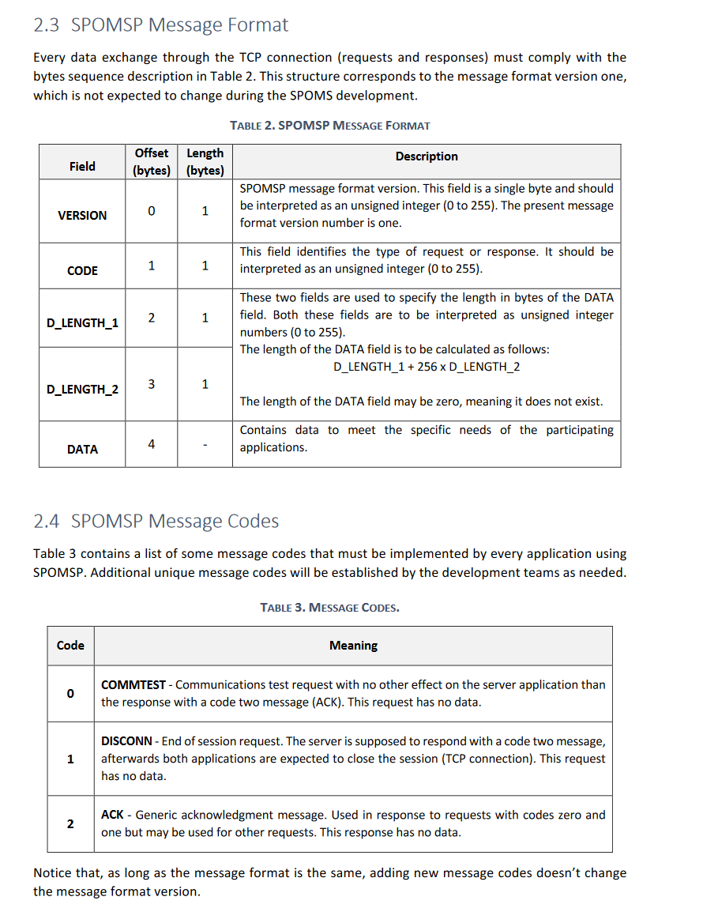

RCOMP 2021-2022 Project - Sprint 4 planning
===========================================

### Sprint master: 1201487

(This file is to be created/edited by the sprint master only)

# 1. Sprint's backlog #

| Task  | Task Description                                                                                                                                                                                                                                           |
|-------|------------------------------------------------------------------------------------------------------------------------------------------------------------------------------------------------------------------------------------------------------------|
| T.3.1 | US4001/US4002/US5001/US5002                                                                                                    |
| T.3.2 | US4001/US4002/US5001/US5002   |
| T.3.3 | US1901/US1501                                                                                                    |
| T.3.4 | Create all 3 servers. US1901/US1501/US5001/US5002                                                                                                    |

# 2. Technical decisions and coordination #

In this sprint, the team needs to develop all needed servers to be able to communicate correctly between modules.

In order to be able to make this, we first need to decide the type of DNS and ports we will use for each server.

And also, we must configure all the codes for all our requeets.

# 3. Servers Requests

All requests made between the servers and given clients are made using the SPOMS2022 Protocol:

In order to respect this protocol, our team decided to implement specific code numbers which have different values interpreted by the server.
This type of codes are in the following tables;

### AGVManagerServer

| Functionality                                      | Message code to the server |
|----------------------------------------------------|----------------------------|
| Obtain the position of the agv's                   | 0x05                       |
| Change the position of an bin                      | 0x06                       |
| Assign an order to an AGV                          | 0x07                       |
| Request all the free AGV                           | 0x08                       |
| Request orders to be prepared                      | 0x09                       |
| AGV requests an order                              | 0x0A                       |
| Warn ther server about an new order to be prepared | 0x0B                       |
| Request the occupied AGV                           | 0x0C                       |
| Request all the free AGV                           | 0x0D                       |

The AGVManager Server uses the following DNS and server socket:

**DNS** : vsgate-s2.dei.isep.ipp.pt

**Server Socket** : 2225

**Client Socket** : 10639

### Order Server

| Functionality                                      | Message code to the server |
|----------------------------------------------------|----------------------------|
| Obtain all products available in dto                | 0x05                       |
| Filter products dto list given options                  | 0x06                      |
| Obtain all products available                   | 0x07                       |
| Verify customer shopping cart                  | 0x08                       |
| Update customer shopping cart given product list                  | 0x09                       |

The Order Server uses the following DNS and server socket:

**DNS** : vsgate-s3.dei.isep.ipp.pt

**Server Socket** : 2227

**Client Socket** : 10639

###HTTPS Server

This server does not need this type of requests, since it uses the HTTP message protocol, to have communication between the server and the client.
And to be able to send information between the back end and the front end, our team decided to use Ajax protocol (which uses java script).

All this type of protocols are implemented in classes inside the base.app.server.

The HTTPS Server uses the following DNS and server socket:

**DNS** : vs-gate.dei.isep.ipp.pt

**Server Socket** : 2228

**Client Socket** : 30639

The URI to see this page is : https://vs-gate.dei.isep.ipp.pt:30639/

**NOTE**: To be able to open the link the HTTPS Server MUST BE RUNNING! Otherwise it will be impossible to see this page

###AGVTwin Server

For mock purposes this server only exists to open a socket to estabilish a communication between the AGVManagerServer and the AGVTwin Application

The AGVTwin Server uses the following DNS and server socket:

**DNS** : vsgate-s1.dei.isep.ipp.pt

**Server Socket** : 2223

**Client Socket** : 10639

**NOTE**: All this DNS and Ports are from our virtual machine running in the DEI Virtual Servers. 
          We decided to make them all public access to challenge our selfes and for test purposes.

# 4. Subtasks assignment #

* **1200601** - Add his needing requests to the AGVManagerServer **(US5001-US5002-US4001-US4002)**.
* **1200902** -  Add his needing requests to the OrderServer **(US1501)**.
* **1200920** -  Create the TwinAGV Server. Add his needing requests to the AGVManagerServer **(US5001-US5002-US4001-US4002)**.
* **1201487** - Creation of 3 servers (AGVManager Server, Order server and HTTPS Server) Verification of all requests.
  Add his needing requests to the AGVManagerServer **(US5001-US5002-US4001-US4002)**
