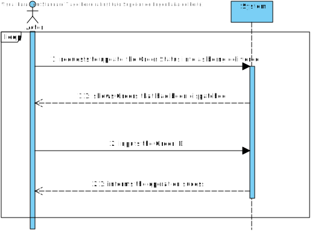
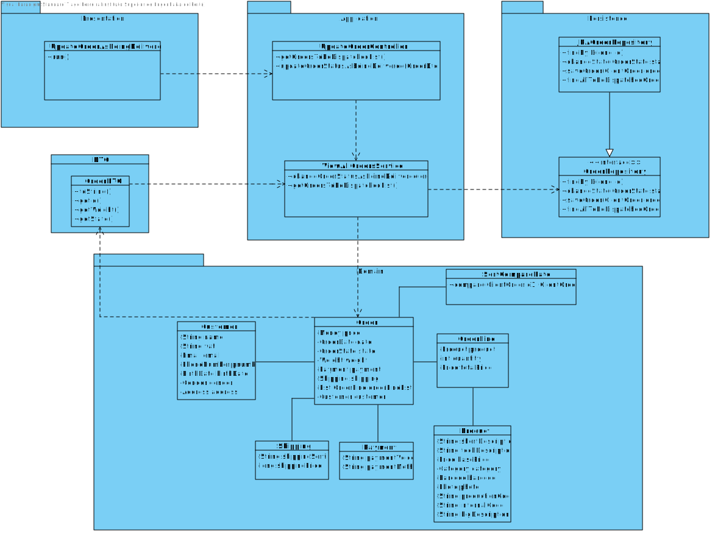

# US 1006
=======================================

# 1. Requisitos

**User Story:** As Sales Clerk, I want to access a list of orders that had been dispatched for customer delivery and be
able to update some of those orders to as being delivered.

# 2. Análise

##Acceptance Criteria

* The program must only show **Orders** that have been dispatched.
* The program must be able to ask the **Sales Clerk** which **Order** it wishes to update.
* Whichever **Orders** the **Sales Clerk** decides to choose, the **Order** must update its status to **as being
  delivered**.

##Client Answers
**Question 1:**

"possible states that can be considered are: (i) registered, (ii) payment pending, (iii) to be prepared (waiting for an initial warehouse action), (iv) being prepared on the warehouse, (v) ready for packaging; (vi) ready for carrier dispatching, (vii) dispatched, (viii) delivered by carrier, (ix) received by customer" (page 3)"

"On orders having a “dispatched for customer delivery” status, it might be possible clerksmarks such orders as “being delivered” (page 7);

"On orders having a “delivered by carrier” status, it might be possible clerks marks such orders as “delivered”";

*DIAGRAM MADE BY RICARDO MOURISCO 1170640*

Or should it just be a symbolic change, akin to a marker that is being dealt by a clerk on that specific stage?

Adding to that, and following the "Warehouse Management" instructions on page 7 and 8, it seems the system never really is made aware of the changes to (v) ready for packaging and (vi) ready for carrier dispatching. Would it be prudent to remove them from the system as state options or not? (this would make it so, the sales clerk would actually change the state from "dispatched for customer delivery" to "being delivered", instead of taking it from "Ready for dispatching".

To end, what property would be of interest for the sales clerk for the orders to be sorted by?

**Answer 1:**
1. The state " (vii) dispatched" and "dispatched for customer delivery" represent the same thing.

2. You should be aware that the specifications' document also states "Notice that all relevant states might not be listed and some of the listed states might be redundant and/or not necessary by some reason. As so, this matter should be carefully analyzed." (page 3).

3. Remember also what is stated on page 7: "At this time, the order status should change from “being prepared” (set when the AGV accepted the task) to “ready for packaging”.

4. It is not prudent to neglect states even if such states are not being exploit at the moment.

5. You might sort the orders from the older ones to the new ones considering the date/time of their status.

## SSD

## Model Domain (MD)

# 3. Design

## Functionality Layers

* The **UI** is responsible to show the **Sales Clerk** the list of **Orders** that **had been dispatched for customer
  delivery**. It is also responsible for asking the **Sales Clerk** which **Order** should be updated to **as being
  delivered**.
* The **Controller** is responsible to call the **ViewAllOrdersService** methods.
* The **ViewAllOrdersService** will have to following methods: **getOrdersToBeDispatchedList** and **
  changeOrderStatusAsBeingDelivered**.

## Sequence Diagrams (SD)

## Class Diagram (CD)

## Layers

* Presentation
  * UpdateOrderAsBeingDeliveredUI 
* Application
  * UpdateOrderController
  * ViewAllOrdersService
* Persistence
  * JPAOrderRepository
  * OrderRepository
* Domain
  * ClientOrder
  * OrderDate
  * OrderLine
  * Customer
  * Shipping
  * Payment
  * Product

## Padrões Aplicados

* Information Expert
* Tell, don't ask
* Single Responsibility Principle
* Interface Segregation Principle
* DDD (Persistence Ignorance, Entity, Value Object, Domain Service, Aggregate, Domain Event, Observer)
* Repositories were used.
* GRASP (High cohesion, Low coupling)
* For this project we will maintain the UI-Controller interaction, the UI will interact with the user, requesting
  information about the object eapli.base.customermanagement.domain.Customer which will then be sent to the Controller.
* The Controller will call the Services that are responsible for the Customer creation.
* The CustomerRepository class will be responsible to add the object into the database.
* A Customer Builder was implemented which is reponsible for building the Customer object.

## Testes

**Test 1:** Sort Orders by Date

    void compare() {

        List<OrderLine> orderLineList = new ArrayList<>();
        Product product = null;
        Customer customer = null;
        OrderLine orderLine = null;
        orderLineList.add(orderLine);

        List<OrderLine> orderLineList1 = new ArrayList<>();
        Product product1 = null;
        OrderLine orderLine1 = null;
        orderLineList1.add(orderLine1);

        Date date = new Date("12/01/2020");
        Date date2 = new Date("15/03/2021");
        Date date3 = new Date("20/01/2021");
        Calendar calendar1 = Calendar.getInstance();
        Calendar calendar2 = Calendar.getInstance();
        Calendar calendar3 = Calendar.getInstance();
        calendar1.setTime(date);
        calendar2.setTime(date2);
        calendar3.setTime(date3);

        final ClientOrder clientOrder = new OrderBuilder()
                .addDate(new OrderDate())
                .addDate(calendar1)
                .addWeight(12)
                .addPrice(new Money(12, Currency.getInstance("EUR")))
                .addCustomer(customer)
                .addOrderLine(orderLineList)
                .addState(OrderState.TO_BE_PREPARED)
                .addPayment(new Payment(PaymentMethod.PAYPAL))
                .addShipping(new Shipping())
                .build();

        final ClientOrder clientOrder1 = new OrderBuilder()
                .addDate(calendar2)
                .addWeight(12)
                .addPrice(new Money(12, Currency.getInstance("EUR")))
                .addCustomer(customer)
                .addOrderLine(orderLineList1)
                .addState(OrderState.TO_BE_PREPARED)
                .addPayment(new Payment(PaymentMethod.PAYPAL))
                .addShipping(new Shipping())
                .build();

        final ClientOrder clientOrder2 = new OrderBuilder()
                .addDate(calendar3)
                .addWeight(12)
                .addPrice(new Money(12, Currency.getInstance("EUR")))
                .addCustomer(customer)
                .addOrderLine(orderLineList1)
                .addState(OrderState.TO_BE_PREPARED)
                .addPayment(new Payment(PaymentMethod.PAYPAL))
                .addShipping(new Shipping())
                .build();

        List<ClientOrder> expected = new ArrayList<>();
        expected.add(clientOrder);
        expected.add(clientOrder2);
        expected.add(clientOrder1);

        List <ClientOrder> actual = new ArrayList<>();
        actual.add(clientOrder);
        actual.add(clientOrder1);
        actual.add(clientOrder2);

        Collections.sort(actual, new SortCompareDate());

        assertEquals(expected.get(0),actual.get(0));
        assertEquals(expected.get(1),actual.get(1));
        assertEquals(expected.get(2),actual.get(2));
    }

# 4. Implementation

For the implementation firstly we created an UI which will show a list of order that "had been dispatched".
Whenever the user chooses one order to change its status as "being delivered", the list will show again but it will
excluded the orders that already have been updated.

The Controller will call the Service for two reason:
 * First it will find all to be dispatched Orders and make a list and show it to the User the Order
that already had been dispatched.
 * The Second time will be to change the Order Status to as being delivered.

# 5. Integração/Demonstração

    package eapli.base.clientordermanagement;

    import eapli.base.customermanagement.domain.Customer;
    import eapli.base.infrastructure.persistence.PersistenceContext;
    import eapli.base.ordermanagement.application.ViewAllOrdersService;
    import eapli.base.ordermanagement.domain.*;
    import eapli.base.ordermanagement.dto.OrderDto;
    import eapli.base.ordermanagement.repositories.OrderRepository;
    import eapli.base.productmanagement.domain.Product;
    import eapli.framework.general.domain.model.Money;
    import java.util.*;
  
    public class Integration {

    private static final OrderRepository orderRepository = PersistenceContext.repositories().orders();
    private static final ViewAllOrdersService viewAllOrdersService = new ViewAllOrdersService();

    public static void main(String[] args) {

        List<OrderLine> orderLineList = new ArrayList<>();
        Product product = null;
        Customer customer = null;
        OrderLine orderLine = null;
        orderLineList.add(orderLine);

        List<OrderLine> orderLineList1 = new ArrayList<>();
        Product product1 = null;
        OrderLine orderLine1 = null;
        orderLineList1.add(orderLine1);

        Date date = new Date("12/01/2020");
        Date date2 = new Date("15/03/2021");
        Date date3 = new Date("20/01/2021");
        Calendar calendar1 = Calendar.getInstance();
        Calendar calendar2 = Calendar.getInstance();
        Calendar calendar3 = Calendar.getInstance();
        calendar1.setTime(date);
        calendar2.setTime(date2);
        calendar3.setTime(date3);

        final ClientOrder clientOrder = new OrderBuilder()
                .addDate(new OrderDate())
                .addDate(calendar1)
                .addWeight(12)
                .addPrice(new Money(12, Currency.getInstance("EUR")))
                .addCustomer(customer)
                .addOrderLine(orderLineList)
                .addState(OrderState.TO_BE_PREPARED)
                .addPayment(new Payment(PaymentMethod.PAYPAL))
                .addShipping(new Shipping())
                .build();

        final ClientOrder clientOrder1 = new OrderBuilder()
                .addDate(calendar2)
                .addWeight(12)
                .addPrice(new Money(12, Currency.getInstance("EUR")))
                .addCustomer(customer)
                .addOrderLine(orderLineList1)
                .addState(OrderState.TO_BE_PREPARED)
                .addPayment(new Payment(PaymentMethod.PAYPAL))
                .addShipping(new Shipping())
                .build();

        final ClientOrder clientOrder2 = new OrderBuilder()
                .addDate(calendar3)
                .addWeight(12)
                .addPrice(new Money(12, Currency.getInstance("EUR")))
                .addCustomer(customer)
                .addOrderLine(orderLineList1)
                .addState(OrderState.TO_BE_PREPARED)
                .addPayment(new Payment(PaymentMethod.PAYPAL))
                .addShipping(new Shipping())
                .build();

        orderRepository.save(clientOrder);
        orderRepository.save(clientOrder1);
        orderRepository.save(clientOrder2);

        List<OrderDto> clientOrders = viewAllOrdersService.getOrdersToBeDispatchedList();

        for (OrderDto dto : clientOrders) {
            System.out.println(dto);
        }
        OrderDto orderDto = clientOrder.toDTO();

        viewAllOrdersService.changeOrderStatusAsBeingDelivered(orderDto);

        clientOrders = viewAllOrdersService.getOrdersToBeDispatchedList();

        for (OrderDto dto : clientOrders) {
            System.out.println(dto);
        }

    }
    }

# 6. Observações

*Nesta secção sugere-se que a equipa apresente uma perspetiva critica sobre o trabalho desenvolvido apontando, por
exemplo, outras alternativas e ou trabalhos futuros relacionados.*

