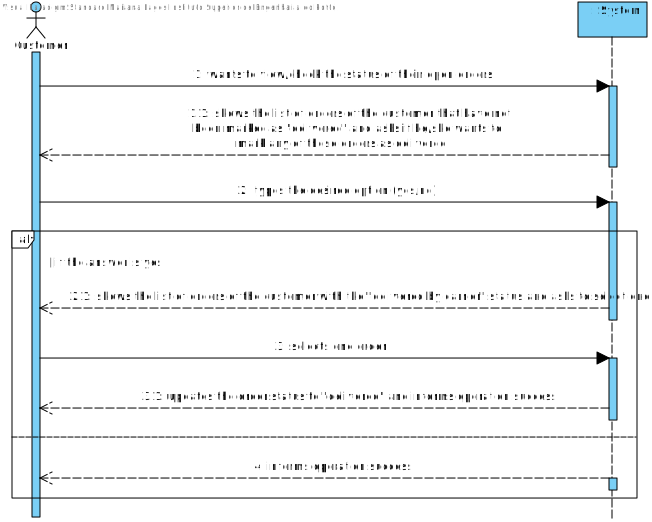
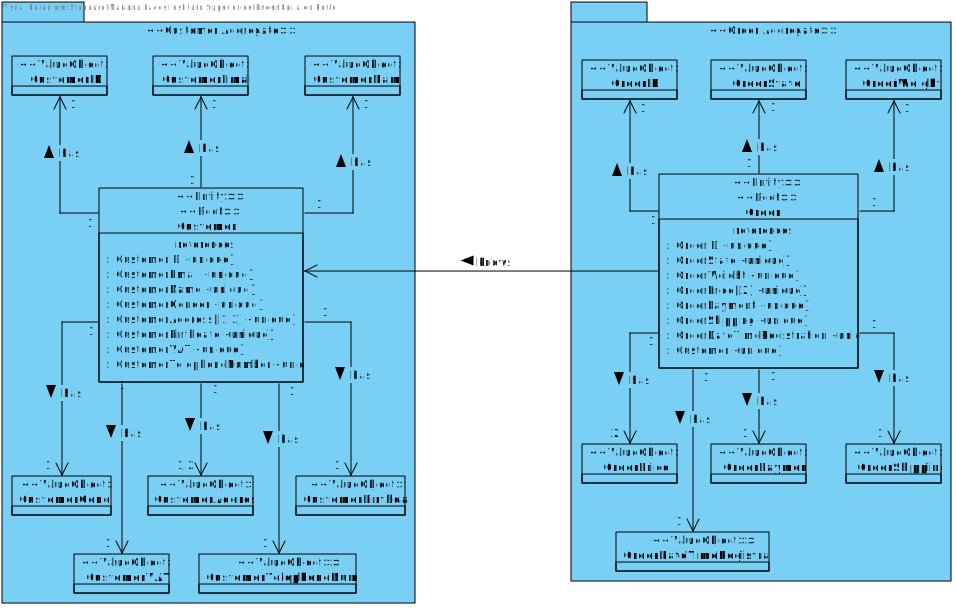

US1502
=======================================

# 1. Requisitos

As Customer, I want to view/check the status of my open orders.

Check the status of my (customer) orders. All the customer orders that have not yet been marked as “delivered” should be
presented to the customer.

* **a.** On orders having a “delivered by carrier” status, it might be possible the customer marks such orders as
  “delivered”.
* **b.** Details regarding any listed order must be presented at user request.

## 1.1 Acceptance Criteria:

It is mandatory using the "OrdersServer" component (cf. US1901).

**Demo**

- Demo 1.2: In this User story, we will focus both in the first Use Case (**a.**).

    + In order to make this demo happen, we first have to analyze what is demanded in this Use Case scenario and what
      the client has said in the forum;
    + We are going to make a feature in our program that will allow a customer (client) to view all his open orders.
    + Also, as mentioned in the use case a., we also will implement a feature that will allow a client to change an
      order in the state "delivered by carrier" to "received by customer".
    + This feature will be constantly communicating with the Order server in order to show all open orders of the
      client.

## 1.2 Client Answers:

**Q1:** Dear client,

In the US 1502, it is asked to "view/check the status of my open orders", can you clarify if the open orders are all the
orders that have been created or if it is orders with a specific status.

**A1:**
It is all orders that have not been delivered to the customer yet.

# 2. Análise

## 2.1. Brief approach

Before making any rash decisions, we must see the whole scenario since the moment that the feature starts until its end.
From the client answers, it is possible to deduce that:

* In the beginning, the system will show to the client all his open orders (orders that have not yet been delivered to
  the client).
    + **From the client answers,** ALL communication between the client application and the Order Server must respect
      the SPOMS2022 protocol, protocol that defines how the responses/requests will be sent/handled by the
      server/client;
    + The system must ensure that the open orders of the client are ONLY the orders that have not been delivered to the
      client yet.


* Afterwards, when the feature is running, all of his open orders will be shown and later on, as mentioned before, the
  client will have the option to change the state of an order in the state **"delivered by carrier"**, the client can
  only change the state of this orders to the state **"received by customer"**.


* In the end, the system will change the state of the order, and ensure the operation was a success to the client.


* All the information needed will be obtained from the OrderServer, by requests, since the client wishes that the client
  doesn't have access to the database.
* This server is implementing the TCP Protocol and the SPOMS2022 Protocol.

**Note: This is all information that the client provided in the forum.**

<br>

In order to better represent this way of thinking, we decided to create some artifacts to "illustrate" the Use Case
itself.

## 2.2. System Sequence Diagram (SSD)

The first artifact is divided in two since this US uses the same logic as a previous US (the catalog one) ,which
specifies that this section was the System Sequence Diagram, where it clearly specifies the interaction between the
System and the Actor, which is, in this case, the customer itself.



The second part of the artifact has the "desired" interaction of this US between the client and the System


As we can see in the diagram, the exact interaction between the actor and the system is illustrated. We must enter all
information demanded by the system (some are not mandatory).

## 2.3. Domain Model Excerpt (DM)

The second artifact applies the DDD pattern in order to illustrate the business concept. It shows all domain concepts
relevant to this Use Case, making a clear representation of all business concepts.



## 2.4. Conclusion

After this analysis, we have gathered all the information to start the design part, the design artifacts.

# 3. Design

## 3.1. Brief approach

Now we can start the "implementation" or, in other words, the design of the system itself, where we "draw" our ideas and
make a "sketch" of the same.

## 3.2. Sequence Diagram (SD)

The first diagram created in this section was the Sequence Diagram, where we illustrate how the system operates in this
Use Case.


In order to better analyze this diagram, I would recommend the reader to open the file and see step by step how the
system operates, that is exactly the same as stated previously in the analysis. The ref box in the US1502_SD references
to diagram above, which describes the interaction between the client application, and the order server


Now we know how the system will operate, step by step, and we can add additional artifacts to illustrate the system
working. As we mention before, this feature will be constantly communicating with the server to retrieve all the needed
information since the backOfficeApplication shouldn't communicate with the database directly.

## 3.3. Functionality Realization

We are using a layer structure design:

- Domain Layer:
    - Order
    - OrderDto

- Application Layer:
    - ViewCustomerOrdersController
    - EstablishCommunication
- Server Application layer:
    - ViewAllOrdersService
    - OrderProtocolServer
    - ServerThreadManager
    - ClientThread
- Repository Layer:
    - OrderRepository
    - CustomerRepository

## 3.5. Padrões Aplicados

* GRASI (Information Expert, Creator, Controller, Low Coupling (evaluative), High Cohesion (evaluative), Polymorphism,
  Pure Fabrication, Indirection, Protected Variations);
    + Information Expert - The service, since has a direct connection with the repositories, in this case, knows all
      domain concepts from this specific Use Case;
    + Creator, the UI creates the controller, and the controller creates all needed services;
    + Low Coupling and High Cohesion, since we are using a lot of structured layers, all with a specific meaning, we are
      applying this pattern aswell;
    + Polymorphism, since a domain concept object may have multiple different values;
    + Pure Fabrication, since there is only 1 of each type of class created, meaning, in case of the controller and the
      UI they are only created one time;
    + The other patterns already were explained by previous points;
* Tell, don't ask;
    + Basic pattern, has a similar function as "Keep it simple", since both patterns apply simple interaction between
      actor - UI and UI - controller;
* Single Responsibility Principle;
* Interface Segregation Principle;
* Intention Revealing Interfaces;
* DDD (Persistence Ignorance, Entity, Value Object, Domain Service, Aggregate, Domain Event, Observer, Events);
    + This pattern was introduced in EAPLI, where we started working with this pattern. It is very important to fully
      understand this pattern, since it makes an implementation of a domain business concept way easier (and makes it
      easier to understand to outside people), Entities, value objects, services... All are well explained in the Geral
      Domain model and the glossary, so I think there is no need to explain this here;
* Repositories pattern;
    + This pattern applies a persistance context using repositories to have an easier communication between the run time
      system, and a remote database, where it makes the operation between the same atomic and simple transactions;
* Services pattern;
    + This pattern applies both to the domain and the application layer, in this specific Use Case it wasn't used
      services in the domain layer only in the Application layer, as stated previously to make an easier interaction
      between CONTROLLER - SERVICE - REPOSITORY;
* Client - Server pattern;
    + The name of this interaction doesn't have properly this name, but, since we didn't found any specific pattern that
      would describe what we utilized here, we decided to have this name to illustrate the fact that we utilize servers
      to communicate with the client/backOffice applications and the servers (using the SPOMS protocol)
* Data Transfer Object (DTO) pattern;
    + In order to abstract the entities and value objects from the domain layer or business layer we implement DTOs to
      abstract the UI Layer from the Domain Layer;

## 3.6. Testes

**Test** Verify if all open orders from a client are valid, and if it is possible to change the state of an order ("
delivered by carrier") to "received by customer"

````java
public class viewAllOpenOrdersC() {

    private void viewAllOpenOrders() {
        try {
            Customer customer = repository.findById(82);

            String receivedCostumer = OrderState.RECEIVED_BY_COSTUMER.toString();

            List<OrderDto> list = ordersIntegrityService.getAllOrdersFromCustomer(customer);

            if (list.isEmpty()) {
                throw new RuntimeException("The List is empty! Please verify if the Customer is valid or if the customer has any open order!");
            }

            for (OrderDto dto : list) {
                if (dto.getState().equals(OrderState.RECEIVED_BY_COSTUMER.toString())) {
                    throw new RuntimeException("There is an order with an invalid state inside the list!");
                }

                dto.changeState(receivedCostumer);

                if (!dto.getState().equals(receivedCostumer)) {
                    throw new RuntimeException("There was an error while changing the order state!");
                }

            }

            logger.info(("»»» View all client orders (Success!)"));

        } catch (Exception e) {
            System.out.println(e.getMessage());
        }

    }
}
````

# 4. Implementation

Since the requirements of this Use Case was to be able to view all open order, and if, the client wants, to change an
order from the state "delivered by carrier" to "received by customer", this same feature should be implemented by having
several modules communicating between each other,for that, we opted to make a service to establish the communication
between the modules. This way we can abstract the Controller, Application Layer, from the Repository Layer, thus
applying the Grap Pattern the best as we can, and the server - client pattern (Since the only module that is going to
use the database API is the application servers module).

# 5. Integration/Demonstration

It was added a new UI to the application and a new menu dedicated for this specific feature, inside the client order
management.

<br>
The client, finally, can see all his orders stored in the system.
Also, he can know the state of all his open orders, and change if he wants, as mentioned before, an order state to another.

<br>

When the Use Case controller requests all information, a new communication is established between the Customer
application and the Application servers.

# 6. Observations

I think our interpretation of the Use Case was the best as possible, since we treated all possible input making it
impossible to have "incorrect data" (all data must be according to the patterns specified by the client), and the way we
show the result list is in a great quality, since we use the DTO pattern and instead of sending the domain concept
object to the UI we send a DTO of the same, only having the necessary information to the actor. Not only that but, for
this specific Use Case we decided to add other feature which allows the customer see his shopping cart.