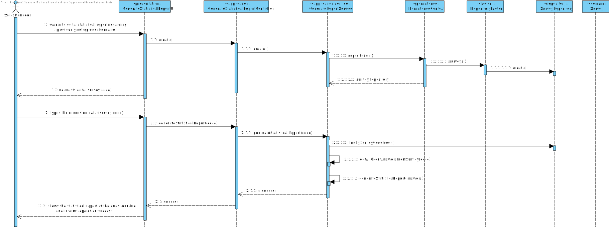

US3002
=======================================

# 1. Requisitos

As Sales Manager, I want to get a statistical report regarding a previously set up questionnaire.

Consult answers of a survey. It consists of presenting in raw all the answers received regarding a
given survey. It must allow:
* a. To check the details of each answer (i.e.: the question answers given by a customer).
* b. To export those answers to a CSV file.
* c. To get a statistical report about each question. E.g.: On question 2, option “A” was given by 37% of the customers, option “B” by 51% and option “C” by the remaining 12%.

**Demo**

- Demo 1.1: In this User story, we will focus in the whole use case:

    + In order to make this demo happen, we first have to analyze what is demanded in this Use Case scenario and what the client has said in the forum;
    + We are going to make a feature in our program that is going to generate a statistical report about a certain questionnaire;
    + This feature must be ready to accept any kind of questionnaire (since there is different types of questions), we must ensure that the system will correctly generate correct data according to the given questionnaire.
    + Also, we must verify if the questionnaire ID introduced by the actor is valid or not, and if not alert the actor that the given questionnaire ID is not valid.

## 1.1 Relevant Client Answers

* "The important is to show the statistical report. Saving the report is not seen as relevant since, at any time, the user might request to see the report again. Notice that the information on which the report is computed is already persisted on the system."

* "Any report must have the basic:
  - Universe Size (implies knowing the amount of users the survey was distributed to);
  - Number of Responses Obtained
  - % of responses obtained;

  Further, something depending on the question type:
  - For “Single-Choice” questions:
    - Distribution (in %) of responses for each alternative (e.g.: A = 30%, B = 27%, C = 40%, Others = 3%)

  - For “Multiple-Choice” questions:
    - Distribution (in %) of responses for each alternative (e.g.: A = 30%, B = 27%, C = 40%, Others = 3%)
    - Distribution (in %) of combined responses (e.g.: A+B = 15%, A+C = 100%, B+C=100%, A+B+C=10%)

  - For “Sorting-Options” questions:
    - Distribution of the various hypotheses for each position (e.g.: 1st Place = A(40%) B (60%) C(0%); 2nd Place = A(50%) B(40%) C(10%); 3rd Place =A(10%) C(90%))

  - For “Scaling-Options” questions:
    - Distribution of each option by scale levels.

  I hope you got the idea."

# 2. Análise

## 2.1. Brief approach

Before making any rash decisions, we must see the whole scenario since the moment that the feature starts until its end. From the client answers, it is possible to deduce that:

* In the beginning, the system will ask for a survey code, which later on, will validate if there exists any survey with the given code.

* Afterwards, if the survey is valid and exists, the system will start computing all statistical information to generate the report. For the given questionnaire, the system will recall all client answers and finally generate the report.

* In the end, the system will inform the actor that the report was successfully created and ask if he wants to see it (a txt file opens with the report) or not.

### **Notes:**
  - This is all information that the client provided in the forum.
  - **Extra feature:** We also give the user the option to open the report in an HTML page.

In order to better represent this way of thinking, we decided to create some artifacts to "illustrate" the Use Case itself.

## 2.2. System Sequence Diagram (SSD)

The first artifact done in this section was the System Sequence Diagram, where it clearly specifies the interaction between the System and the Actor, which is, in this case, the Sales Clerk.

As we can see in the diagram, the exact interaction between the actor and the system is illustrated. We must enter all information demanded by the system (some are not mandatory).

## 2.3. Domain Model Excerpt (DM)

The second artifact applies the DDD pattern in order to illustrate the business concept. It shows all domain concepts relevant to this Use Case, making a clear representation of all business concepts.

##  2.4. Conclusion

After this analysis, we have gathered all the information to start the design part, the design artifacts.

# 3. Design

## 3.1. Brief approach

Now we can start the "implementation" or, in other words, the design of the system itself, where we "draw" our ideas and make a "sketch" of the same.

## 3.2. Sequence Diagram (SD)

The first diagram created in this section was the Sequence Diagram, where we illustrate how the system operates in this Use Case.

In order to better analyze this diagram, I would recommend the reader to open the file and see step by step how the system operates, that is exactly the same as stated previously in the analysis.

Now we know how the system will operate, step by step, and we can add additional artifacts to illustrate the system working.
As we mention before, this feature will be constantly communicating with the server to retrieve all the needed information since the backOfficeApplication shouldn't communicate with the database directly.

## 3.3. Functionality Realization

We are using the following layer structure design:

- Presentation Layer:
    - GenerateStatisticalReportUI
  
- Domain Layer:
    - Survey
    
- Application Layer:
    - GenerateStatisticalReportController
    - GenerateStatisticalReportService
    - VerifyIfSurveyExistsService
    
- Repository Layer:
    - SurveyRepository

## 3.5. Padrões Aplicados

* GRASI (Information Expert, Creator, Controller, Low Coupling (evaluative), High Cohesion (evaluative), Polymorphism, Pure Fabrication, Indirection, Protected Variations);
    + Information Expert - The service, since has a direct connection with the repositories, in this case, knows all domain concepts from this specific Use Case;
    + Creator, the UI creates the controller, and the controller creates all needed services;
    + Low Coupling and High Cohesion, since we are using a lot of structured layers, all with a specific meaning, we are applying this pattern aswell;
    + Polymorphism, since a domain concept object may have multiple different values;
    + Pure Fabrication, since there is only 1 of each type of class created, meaning, in case of the controller and the UI they are only created one time;
    + The other patterns already were explained by previous points;
* Tell, don't ask;
    + Basic pattern, has a similar function as "Keep it simple", since both patterns apply simple interaction between actor - UI and UI - controller;
* Single Responsibility Principle;
* Intention Revealing Interfaces;
* DDD (Persistence Ignorance, Entity, Value Object, Domain Service, Aggregate, Domain Event, Observer, Events);
    + This pattern was introduced in EAPLI, where we started working with this pattern. It is very important to fully understand this pattern, since it makes an implementation of a domain business concept way easier (and makes it easier to understand to outside people), Entities, value objects, services... All are well explained in the Geral Domain model and the glossary, so I think there is no need to explain this here;
* Repositories pattern;
    + This pattern applies a persistance context using repositories to have an easier communication between the run time system, and a remote database, where it makes the operation between the same atomic and simple transactions;
* Services pattern;
    + This pattern applies both to the domain and the application layer, in this specific Use Case it wasn't used services in the domain layer only in the Application layer, as stated previously to make an easier interaction between CONTROLLER - SERVICE - REPOSITORY;
* Data Transfer Object (DTO) pattern;
    + In order to abstract the entities and value objects from the domain layer or business layer we implement DTOs to abstract the UI Layer from the Domain Layer;

## 3.6. Testes

**Smoke test:** Ensure it is possible to generate the statistical report.

    public class GenerateReportSmokeTest implements Action {
    
        private static final Logger LOGGER = LogManager.getLogger(SurveySmokeTest.class);
        private static final GenerateStatisticalReportController controller = new GenerateStatisticalReportController();
    
        @Override
        public boolean execute() {
            generateReport();
    
            if (generateReport()) {
                LOGGER.info("»»» Generate statistical report SUCCESS!");
                return true;
            }
    
            LOGGER.info("»»» Generate statistical report ERROR!");
            return false;
        }
    
        private boolean generateReport() {
            int surveyId = 233;
    
            try {
                controller.verifyIfSurveyExists(surveyId);
                controller.generateReport(surveyId);
                return true;
            } catch (InvalidSurveyException | NoFilesInsideDirectoryException | InvalidAnswerFileException e) {
                System.out.println(e.getMessage());
                return false;
            }
        }
    }

# 4. Implementation

Since the requirements of this Use Case was to be able to generate a report according to the given questionnaire, we implemented patterns which allowed us to make this feature way simpler and completed. This way we can abstract the Controller, Application Layer, from the Repository Layer, thus applying the Grasp Pattern the best as we can (Since the only module that is going to use the database API is the application servers module).

# 5. Integration/Demonstration

It was added a new UI to the  backoffice application and a new menu dedicated for this specific feature, inside the survey management.
This feature can be executed inside the sales manager menu.

 

# 6. Observations

I think our interpretation of the Use Case was the best as possible, since we treated all possible input making it impossible to have "incorrect data" (all data must be according to the patterns specified by the client), and the way we show the result list is in a great quality, since we use the DTO pattern and instead of sending the domain concept object to the UI we send a DTO of the same, only having the necessary information to the actor.