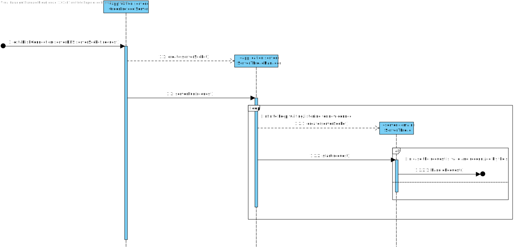
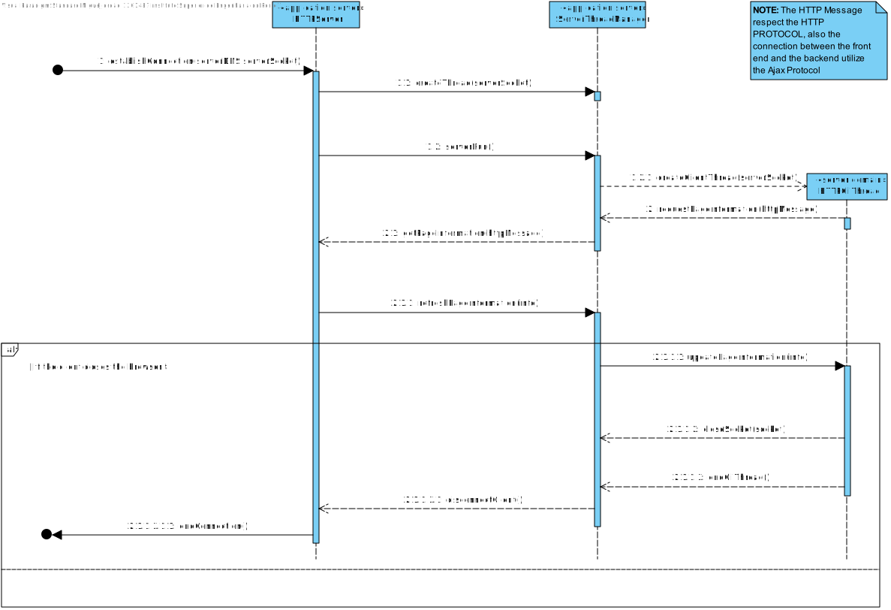

US1902
=======================================

# 1. Requisitos

As Project Manager, I want the communications made through the SPOMS2022 protocol to be secured/protected.

Since this is a FUNCTIONAL USER STORY, there is no current demo.
 

### Acceptance Criteria:

It should be adopted SSL/TLS with mutual authentication based on public key certificates.

---
### SSL/TLS protocol brief explanation
This protocol is dedicated to establishing secure communications between two network applications.
It operates by negotiating a set of mechanisms (known as cypher suite) to be used in order to ensure authentication, privacy, and integrity.
By using SSL/TLS insecure application protocols are turned secure.
SSL/TLS operates over TCP or UDP, though is easier to implement over TCP than over UDP.

# 2. Análise

## 2.1. Brief approach

Before making any rash decisions, we must see the whole scenario since the moment that the feature starts until its end.
From the client answers, it is possible to deduce that:

* This User story only validates the integrity of the ORDER SERVER, and its functionality (using the SSL/TLS protocol).
* This server is implementing the TCP Protocol.
* This server is also implementing a TLS protocol, using a .jks file for the server (with his .pem aswell) and the
  client is also using his .jsk and corresponding permission.

**Note: This is all information that the client provided in the forum.**

 

In order to better represent this way of thinking, we decided to create 3 SDs which illustrate all SERVERS, not only the
ORDER SERVER

# 3. Design

## 3.2. Sequence Diagram (SD)

### Order Server

### AGV MANAGER SERVER

### HTTPS SERVER (DASHBOARD)

### NOTE

There is no need to represent the functions that make the TLS protocol (since that gives way to much detail to the
sequence diagrams).