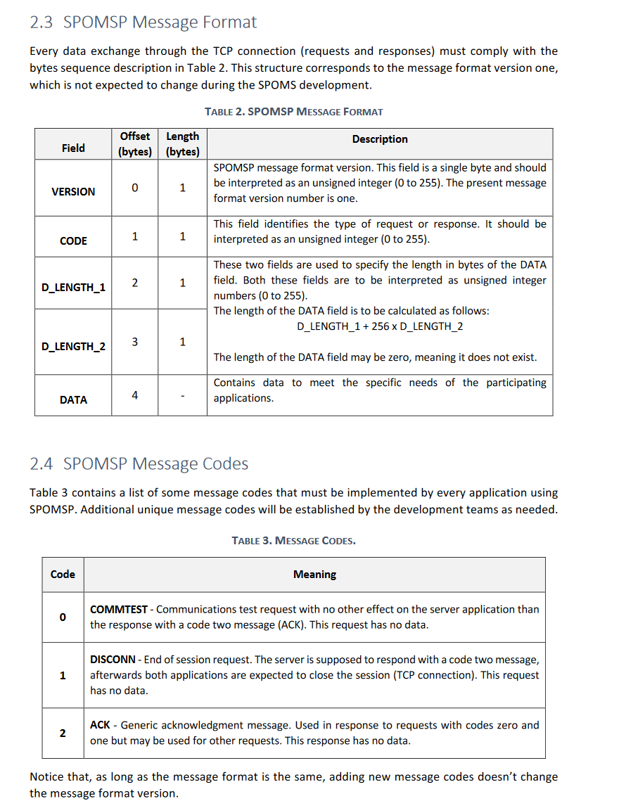

US2006
=======================================

# 1. Requisitos

As Project Manager, I want the communications made through the SPOMS2022 protocol to be secured/protected.

Since this is a FUNCTIONAL USER STORY, there is no current demo.
 

### Acceptance Criteria:
It should be adopted SSL/TLS with mutual authentication based on public key certificates.

---
### SSL/TLS protocol brief explanation
This protocol is dedicated to establishing secure communications between two network applications.
It operates by negotiating a set of mechanisms (known as cypher suite) to be used in order to ensure authentication, privacy, and integrity.
By using SSL/TLS insecure application protocols are turned secure.
SSL/TLS operates over TCP or UDP, though is easier to implement over TCP than over UDP.

# 2. Análise

## 2.1. Brief approach

Before making any rash decisions, we must see the whole scenario since the moment that the feature starts until its end. From the client answers, it is possible to deduce that:

* This User story only validates the integrity of the SPOMS22, and its functionality (using the SSL/TLS protocol).
* This specific user story only serves to ensure that all COMMUNICATIONS between ALL SERVERS and ALL CLIENTS respect the SPOMS22 protocol, and if all servers use the protocol.

**Note: This is all information that the client provided in the forum.**

# 3. Design

The protocol that we must respect is the following :

### AGVManagerServer

| Functionality                                      | Message code to the server |
|----------------------------------------------------|----------------------------|
| Obtain the position of the agv's                   | 0x05                       |
| Change the position of an bin                      | 0x06                       |
| Assign an order to an AGV                          | 0x07                       |
| Request all the free AGV                           | 0x08                       |
| Request orders to be prepared                      | 0x09                       |
| AGV requests an order                              | 0x0A                       |
| Warn ther server about an new order to be prepared | 0x0B                       |
| Request the occupied AGV                           | 0x0C                       |
| Request all the free AGV                           | 0x0D                       |

### Order Server

| Functionality                                      | Message code to the server |
|----------------------------------------------------|----------------------------|
| Obtain all products available in dto               | 0x05                       |
| Filter products dto list given options             | 0x06                       |
| Obtain all products available                      | 0x07                       |
| Verify customer shopping cart                      | 0x08                       |
| Update customer shopping cart given product list   | 0x09                       |

### HTTPS Server

This server does not need this type of requests, since it uses the HTTP message protocol, to have communication between the server and the client.
And to be able to send information between the back end and the front end, our team decided to use Ajax protocol (which uses java script).

All this type of protocols are implemented in classes inside the base.app.server.

The URI to see this page is : https://vs-gate.dei.isep.ipp.pt:30639/

**NOTE**: To be able to open the link the HTTPS Server MUST BE RUNNING! Otherwise, it will be impossible to see this page

### AGVTwin Server

For mock purposes this server only exists to open a socket to estabilish a communication between the AGVManagerServer and the AGVTwin Application

The AGVTwin Server uses the following DNS and server socket:

**NOTE**: All this DNS and Ports are from our virtual machine running in the DEI Virtual Servers.
We decided to make them all public access to challenge our selfes and for test purposes.

### NOTE
There is no need to represent the functions that make the TLS protocol (since that gives way to much detail to the sequence diagrams).