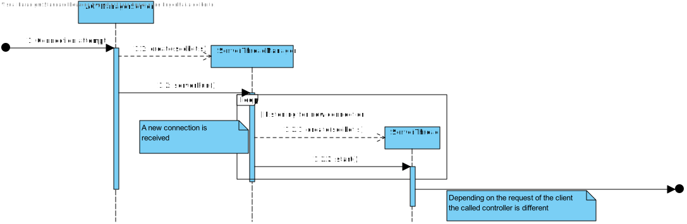

US 4003
=======================================

# 1. Requisitos

## **Demo:**

As Project Manager, I want the communications (of the AGVManager) made through the SPOMS2022 protocol to be
secured/protected.
<br>
<br>

### **AC:**

* 1: As Project Manager, I want the communications (of the AGVManager) made through the SPOMS2022 protocol to be
  secured/protected.

### **Respostas no Forum:**

*Ainda nenhuma resposta*

# 2. Análise

* In this US the AGV Manager Server acts as the server, and the BackOffice application acts as a client.
* The backOffice application should communicate with AVGManager via the REQUESTS_API.
* The AGV digital twin application should communicate with the AVGManager Server via STATUS_API.


In this diagram we can see how the stated components should talk to each other, in special how should the client
components send requests to the server component.

It is worthy to notice that the communication with the Digital Twin works in the two ways: (But in this user Story there
is no need to show this information)

## Required needs

Right now the backoffice component can request the following functionalities to the AGVManager:

* Access the list of orders that need to be prepared by an AGV and be able to ask/force any of those orders to be
  immediately prepared by an AGV available.

  <br>

**Note :** There is no need to have more requests between the application servers (AGVManager Server) and the BackOffice
App (since the software client only, in his acceptance criteria, doesn't demand more)

## Application Server (AGVManager server information)

| Server DNS                | Server Port |
|---------------------------|-------------|
| vsgate-s2.dei.isep.ipp.pt | 2225        |

# 3. Design

## Protocol

### Requests

| Functionality                                      | Message code to the server |
|----------------------------------------------------|----------------------------|
| Obtain the position of the agv's                   | 0x05                       |
| Change the position of an bin                      | 0x06                       |
| Assign an order to an AGV                          | 0x07                       |
| Request all the free AGV                           | 0x08                       |
| Request orders to be prepared                      | 0x09                       |
| AGV requests an order                              | 0x0A                       |
| Warn ther server about an new order to be prepared | 0x0B                       |
| Request the occupied AGV                           | 0x0C                       |
| Request all the free AGV                           | 0x0D                       |

## Sequence of events

Sequence Diagram that illustrates the AGV Manager server in action:



# Testes

Since this user story only serves to implement the TLS Protocol into the AGV Server and ensure all communication is made
accordingly to the SPOMS22 Protocol we can make an **integration test**:

````java
public class agvManagerServerTlsSmokeTest {

    public void ensureServerHasTLS() {

        // Trust these certificates provided by servers
        System.setProperty("javax.net.ssl.trustStore", "base.app.server/src/main/java/eapli/base/tcpServer/orderManagement/domain/SSL_ORDER/orderClient1_J.jks");
        System.setProperty("javax.net.ssl.trustStorePassword", "forgotten");

        // Use this certificate and private key for client certificate when requested by the server
        System.setProperty("javax.net.ssl.keyStore", "base.app.server/src/main/java/eapli/base/tcpServer/orderManagement/domain/SSL_ORDER/orderClient1_J.jks");
        System.setProperty("javax.net.ssl.keyStorePassword", "forgotten");

        SSLSocketFactory sf = (SSLSocketFactory) SSLSocketFactory.getDefault();

        if (dns == null) {
            LOGGER.error("Server IPv4/IPv6 address or DNS name is required as argument");
            return null;
        }

        try {
            serverIP = InetAddress.getByName(dns);
        } catch (UnknownHostException ex) {
            LOGGER.error("Invalid server specified: " + dns);
            return null;
        }

        try {
            sock = (SSLSocket) sf.createSocket(serverIP, sockNum);
        } catch (IOException ex) {
            LOGGER.error("Failed to establish TCP connection");
            return null;
        }

        if (serverExecutor == 1) {
            try {
                sock.startHandshake();
                listStrings = TcpOrderCliRequests.handleRequests(sock, request);
            } catch (IOException e) {
                //FOR TEST PURPOSES ONLY
                e.printStackTrace();
            }
        }

    }

}


````