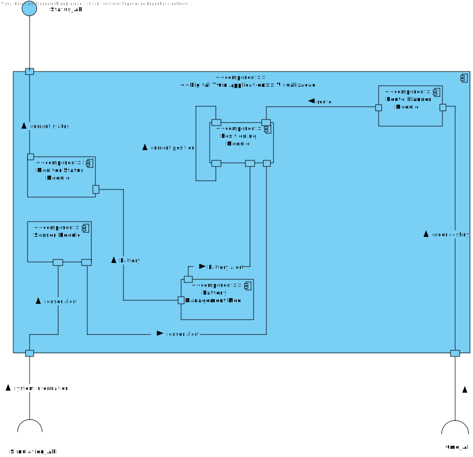

US 5100
=======================================

# 1. Requisitos

## **Demo:**

As Project Manager, I want that the team to develop and integrate the others components/parts of the AGV digital twin (e.g.: movement, obstacle sensors, control unit).

# 2. Análise

## Acceptance Criteria

* In conformity with SCOMP guidelines.

The AGV Digital Twin will have the following functionalities:

* **Communications:** responsible for receiving/sending information from/to other external
  components such as the “AGV Manager” (cf. Figure 2). For instance, it can receive the warehouse
  plant, the location of the other AGVs as well as the command to pick-up some product(s). On other
  hand, it can send information about its current location, status and so on.


* **Control Unit:** responsible for processing/executing the received commands, keeping the AGV
  internal information (e.g.: its position, detected obstacles, battery status) updated and inform
  (through the communications module) the “AGV Manager” about its global status.


* **Simulation Engine:** responsible for knowing the warehouse plant and the current location of all
  AGVs and based on that, transmit information to the AGV sensors at, for instance, every 100 ms.


* **Sensor:** receives information from the “Simulation Engine” and emits obstacles alerts to the other
  modules. For instance, emits “1” if an obstacle is detected at one square distance and, therefore,
  indicates that AGV should stop; emits “2” if an obstacle is detected at two squares distance and,
  therefore, indicates the AGV should reduce its speed; and emits “0” for obstacles detected at
  three or more squares distance and, therefore, indicates the AGV can keep going. Typically, an
  AGV has, at least, 8 sensors (visualizing an AVG as a rectangle, it has two sensors at each corner).
  Each sensors emits signals considering its position on the AGV.


* **Positioning:** responsible for calculating the new AGV position in the warehouse based on the AGV
  (i) speed, (ii) direction, (iii) last position and (iv) current route. Reads/updates information from/on
  the “Control Unit” module. Speed might be expressed in squares per second.


* **Route Planner:** responsible for (re)computing routes based on a source and target location on the
  warehouse considering the warehouse plant only. It is worth noticing that AGV can only move
  horizontally or vertically.


* **Battery Management:** responsible for monitoring the battery status and simulating battery
  consumption and recharge according to the AGV status. For instance, when the AGV is moving
  battery consumption might be computed based on the travelled distance, but when the AGV is
  waiting/stopped on its dock battery consumption might be computed based on time.

## 2.1 Client Answers
**Question 1:** If two AGVs are 1 square close to each other, they must stop, but what needs to be done next? Create a new route to take the assigned task? And if an AGV passes one block away from another and never collides, should we ignore the "AGV must stop" sentence, or should he stop the AGV and move the AGV again?

**Answer 1:**
The overall idea is to avoid collision between AGVs.

As so, the "must stop" aims to avoid an imminent collision. In such case, new routes should be computed in order to complete the task that in  each AGV has in hands. The strategy for that it is up to each team to decide.

**Question 2:** the statement says that an AGV has a total of 8 sensors, 2 in each corner of the AGV. Therefore, some doubts have arisen, such as:

What is the difference between having one or two sensors, in each corner? How do we differentiate between them? Are they in the same position?

**Answer 2:** Each sensor is a source of information to signal (or not) the presence of an obstacle (e.g.: another AGV, an aisle, etc.).

In each corner there is a sensor to evaluate obstacles in the front and another sensor  to evaluate obstacles on the side.

**Question 3:** Would all these AGV Digital Twin instances share information about the different modules, to be aware of the presence of other moving agvs?

**Answer 3:** It is NOT foreseen that AGVs communicate between them. However, each AGV can by its own initiative communicate with the AGV Manager. Notice that in your picture this possibility is not depicted. However, this possibility is depicted on Figure 2 of the specifications' document.

**Question 4:**  At the level of representing the movement of agvs on the dashboard, developed in Sprint 3, how would the information about the movement of an agv be sent to the dashboard, for the dashboard to be able to demonstrate?

**Answer 4:** Your question is related to data/information flow. Such flow must be in accordance with Figure 2 of the specifications' document. Notice that, the dashboard shows the current position of each AGV. If the AGVs position is changing then by refreshing the dashboard is enough to show AGV movement.

**Question 5:** Could you specify how the speed of an AGV is determined, seeing that we do not know the maximum speed of the AGV?

**Answer 5:** If you need such information, you should collect such information previously (e.g.: US 2002).

**Question 6:** At what charge do you suppose the AGV should move to the AGV docker to charge?

**Answer 6:**   Again, such value might be configurable by AGV (model).

**Question 7:** How should we measure the charging of an AGV should it have a certain percentage per minute or per hour?

**Answer 7:**  You should adopt "seconds" as time unit.

**Question 8:** Could you specify at what percentage the discharging of the AGV happens and if it is affected by other factors other than being turned on?

**Answer 8:** As stated on the specifications' document: "when the AGV is moving battery consumption might be computed based on the travelled distance, but when the AGV is waiting/stopped on its dock battery consumption might be computed based on time.". Other factors might be considered, but at this stage, I recommend you to not apply a complex algorithm.

**Question 9:** It is mentioned that when the AGV detects an obstacle 2 squares away it should reduce its velocity, could you please quantify the reduction.

**Answer 9:**  It is up to you decide that. However, notice that the idea is to avoid collision.

**Question 10:** Referring to the documentation, it is mentioned that the Route Planner module of the AGV Digital twin is responsible for "... (re)computing routes based on a source and target location on thewarehouse considering the warehouse plant only. It is worth notifying that AGV can only movehorizontally or vertically".

What do you mean by source and target location of agv ? We can set agvdock as a starting point but what would be the end point?

**Answer 10:** So, the source location (starting point) is the position where the AGV is at that moment (as you said, it might be the AGV dock)

The target location (end point) might be the location of a product.

However,  there are other possibilities.

For instance, consider the scenario where the AGV has to collect 2 products (say A and B).

At least three routes have to be computed:

1. From AGV Dock location to the location of product A.

2. From location of product A to the location of product B.

3. From location of product B to the AGV dock location.

## 2.2. Planning

After discussing many ideas between the team members and the teacher, the team decided that it would be better if we programmed the AGV Digital Twin using the C language, which would communicate with the server AGV Manager which was programmed using the Java language. It was in fact, the first time that our team would make a C client and a Java server communication however, this idea would remove an issue out of our team's way which is the Shared Memory, C programs can easily access others Shared Memories data, while in Java it's way harder and it would probably give us more issues than using a C client.
To conclude, for the Communication, we are using a C client and a Java server communication.

**All the AGV Digital Twin Status** will be saved and updated on the Shared Memory which all the Twin components are able to access and write on it whenever they need to update something.

**Our Control Unit** is responsible to send the AGV digital Twin Status to the AGV manager, since the Virtual Machine communication is not always accuarate and it may send misinformation, we decided to send the status information one by one so it can sucessfully process all the information and send it to the AGV Manager.

**The Simulation Engine** is responsible to know the warehouse plant and to start the AGV simulation which will prepare the AGV Twins for the simulation, which it will be given to each one a starting position. After having the plant by communicating with the AGV Manager, it will save the plant on the Shared Memory.

**The Sensors** don't always need to communicate with the Simulation Engine in C, since the plant will be saved on the Shared Memory which any component of the Digital Twin is able to access, the Sensors decide wether or not there's an obstacle, and it will send signals to the AGV Twin.

**Route Planner** will calculate an AGV Digital Twin route based on the target location, in C since it can always access the plant by the Shared Memory
After discussing many ideas betwen the team members and the teacher, the team decided that it would be better if we programmed the AGV Digital Twin using the C language, which would communicate with the server AGV Manager which was programmed using the Java language. It was in fact, the first time that our team would make a C client and a Java server communication however, this idea would remove an issue out of our team's way which is the Shared Memory, C programs can easily access others Shared Memories data, while in Java it's way harder and it would probably give us more issues than using a C client.
To conclude, for the Communication, we are using a C client and a Java server communication.

## 2.3 Required Needs

* In this US the AGVManager acts as the server and both of Simulation Engine Application and Digital Twin Application as the client
* AGVManager Server should communicate with Simulation Engine Application via the START_API
* AGVManager Server should communicate with AGV Digital Twin via the CMD_API and the STATUS_API
* Simulation Engine Application should communicate with AGV Digital Twin via SIMULATION_API

This same order is represented in the following 2 component diagrams, where it is shown how all applications (in this User Story) communicate between themselves and how do they handle the requests


In this diagram we can see how the stated components should talk to each other, in special how should the client
components send requsts to the server component.

Now we must, aswell, divide the Digital Twin module in order to comprehend how the modules work inside the application:



Right now the AGV Manager Server is not yet prepare to handle the requests from the AGV Digital Twin and from the Simulation Engine,
In order to make this possible we must:

* Prepare the START_API;
* Prepare the SIMULATION_API;
* Prepare the STATUS_API;
* Prepare the CMD_API;

All this API's must be implemented in order to make this requests be possible to handle.

In order to implement the START_API, we must first see how many AGVs are available in the system and use the ones that are ready to be deployed;
In order to implement the SIMULATION_API, first the START_API must already started, only then its possible to start this API which is going to send to the DIGITAL TWIN APPLICATION all information about the AGVs;

The STATUS_API and CMD_API will happen inside the DIGITAL TWIN and the AGV MANAGER SERVER, both running in threads. The AGV Threads must implement a connection with the server and send the status of the current AGV (2 seconds max), and the CMD_API will occur when the connection is establish between the AGV thread and the server, which will later on, send its orders to the AGVs inside the digital twin application;

## The Server

| Server DNS                | Server Port |
|---------------------------|-------------|
| vsgate-s2.dei.isep.ipp.pt | 2225        |

# 3. Design

## Protocol

### Requests

| Functionality                                      | Message code to the server |
|----------------------------------------------------|----------------------------|
| Obtain Order to conduct (AGV)                      | 0x30                       |
| Request all the free AGV                           | 0x0D                       |
| Request warehouse plant                            | 0x0F                       |

## 3.1. Brief approach

Now we can start the "implementation" or, in other words, the design of the system itself, where we "draw" our ideas and make a "sketch" of the same.

## 3.2. Sequence Diagram (SD)

The first diagram created in this section was the Sequence Diagram, where we illustrate how the system operates in this Use Case.


In order to better analyze this diagram, I would recommend the reader to open the file and see step by step how the system operates, that is exactly the same as stated previously in the analysis.
The ref box in the US5001_SD references to diagram above, which describes the interaction between the client applications, and the agv manager server


Now we know how the system will operate, step by step, and we can add additional artifacts to illustrate the system working.
As we mention before, this feature will be constantly communicating with the server to retrieve all the needed information since the backOfficeApplication shouldn't communicate with the database directly.

## 3.3. Functionality Realization

We are using a layer structure design:
- Domain Layer:
  - AGV
  

- Application:
  - SimulationEngineApplication
  - DigitalTwinApplication
  

- Server Application layer:
  - AGVManagerServer
  - SaveAGVStatusService


- Repository Layer:
  - AGVRepository


## 3.5. Padrões Aplicados

* GRASI (Information Expert, Creator, Controller, Low Coupling (evaluative), High Cohesion (evaluative), Polymorphism, Pure Fabrication, Indirection, Protected Variations);
  + Information Expert - The service, since has a direct connection with the repositories, in this case, knows all domain concepts from this specific Use Case;
  + Creator, the UI creates the controller, and the controller creates all needed services;
  + Low Coupling and High Cohesion, since we are using a lot of structured layers, all with a specific meaning, we are applying this pattern aswell;
  + Polymorphism, since a domain concept object may have multiple different values;
  + Pure Fabrication, since there is only 1 of each type of class created, meaning, in case of the controller and the UI they are only created one time;
  + The other patterns already were explained by previous points;
* Tell, don't ask;
  + Basic pattern, has a similar function as "Keep it simple", since both patterns apply simple interaction between actor - UI and UI - controller;
* Single Responsibility Principle;
* Interface Segregation Principle;
* Intention Revealing Interfaces;
* DDD (Persistence Ignorance, Entity, Value Object, Domain Service, Aggregate, Domain Event, Observer, Events);
  + This pattern was introduced in EAPLI, where we started working with this pattern. It is very important to fully understand this pattern, since it makes an implementation of a domain business concept way easier (and makes it easier to understand to outside people), Entities, value objects, services... All are well explained in the Geral Domain model and the glossary, so I think there is no need to explain this here;
* Repositories pattern;
  + This pattern applies a persistance context using repositories to have an easier communication between the run time system, and a remote database, where it makes the operation between the same atomic and simple transactions;
* Services pattern;
  + This pattern applies both to the domain and the application layer, in this specific Use Case it wasn't used services in the domain layer only in the Application layer, as stated previously to make an easier interaction between CONTROLLER - SERVICE - REPOSITORY;
* Client - Server pattern;
  + The name of this interaction doesn't have properly this name, but, since we didn't found any specific pattern that would describe what we utilized here, we decided to have this name to illustrate the fact that we utilize servers to communicate with the client/backOffice applications and the servers (using the SPOMS protocol)
* Data Transfer Object (DTO) pattern;
  + In order to abstract the entities and value objects from the domain layer or business layer we implement DTOs to abstract the UI Layer from the Domain Layer;


# Testes

In order to ensure the route is well calculated we must have a test that illustrates that:

````
void fixMatrix(){
	
	//THIS IS A TEST FUNCTION IN ORDER TO VERIFY THE INTEGRITY OF THE MATRIX
	
	int nCols = 19;
	int nRows = 21;
	
	int i;
	int j;
	
	int matrix[nRows][nCols];
	memset(matrix, 0, nRows*nCols*sizeof(int));

	//ROW 2
	matrix[1][3] = 2;
	matrix[1][5] = 2;
	matrix[1][13] = 2;
	matrix[1][15] = 2;
	
	//ROW 6
	matrix[5][1] = 1;
	matrix[5][18] = 1;
	matrix[5][8] = 1;
	matrix[5][9] = 1;
	matrix[5][10] = 1;
	matrix[5][11] = 1;
	
	//ROW 7
	matrix[6][1] = 1;
	matrix[6][18] = 1;
	matrix[6][8] = 1;
	matrix[6][9] = 1;
	matrix[6][10] = 1;
	matrix[6][11] = 1;
	
	//ROW 8
	matrix[7][1] = 1;
	matrix[7][18] = 1;
	matrix[7][8] = 1;
	matrix[7][9] = 1;
	matrix[7][10] = 1;
	matrix[7][11] = 1;
	
	//ROW 9
	matrix[8][1] = 1;
	matrix[8][18] = 1;
	matrix[8][8] = 1;
	matrix[8][9] = 1;
	matrix[8][10] = 1;
	matrix[8][11] = 1;
	
	//ROW 10
	matrix[9][1] = 1;
	matrix[9][18] = 1;
	matrix[9][8] = 1;
	matrix[9][9] = 1;
	matrix[9][10] = 1;
	matrix[9][11] = 1;
	
	//ROW 11
	matrix[10][1] = 1;
	matrix[10][18] = 1;
	matrix[10][8] = 1;
	matrix[10][9] = 1;
	matrix[10][10] = 1;
	matrix[10][11] = 1;
	
	//ROW 12
	matrix[11][1] = 1;
	matrix[11][18] = 1;
	matrix[11][8] = 1;
	matrix[11][9] = 1;
	matrix[11][10] = 1;
	matrix[11][11] = 1;
	
	//ROW 13
	matrix[12][1] = 1;
	matrix[12][18] = 1;
	matrix[12][8] = 1;
	matrix[12][9] = 1;
	matrix[12][10] = 1;
	matrix[12][11] = 1;
	
	//ROW 14
	matrix[13][1] = 1;
	matrix[13][18] = 1;
	matrix[13][8] = 1;
	matrix[13][9] = 1;
	matrix[13][10] = 1;
	matrix[13][11] = 1;
	
	//ROW 15
	matrix[14][1] = 1;
	matrix[14][18] = 1;
	matrix[14][8] = 1;
	matrix[14][9] = 1;
	matrix[14][10] = 1;
	matrix[14][11] = 1;
	
	//ROW 16
	matrix[15][1] = 1;
	matrix[15][18] = 1;
	matrix[15][8] = 1;
	matrix[15][9] = 1;
	matrix[15][10] = 1;
	matrix[15][11] = 1;
	
	//ROW 20
	matrix[20][4] = 2;
	matrix[20][14] = 2;
	
/*
	int matrixZ[nRows][nCols] = {
			{0,0,0,0,0,0,0,0,0,0,0,0,0,0,0,0,0,0,0},
			{0,0,0,2,0,2,0,0,0,0,0,0,0,2,0,2,0,0,0},
			{0,0,0,0,0,0,0,0,0,0,0,0,0,0,0,0,0,0,0},
			{0,0,0,0,0,0,0,0,0,0,0,0,0,0,0,0,0,0,0},
			{0,0,0,0,0,0,0,0,0,0,0,0,0,0,0,0,0,0,0},
			{0,1,0,0,0,0,0,0,1,1,1,1,0,0,0,0,0,0,1},
			{0,1,0,0,0,0,0,0,1,1,1,1,0,0,0,0,0,0,1},
			{0,1,0,0,0,0,0,0,1,1,1,1,0,0,0,0,0,0,1},
			{0,1,0,0,0,0,0,0,1,1,1,1,0,0,0,0,0,0,1},
			{0,1,0,0,0,0,0,0,1,1,1,1,0,0,0,0,0,0,1},
			{0,1,0,0,0,0,0,0,1,1,1,1,0,0,0,0,0,0,1},
			{0,1,0,0,0,0,0,0,1,1,1,1,0,0,0,0,0,0,1},
			{0,1,0,0,0,0,0,0,1,1,1,1,0,0,0,0,0,0,1},
			{0,1,0,0,0,0,0,0,1,1,1,1,0,0,0,0,0,0,1},
			{0,1,0,0,0,0,0,0,1,1,1,1,0,0,0,0,0,0,1},
			{0,1,0,0,0,0,0,0,1,1,1,1,0,0,0,0,0,0,1},
			{0,1,0,0,0,0,0,0,1,1,1,1,0,0,0,0,0,0,1},
			{0,0,0,0,0,0,0,0,0,0,0,0,0,0,0,0,0,0,0},
			{0,0,0,0,0,0,0,0,0,0,0,0,0,0,0,0,0,0,0},
			{0,0,0,0,0,0,0,0,0,0,0,0,0,0,0,0,0,0,0},
			{0,0,0,0,2,0,0,0,0,0,0,0,0,0,2,0,0,0,0},
			 
			};
			* 
	*/
					
	for (i=0 ; i<nRows; i++){
		for (j=0 ; j<nCols ; j++){
			geralPlant[i * nCols + j] = matrix[i][j];
			
		}	
		
	}
				
	return;

}

void mockRoute(info* st){
	
	//ROUTE MOCK | DOCK -> ORDER LOCATION
	
	st->routeLength = 22;
	
	//INITIAL LOCATION
	st->route[0].x = 3;
	st->route[0].y = 1;
	
	//1 MOVEMENT
	st->route[1].x = 3;
	st->route[1].y = 2;
	
	//2 MOVEMENT
	st->route[2].x = 4;
	st->route[2].y = 2;
	
	//3 MOVEMENT
	st->route[3].x = 5;
	st->route[3].y = 2;
	
	//4 MOVEMENT
	st->route[4].x = 6;
	st->route[4].y = 2;
	
	//5 MOVEMENT
	st->route[5].x = 7;
	st->route[5].y = 2;
	
	//6 MOVEMENT
	st->route[6].x = 8;
	st->route[6].y = 2;
	
	//7 MOVEMENT
	st->route[7].x = 9;
	st->route[7].y = 2;
	
	//8 MOVEMENT
	st->route[8].x = 10;
	st->route[8].y = 2;
	
	//9 MOVEMENT
	st->route[9].x = 11;
	st->route[9].y = 2;
	
	//10 MOVEMENT
	st->route[10].x = 12;
	st->route[10].y = 2;
	
	//11 MOVEMENT
	st->route[11].x = 13;
	st->route[11].y = 2;
	
	//12 MOVEMENT
	st->route[12].x = 14;
	st->route[12].y = 2;
	
	//13 MOVEMENT
	st->route[13].x = 15;
	st->route[13].y = 2;
	
	//14 MOVEMENT
	st->route[14].x = 16;
	st->route[14].y = 2;
	
	//15 MOVEMENT
	st->route[15].x = 17;
	st->route[15].y = 2;
		
	//16 MOVEMENT
	st->route[16].x = 17;
	st->route[16].y = 3;
	
	//17 MOVEMENT
	st->route[17].x = 17;
	st->route[17].y = 4;
	
	//18 MOVEMENT
	st->route[18].x = 17;
	st->route[18].y = 5;
	
	//19 MOVEMENT
	st->route[19].x = 17;
	st->route[19].y = 6;
	
	//20 MOVEMENT
	st->route[20].x = 17;
	st->route[20].y = 7;
	
	//21 MOVEMENT
	st->route[21].x = 17;
	st->route[21].y = 8;
	
}

void mockRouteToDock(info* st){
	
	//ROUTE MOCK | DOCK -> ORDER LOCATION
	
	st->routeLength = 22;
	
	//INITIAL LOCATION
	st->route[0].x = 17;
	st->route[0].y = 8;
	
	//1 MOVEMENT
	st->route[1].x = 17;
	st->route[1].y = 7;
	
	//2 MOVEMENT
	st->route[2].x = 17;
	st->route[2].y = 6;
	
	//3 MOVEMENT
	st->route[3].x = 17;
	st->route[3].y = 5;
	
	//4 MOVEMENT
	st->route[4].x = 17;
	st->route[4].y = 4;
	
	//5 MOVEMENT
	st->route[5].x = 17;
	st->route[5].y = 3;
	
	//6 MOVEMENT
	st->route[6].x = 17;
	st->route[6].y = 2;
	
	//7 MOVEMENT
	st->route[7].x = 16;
	st->route[7].y = 2;
	
	//8 MOVEMENT
	st->route[8].x = 15;
	st->route[8].y = 2;
	
	//9 MOVEMENT
	st->route[9].x = 14;
	st->route[9].y = 2;
	
	//10 MOVEMENT
	st->route[10].x = 13;
	st->route[10].y = 2;
	
	//11 MOVEMENT
	st->route[11].x = 12;
	st->route[11].y = 2;
	
	//12 MOVEMENT
	st->route[12].x = 11;
	st->route[12].y = 2;
	
	//13 MOVEMENT
	st->route[13].x = 10;
	st->route[13].y = 2;
	
	//14 MOVEMENT
	st->route[14].x = 9;
	st->route[14].y = 2;
	
	//15 MOVEMENT
	st->route[15].x = 8;
	st->route[15].y = 2;
		
	//16 MOVEMENT
	st->route[16].x = 7;
	st->route[16].y = 2;
	
	//17 MOVEMENT
	st->route[17].x = 6;
	st->route[17].y = 2;
	
	//18 MOVEMENT
	st->route[18].x = 5;
	st->route[18].y = 2;
	
	//19 MOVEMENT
	st->route[19].x = 4;
	st->route[19].y = 2;
	
	//20 MOVEMENT
	st->route[20].x = 3;
	st->route[20].y = 2;
	
	//21 MOVEMENT
	st->route[21].x = 3;
	st->route[21].y = 1;
	
}void fixMatrix(){
	
	//THIS IS A TEST FUNCTION IN ORDER TO VERIFY THE INTEGRITY OF THE MATRIX
	
	int nCols = 19;
	int nRows = 21;
	
	int i;
	int j;
	
	int matrix[nRows][nCols];
	memset(matrix, 0, nRows*nCols*sizeof(int));

	//ROW 2
	matrix[1][3] = 2;
	matrix[1][5] = 2;
	matrix[1][13] = 2;
	matrix[1][15] = 2;
	
	//ROW 6
	matrix[5][1] = 1;
	matrix[5][18] = 1;
	matrix[5][8] = 1;
	matrix[5][9] = 1;
	matrix[5][10] = 1;
	matrix[5][11] = 1;
	
	//ROW 7
	matrix[6][1] = 1;
	matrix[6][18] = 1;
	matrix[6][8] = 1;
	matrix[6][9] = 1;
	matrix[6][10] = 1;
	matrix[6][11] = 1;
	
	//ROW 8
	matrix[7][1] = 1;
	matrix[7][18] = 1;
	matrix[7][8] = 1;
	matrix[7][9] = 1;
	matrix[7][10] = 1;
	matrix[7][11] = 1;
	
	//ROW 9
	matrix[8][1] = 1;
	matrix[8][18] = 1;
	matrix[8][8] = 1;
	matrix[8][9] = 1;
	matrix[8][10] = 1;
	matrix[8][11] = 1;
	
	//ROW 10
	matrix[9][1] = 1;
	matrix[9][18] = 1;
	matrix[9][8] = 1;
	matrix[9][9] = 1;
	matrix[9][10] = 1;
	matrix[9][11] = 1;
	
	//ROW 11
	matrix[10][1] = 1;
	matrix[10][18] = 1;
	matrix[10][8] = 1;
	matrix[10][9] = 1;
	matrix[10][10] = 1;
	matrix[10][11] = 1;
	
	//ROW 12
	matrix[11][1] = 1;
	matrix[11][18] = 1;
	matrix[11][8] = 1;
	matrix[11][9] = 1;
	matrix[11][10] = 1;
	matrix[11][11] = 1;
	
	//ROW 13
	matrix[12][1] = 1;
	matrix[12][18] = 1;
	matrix[12][8] = 1;
	matrix[12][9] = 1;
	matrix[12][10] = 1;
	matrix[12][11] = 1;
	
	//ROW 14
	matrix[13][1] = 1;
	matrix[13][18] = 1;
	matrix[13][8] = 1;
	matrix[13][9] = 1;
	matrix[13][10] = 1;
	matrix[13][11] = 1;
	
	//ROW 15
	matrix[14][1] = 1;
	matrix[14][18] = 1;
	matrix[14][8] = 1;
	matrix[14][9] = 1;
	matrix[14][10] = 1;
	matrix[14][11] = 1;
	
	//ROW 16
	matrix[15][1] = 1;
	matrix[15][18] = 1;
	matrix[15][8] = 1;
	matrix[15][9] = 1;
	matrix[15][10] = 1;
	matrix[15][11] = 1;
	
	//ROW 20
	matrix[20][4] = 2;
	matrix[20][14] = 2;
	
/*
	int matrixZ[nRows][nCols] = {
			{0,0,0,0,0,0,0,0,0,0,0,0,0,0,0,0,0,0,0},
			{0,0,0,2,0,2,0,0,0,0,0,0,0,2,0,2,0,0,0},
			{0,0,0,0,0,0,0,0,0,0,0,0,0,0,0,0,0,0,0},
			{0,0,0,0,0,0,0,0,0,0,0,0,0,0,0,0,0,0,0},
			{0,0,0,0,0,0,0,0,0,0,0,0,0,0,0,0,0,0,0},
			{0,1,0,0,0,0,0,0,1,1,1,1,0,0,0,0,0,0,1},
			{0,1,0,0,0,0,0,0,1,1,1,1,0,0,0,0,0,0,1},
			{0,1,0,0,0,0,0,0,1,1,1,1,0,0,0,0,0,0,1},
			{0,1,0,0,0,0,0,0,1,1,1,1,0,0,0,0,0,0,1},
			{0,1,0,0,0,0,0,0,1,1,1,1,0,0,0,0,0,0,1},
			{0,1,0,0,0,0,0,0,1,1,1,1,0,0,0,0,0,0,1},
			{0,1,0,0,0,0,0,0,1,1,1,1,0,0,0,0,0,0,1},
			{0,1,0,0,0,0,0,0,1,1,1,1,0,0,0,0,0,0,1},
			{0,1,0,0,0,0,0,0,1,1,1,1,0,0,0,0,0,0,1},
			{0,1,0,0,0,0,0,0,1,1,1,1,0,0,0,0,0,0,1},
			{0,1,0,0,0,0,0,0,1,1,1,1,0,0,0,0,0,0,1},
			{0,1,0,0,0,0,0,0,1,1,1,1,0,0,0,0,0,0,1},
			{0,0,0,0,0,0,0,0,0,0,0,0,0,0,0,0,0,0,0},
			{0,0,0,0,0,0,0,0,0,0,0,0,0,0,0,0,0,0,0},
			{0,0,0,0,0,0,0,0,0,0,0,0,0,0,0,0,0,0,0},
			{0,0,0,0,2,0,0,0,0,0,0,0,0,0,2,0,0,0,0},
			 
			};
			* 
	*/
					
	for (i=0 ; i<nRows; i++){
		for (j=0 ; j<nCols ; j++){
			geralPlant[i * nCols + j] = matrix[i][j];
			
		}	
		
	}
				
	return;

}

void mockRoute(info* st){
	
	//ROUTE MOCK | DOCK -> ORDER LOCATION
	
	st->routeLength = 22;
	
	//INITIAL LOCATION
	st->route[0].x = 3;
	st->route[0].y = 1;
	
	//1 MOVEMENT
	st->route[1].x = 3;
	st->route[1].y = 2;
	
	//2 MOVEMENT
	st->route[2].x = 4;
	st->route[2].y = 2;
	
	//3 MOVEMENT
	st->route[3].x = 5;
	st->route[3].y = 2;
	
	//4 MOVEMENT
	st->route[4].x = 6;
	st->route[4].y = 2;
	
	//5 MOVEMENT
	st->route[5].x = 7;
	st->route[5].y = 2;
	
	//6 MOVEMENT
	st->route[6].x = 8;
	st->route[6].y = 2;
	
	//7 MOVEMENT
	st->route[7].x = 9;
	st->route[7].y = 2;
	
	//8 MOVEMENT
	st->route[8].x = 10;
	st->route[8].y = 2;
	
	//9 MOVEMENT
	st->route[9].x = 11;
	st->route[9].y = 2;
	
	//10 MOVEMENT
	st->route[10].x = 12;
	st->route[10].y = 2;
	
	//11 MOVEMENT
	st->route[11].x = 13;
	st->route[11].y = 2;
	
	//12 MOVEMENT
	st->route[12].x = 14;
	st->route[12].y = 2;
	
	//13 MOVEMENT
	st->route[13].x = 15;
	st->route[13].y = 2;
	
	//14 MOVEMENT
	st->route[14].x = 16;
	st->route[14].y = 2;
	
	//15 MOVEMENT
	st->route[15].x = 17;
	st->route[15].y = 2;
		
	//16 MOVEMENT
	st->route[16].x = 17;
	st->route[16].y = 3;
	
	//17 MOVEMENT
	st->route[17].x = 17;
	st->route[17].y = 4;
	
	//18 MOVEMENT
	st->route[18].x = 17;
	st->route[18].y = 5;
	
	//19 MOVEMENT
	st->route[19].x = 17;
	st->route[19].y = 6;
	
	//20 MOVEMENT
	st->route[20].x = 17;
	st->route[20].y = 7;
	
	//21 MOVEMENT
	st->route[21].x = 17;
	st->route[21].y = 8;
	
}

void mockRouteToDock(info* st){
	
	//ROUTE MOCK | DOCK -> ORDER LOCATION
	
	st->routeLength = 22;
	
	//INITIAL LOCATION
	st->route[0].x = 17;
	st->route[0].y = 8;
	
	//1 MOVEMENT
	st->route[1].x = 17;
	st->route[1].y = 7;
	
	//2 MOVEMENT
	st->route[2].x = 17;
	st->route[2].y = 6;
	
	//3 MOVEMENT
	st->route[3].x = 17;
	st->route[3].y = 5;
	
	//4 MOVEMENT
	st->route[4].x = 17;
	st->route[4].y = 4;
	
	//5 MOVEMENT
	st->route[5].x = 17;
	st->route[5].y = 3;
	
	//6 MOVEMENT
	st->route[6].x = 17;
	st->route[6].y = 2;
	
	//7 MOVEMENT
	st->route[7].x = 16;
	st->route[7].y = 2;
	
	//8 MOVEMENT
	st->route[8].x = 15;
	st->route[8].y = 2;
	
	//9 MOVEMENT
	st->route[9].x = 14;
	st->route[9].y = 2;
	
	//10 MOVEMENT
	st->route[10].x = 13;
	st->route[10].y = 2;
	
	//11 MOVEMENT
	st->route[11].x = 12;
	st->route[11].y = 2;
	
	//12 MOVEMENT
	st->route[12].x = 11;
	st->route[12].y = 2;
	
	//13 MOVEMENT
	st->route[13].x = 10;
	st->route[13].y = 2;
	
	//14 MOVEMENT
	st->route[14].x = 9;
	st->route[14].y = 2;
	
	//15 MOVEMENT
	st->route[15].x = 8;
	st->route[15].y = 2;
		
	//16 MOVEMENT
	st->route[16].x = 7;
	st->route[16].y = 2;
	
	//17 MOVEMENT
	st->route[17].x = 6;
	st->route[17].y = 2;
	
	//18 MOVEMENT
	st->route[18].x = 5;
	st->route[18].y = 2;
	
	//19 MOVEMENT
	st->route[19].x = 4;
	st->route[19].y = 2;
	
	//20 MOVEMENT
	st->route[20].x = 3;
	st->route[20].y = 2;
	
	//21 MOVEMENT
	st->route[21].x = 3;
	st->route[21].y = 1;
	
}

````

It is important to test the correct creation of each request.

# 4. Implementation

Since the requirements of this Use Case was to be able to simulate the movement inside the Warehouse, and this same feature should be implemented by having several modules communicating between each other,for that, we opted to make a service to establish the communication between the modules. This way we can abstract the Controller, Application Layer, from the Repository Layer, thus applying the Grap Pattern the best as we can, and the server - client pattern (Since the only module that is going to use the database API is the application servers module).

# 5. Integration/Demonstration

The integration was made by several modules as specified before. Some modules run in different machines, such as the Server, which runs in our virtual machine running in a docker. The Programming Language between this 2 modules are different, so we must be extremly careful sharing information between the server and the clients;

The clients applications run in the local machine, which will later on try to connect to the server to complete the assigned orders.

# 6. Observations

The Route Planner doesn't always calculate the best route possible.