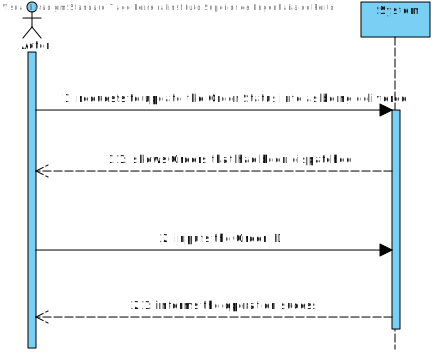
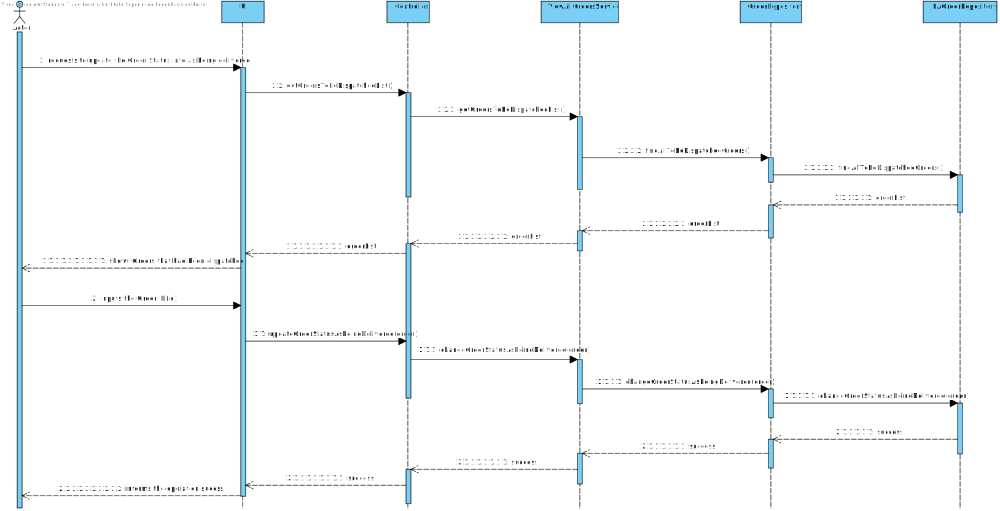
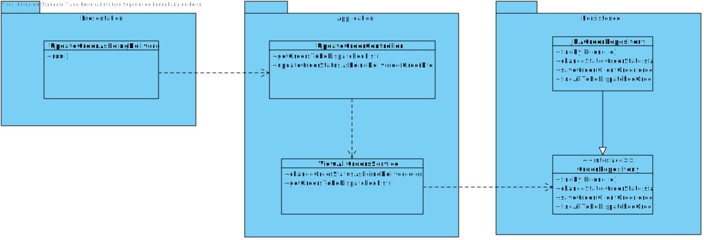

# US 1006
=======================================

# 1. Requisitos

**User Story:** As Sales Clerk, I want to access a list of orders that had been dispatched for customer delivery and be
able to update some of those orders to as being delivered.

# 2. Análise

* The program must only show **Orders** that have been dispatched.
* The program must be able to ask the **Sales Clerk** which **Order** it wishes to update.
* Whichever **Orders** the **Sales Clerk** decides to choose, the **Order** must update its status to **as being
  delivered**.

## SSD

## Model Domain (MD)

# 3. Design

## Functionality Layers

* The **UI** is responsible to show the **Sales Clerk** the list of **Orders** that **had been dispatched for customer
  delivery**. It is also responsible for asking the **Sales Clerk** which **Order** should be updated to **as being
  delivered**.
* The **Controller** is responsible to call the **ViewAllOrdersService** methods.
* The **ViewAllOrdersService** will have to following methods: **getOrdersToBeDispatchedList** and **
  changeOrderStatusAsBeingDelivered**.

## Sequence Diagrams (SD)

## Class Diagram (CD)

### Sales Clerk Manual Customer Creation

* Information Expert
* Tell, don't ask
* Single Responsibility Principle
* Interface Segregation Principle
* DDD (Persistence Ignorance, Entity, Value Object, Domain Service, Aggregate, Domain Event, Observer)
* Repositories were used.
* GRASP (High cohesion, Low coupling)
* For this project we will maintain the UI-Controller interaction, the UI will interact with the user, requesting
  information about the object eapli.base.customermanagement.domain.Customer which will then be sent to the Controller.
* The Controller will call the Services that are responsible for the Customer creation.
* The CustomerRepository class will be responsible to add the object into the database.
* A Customer Builder was implemented which is reponsible for building the Customer object.

## 3.4. Tests

# 4. Implementation

# 5. Integração/Demonstração

*Nesta secção a equipa deve descrever os esforços realizados no sentido de integrar a funcionalidade desenvolvida com as
restantes funcionalidades do sistema.*

# 6. Observações

*Nesta secção sugere-se que a equipa apresente uma perspetiva critica sobre o trabalho desenvolvido apontando, por
exemplo, outras alternativas e ou trabalhos futuros relacionados.*

